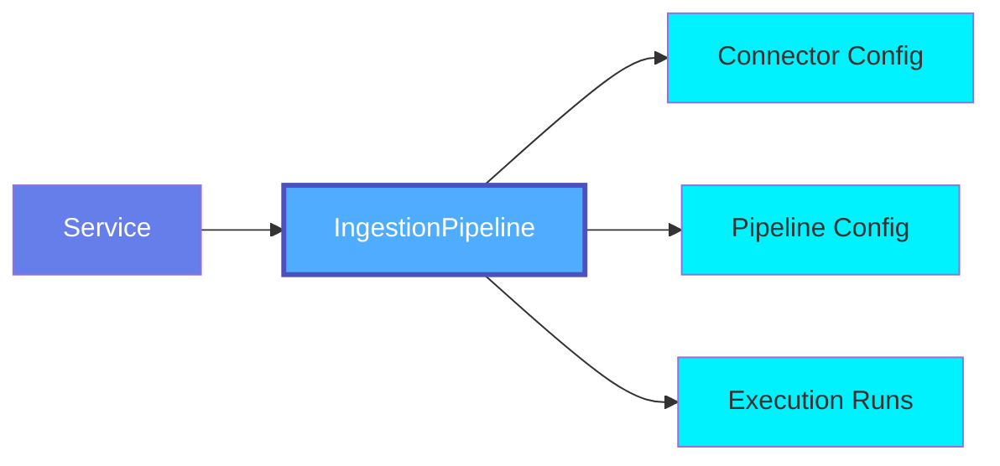

# Ingestion Pipeline

An **Ingestion Pipeline** in OpenMetadadata defines automated workflows for extracting, transforming, and loading metadata from various data sources into the OpenMetadata platform. Ingestion Pipelines enable continuous metadata synchronization and discovery.

## Overview

Ingestion Pipelines in OpenMetadata provide:

- **Automated Metadata Discovery**: Automatically discover tables, schemas, columns, and relationships
- **Scheduled Execution**: Run on schedules (hourly, daily, weekly) or triggered manually
- **Incremental Updates**: Detect and sync only changed metadata
- **Profiling & Sampling**: Collect data profiles and sample data
- **Usage Analytics**: Extract query logs and usage statistics
- **Lineage Extraction**: Discover data lineage from SQL queries and ETL pipelines
- **Quality Testing**: Execute data quality tests during ingestion

Ingestion types include:
- **Metadata Ingestion**: Extract schema, tables, columns, relationships
- **Usage Ingestion**: Extract query logs and access patterns
- **Lineage Ingestion**: Extract data lineage information
- **Profiler Ingestion**: Collect data profiles and statistics
- **Auto Classification Ingestion**: Automatically classify data assets
- **Test Suite Ingestion**: Execute data quality tests
- **Data Insight Ingestion**: Generate data insights and analytics
- **ElasticSearch Reindex**: Reindex metadata in ElasticSearch
- **DBT Ingestion**: Ingest dbt models and lineage
- **Application Ingestion**: Application-specific metadata ingestion

## Hierarchy



**Click on any node to learn more about that entity.**

## Relationships

Ingestion Pipelines have relationships with various entities in the metadata ecosystem:

```mermaid
graph TD
    subgraph Pipeline Configuration
        A[IngestionPipeline:<br/>Snowflake Metadata] --> B1[Connector:<br/>Snowflake]
        A --> B2[Schedule:<br/>Daily 2 AM]
        A --> B3[Run:<br/>2024-01-15 02:00]
        A --> B4[Run:<br/>2024-01-14 02:00]
    end

    subgraph Source
        A -.->|extracts from| C1[DatabaseService:<br/>Snowflake Production]
        C1 -.->|connects to| C2[Snowflake Instance]
    end

    subgraph Target Assets
        A -.->|creates/updates| D1[Database:<br/>sales_db]
        A -.->|creates/updates| D2[Table:<br/>customers]
        A -.->|creates/updates| D3[Table:<br/>orders]
        D1 --> D2
        D1 --> D3
    end

    subgraph Metadata Collected
        A -.->|extracts| E1[Schema Metadata]
        A -.->|extracts| E2[Column Metadata]
        A -.->|extracts| E3[Relationships]
        A -.->|extracts| E4[Tags & Descriptions]
    end

    subgraph Governance
        A -.->|owned by| F1[User:<br/>data.engineer]
        A -.->|managed by| F2[Team:<br/>Data Engineering]
        A -.->|in domain| F3[Domain:<br/>Operations]
    end

    subgraph Monitoring
        A -.->|triggers| G1[Alert:<br/>Ingestion Failure]
        A -.->|logs to| G2[AuditLog]
        A -.->|metrics in| G3[Dashboard:<br/>Ingestion Metrics]
    end

    style A fill:#4facfe,color:#fff,stroke:#4c51bf,stroke-width:3px
    style B1 fill:#00f2fe,color:#333
    style B2 fill:#00f2fe,color:#333
    style B3 fill:#ffd700,color:#333
    style B4 fill:#ffd700,color:#333
    style C1 fill:#667eea,color:#fff
    style C2 fill:#764ba2,color:#fff
    style D1 fill:#764ba2,color:#fff
    style D2 fill:#764ba2,color:#fff
    style D3 fill:#764ba2,color:#fff
    style E1 fill:#00f2fe,color:#333
    style E2 fill:#00f2fe,color:#333
    style E3 fill:#00f2fe,color:#333
    style E4 fill:#00f2fe,color:#333
    style F1 fill:#43e97b,color:#333
    style F2 fill:#43e97b,color:#333
    style F3 fill:#f093fb,color:#333
    style G1 fill:#f5576c,color:#fff
    style G2 fill:#ffd700,color:#333
    style G3 fill:#764ba2,color:#fff

    click A "#ingestion-pipeline" "Ingestion Pipeline"
    click C1 "../../data-assets/databases/database-service/" "Database Service"
    click D1 "../../data-assets/databases/database/" "Database"
    click D2 "../../data-assets/databases/table/" "Table"
    click F1 "../../teams-users/user/" "User"
    click F2 "../../teams-users/team/" "Team"
    click F3 "../../domains/domain/" "Domain"
    click G1 "../../data-quality/alert/" "Alert"
    click G3 "../../data-assets/dashboards/dashboard/" "Dashboard"
```



**Key Relationships:**

- **Pipeline Configuration**: Includes connector, schedule, and execution history
- **Source**: Database Service or other service from which metadata is extracted
- **Target Assets**: Databases, tables, and other entities created/updated by ingestion
- **Metadata Collected**: Schema, columns, relationships, tags extracted during ingestion
- **Governance**: Owned and managed by users/teams, organized by domain
- **Monitoring**: Triggers alerts, creates audit logs, feeds monitoring dashboards

## Schema Specifications

=== "JSON Schema"

    ```json
    {
      "$id": "https://open-metadata.org/schema/entity/services/ingestionPipelines/ingestionPipeline.json",
      "$schema": "http://json-schema.org/draft-07/schema#",
      "title": "IngestionPipeline",
      "description": "Ingestion Pipeline Config is used to set up a DAG and deploy. This entity is used to setup metadata/quality pipelines on Apache Airflow.",
      "type": "object",
      "javaType": "org.openmetadata.schema.entity.services.ingestionPipelines.IngestionPipeline",
      "javaInterfaces": [
        "org.openmetadata.schema.EntityInterface"
      ],
      "definitions": {
        "pipelineType": {
          "description": "Type of Pipeline - metadata, usage",
          "type": "string",
          "javaType": "org.openmetadata.schema.entity.services.ingestionPipelines.PipelineType",
          "enum": [
            "metadata",
            "usage",
            "lineage",
            "profiler",
            "autoClassification",
            "TestSuite",
            "dataInsight",
            "elasticSearchReindex",
            "dbt",
            "application"
          ]
        },
        "pipelineStatus": {
          "type": "object",
          "javaType": "org.openmetadata.schema.entity.services.ingestionPipelines.PipelineStatus",
          "description": "This defines runtime status of Pipeline.",
          "properties": {
            "runId": {
              "description": "Pipeline unique run ID.",
              "type": "string"
            },
            "pipelineState": {
              "description": "Pipeline status denotes if its failed or succeeded.",
              "type": "string",
              "javaType": "org.openmetadata.schema.entity.services.ingestionPipelines.PipelineStatusType",
              "enum": [
                "queued",
                "success",
                "failed",
                "running",
                "partialSuccess"
              ]
            },
            "startDate": {
              "description": "startDate of the pipeline run for this particular execution.",
              "$ref": "../../../type/basic.json#/definitions/timestamp"
            },
            "timestamp": {
              "description": "executionDate of the pipeline run for this particular execution.",
              "$ref": "../../../type/basic.json#/definitions/timestamp"
            },
            "endDate": {
              "description": "endDate of the pipeline run for this particular execution.",
              "$ref": "../../../type/basic.json#/definitions/timestamp"
            },
            "status": {
              "description": "Ingestion Pipeline summary status. Informed at the end of the execution.",
              "$ref": "status.json#/definitions/ingestionStatus"
            },
            "config": {
              "description": "Pipeline configuration for this particular execution.",
              "$ref": "../../../type/basic.json#/definitions/map"
            },
            "metadata": {
              "description": "Metadata for the pipeline status.",
              "$ref": "../../../type/basic.json#/definitions/map"
            }
          },
          "additionalProperties": false
        },
        "airflowConfig": {
          "description": "Properties to configure the Airflow pipeline that will run the workflow.",
          "type": "object",
          "javaType": "org.openmetadata.schema.entity.services.ingestionPipelines.AirflowConfig",
          "properties": {
            "pausePipeline": {
              "description": "pause the pipeline from running once the deploy is finished successfully.",
              "type": "boolean",
              "default": false
            },
            "concurrency": {
              "description": "Concurrency of the Pipeline.",
              "type": "integer",
              "default": 1
            },
            "startDate": {
              "description": "Start date of the pipeline.",
              "$ref": "../../../type/basic.json#/definitions/dateTime"
            },
            "endDate": {
              "description": "End Date of the pipeline.",
              "$ref": "../../../type/basic.json#/definitions/dateTime"
            },
            "pipelineTimezone": {
              "description": "Timezone in which pipeline going to be scheduled.",
              "type": "string",
              "default": "UTC"
            },
            "retries": {
              "description": "Retry pipeline in case of failure.",
              "type": "integer",
              "default": 0
            },
            "retryDelay": {
              "description": "Delay between retries in seconds.",
              "type": "integer",
              "default": 300
            },
            "pipelineCatchup": {
              "description": "Run past executions if the start date is in the past.",
              "type": "boolean",
              "default": false
            },
            "scheduleInterval": {
              "description": "Scheduler Interval for the pipeline in cron format.",
              "type": "string"
            },
            "maxActiveRuns": {
              "description": "Maximum Number of active runs.",
              "type": "integer",
              "default": 1
            },
            "workflowTimeout": {
              "description": "Timeout for the workflow in seconds.",
              "type": "integer",
              "default": null
            },
            "workflowDefaultView": {
              "description": "Default view in Airflow.",
              "type": "string",
              "default": "tree"
            },
            "workflowDefaultViewOrientation": {
              "description": "Default view Orientation in Airflow.",
              "type": "string",
              "default": "LR"
            },
            "email": {
              "description": "Email to notify workflow status.",
              "$ref": "../../../type/basic.json#/definitions/email"
            }
          },
          "additionalProperties": false
        }
      },
      "properties": {
        "id": {
          "description": "Unique identifier that identifies this pipeline.",
          "$ref": "../../../type/basic.json#/definitions/uuid"
        },
        "name": {
          "description": "Name that identifies this pipeline instance uniquely.",
          "$ref": "../../../type/basic.json#/definitions/entityName"
        },
        "displayName": {
          "description": "Display Name that identifies this Pipeline.",
          "type": "string"
        },
        "description": {
          "description": "Description of the Pipeline.",
          "$ref": "../../../type/basic.json#/definitions/markdown"
        },
        "pipelineType": {
          "$ref": "#/definitions/pipelineType"
        },
        "owners": {
          "description": "Owners of this Pipeline.",
          "$ref": "../../../type/entityReferenceList.json",
          "default": null
        },
        "fullyQualifiedName": {
          "description": "Name that uniquely identifies a Pipeline.",
          "$ref": "../../../type/basic.json#/definitions/fullyQualifiedEntityName"
        },
        "sourceConfig": {
          "$ref": "../../../metadataIngestion/workflow.json#/definitions/sourceConfig"
        },
        "openMetadataServerConnection": {
          "$ref": "../connections/metadata/openMetadataConnection.json"
        },
        "airflowConfig": {
          "$ref": "#/definitions/airflowConfig"
        },
        "service": {
          "description": "Link to the service (such as database, messaging, storage services, etc. for which this ingestion pipeline ingests the metadata from.",
          "$ref": "../../../type/entityReference.json"
        },
        "pipelineStatuses": {
          "description": "Last of executions and status for the Pipeline.",
          "$ref": "#/definitions/pipelineStatus"
        },
        "loggerLevel": {
          "description": "Set the logging level for the workflow.",
          "$ref": "../../../metadataIngestion/workflow.json#/definitions/logLevels"
        },
        "raiseOnError": {
          "description": "Control if we want to flag the workflow as failed if we encounter any processing errors.",
          "type": "boolean",
          "default": true
        },
        "deployed": {
          "description": "Indicates if the workflow has been successfully deployed to Airflow.",
          "type": "boolean",
          "default": false
        },
        "enabled": {
          "description": "True if the pipeline is ready to be run in the next schedule. False if it is paused.",
          "type": "boolean",
          "default": true
        },
        "enableStreamableLogs": {
          "description": "Enable real-time log streaming to the OpenMetadata server. When enabled, ingestion logs will be automatically shipped to the server's configured log storage backend (S3 or compatible).",
          "type": "boolean",
          "default": false
        },
        "href": {
          "description": "Link to this ingestion pipeline resource.",
          "$ref": "../../../type/basic.json#/definitions/href"
        },
        "version": {
          "description": "Metadata version of the entity.",
          "$ref": "../../../type/entityHistory.json#/definitions/entityVersion"
        },
        "updatedAt": {
          "description": "Last update time corresponding to the new version of the entity in Unix epoch time milliseconds.",
          "$ref": "../../../type/basic.json#/definitions/timestamp"
        },
        "updatedBy": {
          "description": "User who made the update.",
          "type": "string"
        },
        "impersonatedBy": {
          "description": "Bot user that performed the action on behalf of the actual user.",
          "$ref": "../../../type/basic.json#/definitions/impersonatedBy"
        },
        "changeDescription": {
          "description": "Change that led to this version of the entity.",
          "$ref": "../../../type/entityHistory.json#/definitions/changeDescription"
        },
        "incrementalChangeDescription": {
          "description": "Change that lead to this version of the entity.",
          "$ref": "../../../type/entityHistory.json#/definitions/changeDescription"
        },
        "followers": {
          "description": "Followers of this entity.",
          "$ref": "../../../type/entityReferenceList.json"
        },
        "deleted": {
          "description": "When `true` indicates the entity has been soft deleted.",
          "type": "boolean",
          "default": false
        },
        "provider": {
          "$ref": "../../../type/basic.json#/definitions/providerType"
        },
        "domains": {
          "description": "Domains the asset belongs to. When not set, the asset inherits the domain from the parent it belongs to.",
          "$ref": "../../../type/entityReferenceList.json"
        },
        "applicationType": {
          "description": "Type of the application when pipelineType is 'application'.",
          "type": "string"
        },
        "ingestionRunner": {
          "description": "The ingestion agent responsible for executing the ingestion pipeline.",
          "$ref": "../../../type/entityReference.json"
        },
        "processingEngine": {
          "description": "The processing engine responsible for executing the ingestion pipeline logic.",
          "$ref": "../../../type/entityReference.json"
        }
      },
      "required": [
        "name",
        "pipelineType",
        "sourceConfig",
        "airflowConfig"
      ],
      "additionalProperties": false
    }
    ```

=== "RDF (Turtle)"

    ```turtle
    @prefix om: <https://open-metadata.org/schema/> .
    @prefix om-entity: <https://open-metadata.org/schema/entity/> .
    @prefix om-ingestion: <https://open-metadata.org/schema/entity/services/ingestionPipelines/> .
    @prefix rdf: <http://www.w3.org/1999/02/22-rdf-syntax-ns#> .
    @prefix rdfs: <http://www.w3.org/2000/01/rdf-schema#> .
    @prefix owl: <http://www.w3.org/2002/07/owl#> .
    @prefix xsd: <http://www.w3.org/2001/XMLSchema#> .
    @prefix dcterms: <http://purl.org/dc/terms/> .
    @prefix skos: <http://www.w3.org/2004/02/skos/core#> .
    @prefix prov: <http://www.w3.org/ns/prov#> .

    # Ingestion Pipeline Class Definition
    om-ingestion:IngestionPipeline a owl:Class ;
        rdfs:label "Ingestion Pipeline" ;
        rdfs:comment "Ingestion Pipeline Config is used to set up a DAG and deploy. This entity is used to setup metadata/quality pipelines on Apache Airflow." ;
        rdfs:subClassOf om-entity:Entity ;
        rdfs:isDefinedBy om: .

    # Pipeline Type Class
    om-ingestion:PipelineType a owl:Class ;
        rdfs:label "Pipeline Type" ;
        rdfs:comment "Type of Pipeline - metadata, usage" ;
        rdfs:isDefinedBy om: .

    # Pipeline Status Class
    om-ingestion:PipelineStatus a owl:Class ;
        rdfs:label "Pipeline Status" ;
        rdfs:comment "This defines runtime status of Pipeline." ;
        rdfs:isDefinedBy om: .

    # Pipeline State Class
    om-ingestion:PipelineState a owl:Class ;
        rdfs:label "Pipeline State" ;
        rdfs:comment "Pipeline status denotes if its failed or succeeded." ;
        rdfs:isDefinedBy om: .

    # Airflow Config Class
    om-ingestion:AirflowConfig a owl:Class ;
        rdfs:label "Airflow Config" ;
        rdfs:comment "Properties to configure the Airflow pipeline that will run the workflow." ;
        rdfs:isDefinedBy om: .

    # Core Properties
    om-ingestion:pipelineType a owl:ObjectProperty ;
        rdfs:label "pipeline type" ;
        rdfs:comment "Type of the ingestion pipeline" ;
        rdfs:domain om-ingestion:IngestionPipeline ;
        rdfs:range om-ingestion:PipelineType .

    om-ingestion:service a owl:ObjectProperty ;
        rdfs:label "service" ;
        rdfs:comment "Link to the service (such as database, messaging, storage services, etc.) for which this ingestion pipeline ingests the metadata from" ;
        rdfs:domain om-ingestion:IngestionPipeline ;
        rdfs:range om-entity:Service .

    om-ingestion:owners a owl:ObjectProperty ;
        rdfs:label "owners" ;
        rdfs:comment "Owners of this Pipeline" ;
        rdfs:domain om-ingestion:IngestionPipeline ;
        rdfs:range om-entity:EntityReference .

    om-ingestion:domains a owl:ObjectProperty ;
        rdfs:label "domains" ;
        rdfs:comment "Domains the asset belongs to. When not set, the asset inherits the domain from the parent it belongs to." ;
        rdfs:domain om-ingestion:IngestionPipeline ;
        rdfs:range om-entity:EntityReference .

    om-ingestion:followers a owl:ObjectProperty ;
        rdfs:label "followers" ;
        rdfs:comment "Followers of this entity" ;
        rdfs:domain om-ingestion:IngestionPipeline ;
        rdfs:range om-entity:EntityReference .

    # Configuration Properties
    om-ingestion:sourceConfig a owl:ObjectProperty ;
        rdfs:label "source config" ;
        rdfs:comment "Source configuration for the ingestion pipeline" ;
        rdfs:domain om-ingestion:IngestionPipeline .

    om-ingestion:openMetadataServerConnection a owl:ObjectProperty ;
        rdfs:label "OpenMetadata server connection" ;
        rdfs:comment "Connection to OpenMetadata server" ;
        rdfs:domain om-ingestion:IngestionPipeline .

    om-ingestion:airflowConfig a owl:ObjectProperty ;
        rdfs:label "airflow config" ;
        rdfs:comment "Airflow configuration for the pipeline" ;
        rdfs:domain om-ingestion:IngestionPipeline ;
        rdfs:range om-ingestion:AirflowConfig .

    # State Properties
    om-ingestion:enabled a owl:DatatypeProperty ;
        rdfs:label "enabled" ;
        rdfs:comment "True if the pipeline is ready to be run in the next schedule. False if it is paused." ;
        rdfs:domain om-ingestion:IngestionPipeline ;
        rdfs:range xsd:boolean .

    om-ingestion:deployed a owl:DatatypeProperty ;
        rdfs:label "deployed" ;
        rdfs:comment "Indicates if the workflow has been successfully deployed to Airflow" ;
        rdfs:domain om-ingestion:IngestionPipeline ;
        rdfs:range xsd:boolean .

    om-ingestion:raiseOnError a owl:DatatypeProperty ;
        rdfs:label "raise on error" ;
        rdfs:comment "Control if we want to flag the workflow as failed if we encounter any processing errors" ;
        rdfs:domain om-ingestion:IngestionPipeline ;
        rdfs:range xsd:boolean .

    om-ingestion:enableStreamableLogs a owl:DatatypeProperty ;
        rdfs:label "enable streamable logs" ;
        rdfs:comment "Enable real-time log streaming to the OpenMetadata server" ;
        rdfs:domain om-ingestion:IngestionPipeline ;
        rdfs:range xsd:boolean .

    om-ingestion:pipelineStatuses a owl:ObjectProperty ;
        rdfs:label "pipeline statuses" ;
        rdfs:comment "Last of executions and status for the Pipeline" ;
        rdfs:domain om-ingestion:IngestionPipeline ;
        rdfs:range om-ingestion:PipelineStatus .

    om-ingestion:loggerLevel a owl:DatatypeProperty ;
        rdfs:label "logger level" ;
        rdfs:comment "Set the logging level for the workflow" ;
        rdfs:domain om-ingestion:IngestionPipeline ;
        rdfs:range xsd:string .

    om-ingestion:applicationType a owl:DatatypeProperty ;
        rdfs:label "application type" ;
        rdfs:comment "Type of the application when pipelineType is 'application'" ;
        rdfs:domain om-ingestion:IngestionPipeline ;
        rdfs:range xsd:string .

    om-ingestion:ingestionRunner a owl:ObjectProperty ;
        rdfs:label "ingestion runner" ;
        rdfs:comment "The ingestion agent responsible for executing the ingestion pipeline" ;
        rdfs:domain om-ingestion:IngestionPipeline ;
        rdfs:range om-entity:EntityReference .

    om-ingestion:processingEngine a owl:ObjectProperty ;
        rdfs:label "processing engine" ;
        rdfs:comment "The processing engine responsible for executing the ingestion pipeline logic" ;
        rdfs:domain om-ingestion:IngestionPipeline ;
        rdfs:range om-entity:EntityReference .

    # Pipeline Status Properties
    om-ingestion:runId a owl:DatatypeProperty ;
        rdfs:label "run ID" ;
        rdfs:comment "Pipeline unique run ID" ;
        rdfs:domain om-ingestion:PipelineStatus ;
        rdfs:range xsd:string .

    om-ingestion:pipelineState a owl:ObjectProperty ;
        rdfs:label "pipeline state" ;
        rdfs:comment "State of the pipeline run" ;
        rdfs:domain om-ingestion:PipelineStatus ;
        rdfs:range om-ingestion:PipelineState .

    om-ingestion:startDate a owl:DatatypeProperty ;
        rdfs:label "start date" ;
        rdfs:comment "startDate of the pipeline run for this particular execution" ;
        rdfs:domain om-ingestion:PipelineStatus ;
        rdfs:range xsd:dateTime .

    om-ingestion:endDate a owl:DatatypeProperty ;
        rdfs:label "end date" ;
        rdfs:comment "endDate of the pipeline run for this particular execution" ;
        rdfs:domain om-ingestion:PipelineStatus ;
        rdfs:range xsd:dateTime .

    om-ingestion:timestamp a owl:DatatypeProperty ;
        rdfs:label "timestamp" ;
        rdfs:comment "executionDate of the pipeline run for this particular execution" ;
        rdfs:domain om-ingestion:PipelineStatus ;
        rdfs:range xsd:dateTime .

    # Metadata Properties
    om-ingestion:impersonatedBy a owl:ObjectProperty ;
        rdfs:label "impersonated by" ;
        rdfs:comment "Bot user that performed the action on behalf of the actual user" ;
        rdfs:domain om-ingestion:IngestionPipeline .

    om-ingestion:incrementalChangeDescription a owl:ObjectProperty ;
        rdfs:label "incremental change description" ;
        rdfs:comment "Change that lead to this version of the entity" ;
        rdfs:domain om-ingestion:IngestionPipeline .

    om-ingestion:provider a owl:DatatypeProperty ;
        rdfs:label "provider" ;
        rdfs:comment "Provider type for the ingestion pipeline" ;
        rdfs:domain om-ingestion:IngestionPipeline ;
        rdfs:range xsd:string .

    # Pipeline Type Individuals
    om-ingestion:Metadata a om-ingestion:PipelineType ;
        rdfs:label "Metadata" ;
        skos:definition "Pipeline for ingesting metadata (schemas, tables, columns)" .

    om-ingestion:Usage a om-ingestion:PipelineType ;
        rdfs:label "Usage" ;
        skos:definition "Pipeline for ingesting usage and query logs" .

    om-ingestion:Lineage a om-ingestion:PipelineType ;
        rdfs:label "Lineage" ;
        skos:definition "Pipeline for extracting data lineage" .

    om-ingestion:Profiler a om-ingestion:PipelineType ;
        rdfs:label "Profiler" ;
        skos:definition "Pipeline for collecting data profiles and statistics" .

    om-ingestion:AutoClassification a om-ingestion:PipelineType ;
        rdfs:label "Auto Classification" ;
        skos:definition "Pipeline for automatic classification of data assets" .

    om-ingestion:TestSuite a om-ingestion:PipelineType ;
        rdfs:label "Test Suite" ;
        skos:definition "Pipeline for executing data quality tests" .

    om-ingestion:DataInsight a om-ingestion:PipelineType ;
        rdfs:label "Data Insight" ;
        skos:definition "Pipeline for generating data insights" .

    om-ingestion:ElasticSearchReindex a om-ingestion:PipelineType ;
        rdfs:label "ElasticSearch Reindex" ;
        skos:definition "Pipeline for reindexing ElasticSearch" .

    om-ingestion:DBT a om-ingestion:PipelineType ;
        rdfs:label "DBT" ;
        skos:definition "Pipeline for ingesting dbt models and lineage" .

    om-ingestion:Application a om-ingestion:PipelineType ;
        rdfs:label "Application" ;
        skos:definition "Pipeline for application-specific ingestion" .

    # Pipeline State Individuals
    om-ingestion:Queued a om-ingestion:PipelineState ;
        rdfs:label "Queued" ;
        skos:definition "Pipeline run is queued" .

    om-ingestion:Success a om-ingestion:PipelineState ;
        rdfs:label "Success" ;
        skos:definition "Pipeline run completed successfully" .

    om-ingestion:Failed a om-ingestion:PipelineState ;
        rdfs:label "Failed" ;
        skos:definition "Pipeline run failed" .

    om-ingestion:Running a om-ingestion:PipelineState ;
        rdfs:label "Running" ;
        skos:definition "Pipeline run is in progress" .

    om-ingestion:PartialSuccess a om-ingestion:PipelineState ;
        rdfs:label "Partial Success" ;
        skos:definition "Pipeline run completed with some errors" .
    ```

=== "JSON-LD Context"

    ```json
    {
      "@context": {
        "@vocab": "https://open-metadata.org/schema/entity/services/ingestionPipelines/",
        "rdf": "http://www.w3.org/1999/02/22-rdf-syntax-ns#",
        "rdfs": "http://www.w3.org/2000/01/rdf-schema#",
        "owl": "http://www.w3.org/2002/07/owl#",
        "xsd": "http://www.w3.org/2001/XMLSchema#",
        "dcterms": "http://purl.org/dc/terms/",
        "skos": "http://www.w3.org/2004/02/skos/core#",
        "prov": "http://www.w3.org/ns/prov#",
        "om": "https://open-metadata.org/schema/",

        "IngestionPipeline": {
          "@id": "om:IngestionPipeline",
          "@type": "@id"
        },
        "id": {
          "@id": "om:id",
          "@type": "xsd:string"
        },
        "name": {
          "@id": "om:name",
          "@type": "xsd:string"
        },
        "displayName": {
          "@id": "om:displayName",
          "@type": "xsd:string"
        },
        "description": {
          "@id": "dcterms:description",
          "@type": "xsd:string"
        },
        "pipelineType": {
          "@id": "om:pipelineType",
          "@type": "@id"
        },
        "owners": {
          "@id": "om:owners",
          "@type": "@id",
          "@container": "@set"
        },
        "fullyQualifiedName": {
          "@id": "om:fullyQualifiedName",
          "@type": "xsd:string"
        },
        "sourceConfig": {
          "@id": "om:sourceConfig",
          "@type": "@id"
        },
        "openMetadataServerConnection": {
          "@id": "om:openMetadataServerConnection",
          "@type": "@id"
        },
        "airflowConfig": {
          "@id": "om:airflowConfig",
          "@type": "@id"
        },
        "service": {
          "@id": "om:service",
          "@type": "@id"
        },
        "pipelineStatuses": {
          "@id": "om:pipelineStatuses",
          "@type": "@id"
        },
        "loggerLevel": {
          "@id": "om:loggerLevel",
          "@type": "xsd:string"
        },
        "raiseOnError": {
          "@id": "om:raiseOnError",
          "@type": "xsd:boolean"
        },
        "deployed": {
          "@id": "om:deployed",
          "@type": "xsd:boolean"
        },
        "enabled": {
          "@id": "om:enabled",
          "@type": "xsd:boolean"
        },
        "enableStreamableLogs": {
          "@id": "om:enableStreamableLogs",
          "@type": "xsd:boolean"
        },
        "href": {
          "@id": "om:href",
          "@type": "xsd:anyURI"
        },
        "version": {
          "@id": "om:version",
          "@type": "xsd:string"
        },
        "updatedAt": {
          "@id": "dcterms:modified",
          "@type": "xsd:dateTime"
        },
        "updatedBy": {
          "@id": "prov:wasAttributedTo",
          "@type": "xsd:string"
        },
        "impersonatedBy": {
          "@id": "om:impersonatedBy",
          "@type": "@id"
        },
        "changeDescription": {
          "@id": "om:changeDescription",
          "@type": "@id"
        },
        "incrementalChangeDescription": {
          "@id": "om:incrementalChangeDescription",
          "@type": "@id"
        },
        "followers": {
          "@id": "om:followers",
          "@type": "@id",
          "@container": "@set"
        },
        "deleted": {
          "@id": "om:deleted",
          "@type": "xsd:boolean"
        },
        "provider": {
          "@id": "om:provider",
          "@type": "xsd:string"
        },
        "domains": {
          "@id": "om:domains",
          "@type": "@id",
          "@container": "@set"
        },
        "applicationType": {
          "@id": "om:applicationType",
          "@type": "xsd:string"
        },
        "ingestionRunner": {
          "@id": "om:ingestionRunner",
          "@type": "@id"
        },
        "processingEngine": {
          "@id": "om:processingEngine",
          "@type": "@id"
        }
      }
    }
    ```

## Use Cases

### Metadata Ingestion Pipeline

Ingest schema metadata from a Snowflake database:

```json
{
  "name": "SnowflakeMetadataIngestion",
  "displayName": "Snowflake Production Metadata",
  "pipelineType": "metadata",
  "description": "Ingest metadata from Snowflake production databases",
  "service": {
    "type": "databaseService",
    "name": "SnowflakeProduction"
  },
  "sourceConfig": {
    "config": {
      "type": "DatabaseMetadata",
      "schemaFilterPattern": {
        "includes": ["sales", "marketing", "analytics"]
      },
      "tableFilterPattern": {
        "excludes": [".*_temp$", ".*_backup$"]
      },
      "includeTables": true,
      "includeViews": true,
      "includeTags": true,
      "markDeletedTables": true
    }
  },
  "airflowConfig": {
    "scheduleInterval": "0 2 * * *",
    "pausePipeline": false,
    "concurrency": 1,
    "retries": 3,
    "retryDelay": 300
  },
  "enabled": true,
  "owners": [
    {
      "type": "team",
      "name": "DataEngineering"
    }
  ]
}
```

### Usage Ingestion Pipeline

Extract query logs and usage statistics:

```json
{
  "name": "SnowflakeUsageIngestion",
  "displayName": "Snowflake Usage Analytics",
  "pipelineType": "usage",
  "description": "Extract query logs and usage patterns",
  "service": {
    "type": "databaseService",
    "name": "SnowflakeProduction"
  },
  "sourceConfig": {
    "config": {
      "type": "DatabaseUsage",
      "queryLogDuration": 7,
      "stageFileLocation": "/tmp/query_logs",
      "resultLimit": 1000
    }
  },
  "airflowConfig": {
    "scheduleInterval": "0 * * * *",
    "retries": 2
  },
  "enabled": true,
  "owners": [
    {
      "type": "user",
      "name": "data.engineer"
    }
  ]
}
```

### Lineage Ingestion Pipeline

Extract data lineage from SQL queries:

```json
{
  "name": "SnowflakeLineageIngestion",
  "displayName": "Snowflake Lineage Extraction",
  "pipelineType": "lineage",
  "description": "Extract data lineage from query history",
  "service": {
    "type": "databaseService",
    "name": "SnowflakeProduction"
  },
  "sourceConfig": {
    "config": {
      "type": "DatabaseLineage",
      "queryLogDuration": 30,
      "parsingTimeoutLimit": 300,
      "filterCondition": "query_type = 'INSERT' OR query_type = 'CTAS'"
    }
  },
  "airflowConfig": {
    "scheduleInterval": "0 3 * * *",
    "retries": 3
  },
  "enabled": true
}
```

### Profiler Pipeline

Collect data profiles and statistics:

```json
{
  "name": "CustomerDataProfiler",
  "displayName": "Customer Data Profiling",
  "pipelineType": "profiler",
  "description": "Profile customer tables and collect statistics",
  "service": {
    "type": "databaseService",
    "name": "PostgresCustomer"
  },
  "sourceConfig": {
    "config": {
      "type": "Profiler",
      "generateSampleData": true,
      "profileSample": 100,
      "profileSampleType": "PERCENTAGE",
      "sampleDataCount": 50,
      "schemaFilterPattern": {
        "includes": ["customer"]
      },
      "tableFilterPattern": {
        "includes": ["customer.*", "account.*"]
      },
      "profileQuery": "SELECT * FROM {table} WHERE active = true"
    }
  },
  "airflowConfig": {
    "scheduleInterval": "0 0 * * 0",
    "workflowTimeout": 7200
  },
  "enabled": true,
  "owners": [
    {
      "type": "team",
      "name": "DataQuality"
    }
  ]
}
```

### DBT Ingestion Pipeline

Ingest dbt models, tests, and lineage:

```json
{
  "name": "DBTIngestion",
  "displayName": "DBT Models & Lineage",
  "pipelineType": "dbt",
  "description": "Ingest dbt models, tests, and lineage from manifest",
  "service": {
    "type": "databaseService",
    "name": "SnowflakeProduction"
  },
  "sourceConfig": {
    "config": {
      "type": "DBT",
      "dbtConfigSource": {
        "dbtManifestFilePath": "s3://my-bucket/dbt/manifest.json",
        "dbtCatalogFilePath": "s3://my-bucket/dbt/catalog.json",
        "dbtRunResultsFilePath": "s3://my-bucket/dbt/run_results.json"
      },
      "dbtUpdateDescriptions": true,
      "includeTags": true,
      "dbtClassificationName": "dbtTags"
    }
  },
  "airflowConfig": {
    "scheduleInterval": "0 4 * * *"
  },
  "enabled": true,
  "owners": [
    {
      "type": "team",
      "name": "Analytics"
    }
  ]
}
```

### Test Suite Pipeline

Execute data quality tests:

```json
{
  "name": "CustomerQualityTests",
  "displayName": "Customer Data Quality Tests",
  "pipelineType": "TestSuite",
  "description": "Run quality tests on customer data",
  "service": {
    "type": "databaseService",
    "name": "PostgresCustomer"
  },
  "sourceConfig": {
    "config": {
      "type": "TestSuite",
      "entityFullyQualifiedName": "PostgresCustomer.customer.public.customers"
    }
  },
  "airflowConfig": {
    "scheduleInterval": "0 */6 * * *"
  },
  "enabled": true,
  "owners": [
    {
      "type": "team",
      "name": "DataQuality"
    }
  ]
}
```

## Pipeline Types

| Type | Description | Frequency | Output |
|------|-------------|-----------|--------|
| **metadata** | Extracts schema, tables, columns, relationships | Daily | Database, Table, Column entities |
| **usage** | Extracts query logs and access patterns | Hourly | Usage statistics, popular queries |
| **lineage** | Extracts data lineage from queries/ETL | Daily | Lineage edges between entities |
| **profiler** | Collects data profiles and statistics | Weekly | Data profiles, column statistics |
| **TestSuite** | Executes data quality tests | Multiple times daily | Test results |
| **dbt** | Ingests dbt models and lineage | Daily after dbt runs | DBT models, tests, lineage |

## Pipeline States

| State | Description | Actions |
|-------|-------------|---------|
| **queued** | Pipeline is waiting to execute | Monitor queue |
| **running** | Pipeline is currently executing | Monitor progress |
| **success** | Pipeline completed successfully | Review metrics |
| **failed** | Pipeline encountered errors | Check logs, retry |
| **partialSuccess** | Pipeline completed with some errors | Review warnings |

## Airflow Configuration

Common Airflow settings for ingestion pipelines:

```json
{
  "scheduleInterval": "0 2 * * *",
  "pausePipeline": false,
  "concurrency": 1,
  "pipelineTimezone": "UTC",
  "retries": 3,
  "retryDelay": 300,
  "pipelineCatchup": false,
  "maxActiveRuns": 1,
  "workflowTimeout": 3600,
  "workflowDefaultView": "tree"
}
```

## Best Practices

### 1. Start with Metadata Ingestion
Begin with basic metadata ingestion before adding usage, lineage, and profiling.

### 2. Use Appropriate Schedules
- Metadata: Daily
- Usage: Hourly
- Lineage: Daily
- Profiler: Weekly

### 3. Filter Appropriately
Use schema and table filters to avoid ingesting unnecessary metadata.

### 4. Handle Failures Gracefully
Configure retries and alerts for pipeline failures.

### 5. Monitor Performance
Track ingestion duration, entity counts, and error rates.

### 6. Incremental Updates
Enable incremental ingestion to detect only changed metadata.

### 7. Test Before Production
Test ingestion pipelines in non-production environments first.

### 8. Document Configuration
Maintain clear documentation of pipeline configurations and filters.

## Custom Properties

This entity supports custom properties through the `extension` field.
Common custom properties include:

- **Data Classification**: Sensitivity level
- **Cost Center**: Billing allocation
- **Retention Period**: Data retention requirements
- **Application Owner**: Owning application/team

See [Custom Properties](../metadata-specifications/custom-properties.md)
for details on defining and using custom properties.

---

## API Operations

### Create Ingestion Pipeline

```http
POST /api/v1/services/ingestionPipelines
Content-Type: application/json

{
  "name": "SnowflakeMetadata",
  "pipelineType": "metadata",
  "service": {...},
  "sourceConfig": {...},
  "airflowConfig": {...}
}
```

### Get Ingestion Pipeline

```http
GET /api/v1/services/ingestionPipelines/{id}
```

### Deploy Pipeline

```http
POST /api/v1/services/ingestionPipelines/deploy/{id}
```

### Trigger Pipeline Run

```http
POST /api/v1/services/ingestionPipelines/trigger/{id}
```

### Get Pipeline Status

```http
GET /api/v1/services/ingestionPipelines/{id}/pipelineStatus?startTs=1234567890&endTs=1234567999
```

### Update Pipeline

```http
PATCH /api/v1/services/ingestionPipelines/{id}
Content-Type: application/json-patch+json

[
  {
    "op": "replace",
    "path": "/enabled",
    "value": false
  }
]
```

### Delete Pipeline

```http
DELETE /api/v1/services/ingestionPipelines/{id}
```

### List Pipelines

```http
GET /api/v1/services/ingestionPipelines?service=SnowflakeProduction&pipelineType=metadata
```

## Related Entities

- **[Database Service](../data-assets/databases/database-service.md)**: Source services for metadata ingestion
- **[Pipeline Service](../data-assets/pipelines/pipeline-service.md)**: ETL pipeline services
- **[Database](../data-assets/databases/database.md)**: Databases created/updated by ingestion
- **[Table](../data-assets/databases/table.md)**: Tables created/updated by ingestion
- **[Alert](../data-quality/alert.md)**: Alerts for pipeline failures
- **[Domain](../domains/domain.md)**: Domains for organizing pipelines
- **[User](../teams-users/user.md)**: Pipeline owners
- **[Team](../teams-users/team.md)**: Teams managing pipelines
