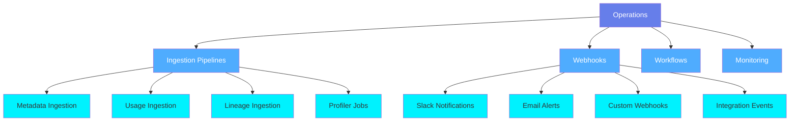
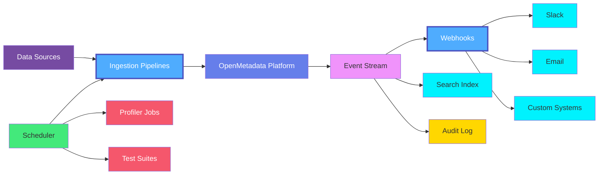
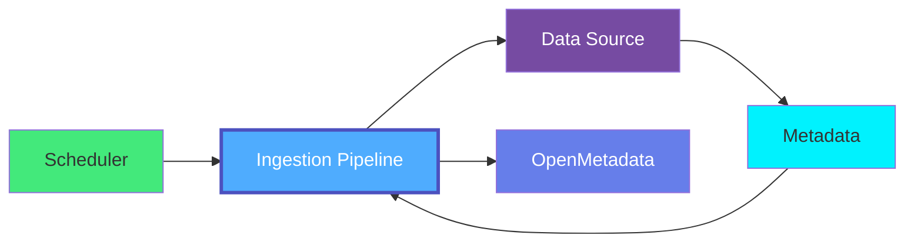
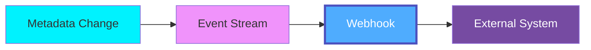

# Operations Overview

**Operations** in OpenMetadata encompasses the systems and processes that manage, monitor, and maintain the metadata platform itself. This includes metadata ingestion, event notifications, automation workflows, and operational monitoring.

## What is Operations?

Operations entities manage the day-to-day functioning of the metadata platform:

- **Metadata Ingestion**: Automated extraction of metadata from data sources
- **Event Notifications**: Real-time alerts and webhooks for metadata changes
- **Workflow Automation**: Scheduled jobs and automated processes
- **Monitoring & Health**: Platform health checks and operational metrics
- **Integration Management**: Connections to external systems

## Operations Entities

### Core Components

#### 1. Ingestion Pipelines
Automated workflows that extract metadata from data sources:

- **Metadata Ingestion**: Schemas, tables, columns, relationships
- **Usage Ingestion**: Query logs, access patterns, popular queries
- **Lineage Ingestion**: Data flow and transformation lineage
- **Profiler Ingestion**: Statistical profiles and data quality metrics
- **Test Suite Execution**: Automated data quality testing
- **dbt Integration**: dbt model and test metadata

#### 2. Webhooks
Event-driven notifications to external systems:

- **Real-time Events**: Instant notifications on metadata changes
- **Custom Integrations**: Connect to third-party tools
- **Alert Routing**: Send alerts to appropriate channels
- **Audit Trail**: Track all outbound notifications

#### 3. Workflows (Future)
Automated operational workflows:

- Scheduled metadata refreshes
- Automated tagging and classification
- Data quality monitoring
- Compliance checks
- Cleanup and archival

#### 4. Monitoring (Future)
Platform health and operations monitoring:

- Ingestion pipeline health
- Webhook delivery status
- System performance metrics
- Error tracking and alerting

## Operations Architecture

## Use Cases

### Automated Metadata Discovery
Automatically discover and catalog data assets:

### Real-time Change Notifications
Get instant alerts when metadata changes:

- Schema changes in production tables
- New PII data tagged
- Data quality test failures
- Ownership changes
- Policy violations

### Data Quality Automation
Automate data quality monitoring:

1. Schedule profiler jobs
2. Run data quality tests
3. Track quality metrics over time
4. Alert on quality degradation
5. Trigger remediation workflows

### Compliance Auditing
Maintain audit trail for compliance:

- Track all metadata changes
- Monitor data access patterns
- Alert on policy violations
- Generate compliance reports
- Maintain change history

## Ingestion Pipeline Types

### Metadata Ingestion
Extract schema, structure, and relationships:

- Tables, columns, data types
- Primary and foreign keys
- Relationships and constraints
- Descriptions and tags
- Ownership information

### Usage Ingestion
Extract query logs and usage patterns:

- Popular tables and columns
- Query patterns and frequency
- User access patterns
- Join relationships
- Query performance

### Lineage Ingestion
Extract data flow and transformations:

- Column-level lineage
- Pipeline dependencies
- Transformation logic
- Data provenance
- Impact analysis

### Profiler Ingestion
Collect data quality metrics:

- Row counts and table statistics
- Column profiles and distributions
- Null percentages
- Unique value counts
- Data type validation

### Test Suite Execution
Run automated quality tests:

- Schema validation
- Data quality checks
- Freshness verification
- Completeness testing
- Custom business rules

## Webhook Event Types

### Entity Events
- `entityCreated`: New entity created
- `entityUpdated`: Entity modified
- `entitySoftDeleted`: Entity soft deleted
- `entityDeleted`: Entity permanently deleted

### Quality Events
- Data quality test failures
- Profile metric anomalies
- SLA violations
- Data freshness issues

### Schema Events
- Schema changes detected
- Breaking changes identified
- New columns added
- Columns removed

### Access Events
- Policy violations
- Unauthorized access attempts
- Permission changes
- Security alerts

## Best Practices

### 1. Schedule Appropriately
Choose ingestion frequency based on data volatility:
- **Real-time**: Streaming data, critical tables
- **Hourly**: Frequently changing data
- **Daily**: Most production tables
- **Weekly**: Static reference data

### 2. Filter Wisely
Use filters to avoid ingesting unnecessary metadata:
- Include/exclude patterns
- Schema filtering
- Table name patterns
- Database filtering

### 3. Monitor Pipeline Health
Track ingestion pipeline execution:
- Success/failure rates
- Execution duration
- Entities processed
- Error patterns

### 4. Configure Retry Logic
Handle transient failures gracefully:
- Exponential backoff
- Maximum retry attempts
- Error notification thresholds
- Failure handling policies

### 5. Secure Credentials
Protect data source credentials:
- Use secrets management
- Rotate credentials regularly
- Least privilege access
- Encrypted storage

### 6. Test Before Production
Validate pipelines in non-production:
- Test filters and patterns
- Verify metadata quality
- Check performance impact
- Validate transformations

### 7. Document Configurations
Maintain clear documentation:
- Pipeline purpose and scope
- Schedule rationale
- Filter explanations
- Troubleshooting guides

### 8. Optimize Webhook Delivery
Ensure reliable notification delivery:
- Implement idempotency
- Handle retries
- Monitor delivery rates
- Filter events appropriately

## Monitoring Operations

### Key Metrics

| Metric | Description | Target |
|--------|-------------|--------|
| **Pipeline Success Rate** | % of successful pipeline runs | > 99% |
| **Ingestion Latency** | Time to complete ingestion | < 1 hour |
| **Webhook Delivery Rate** | % of webhooks delivered successfully | > 99.9% |
| **Event Processing Lag** | Delay in event processing | < 1 minute |
| **Error Rate** | % of failed operations | < 1% |

### Alerts

Configure alerts for operational issues:
- Pipeline failures
- Webhook delivery failures
- High error rates
- Performance degradation
- Resource exhaustion

## Integration Patterns

### Pull-based Ingestion
Scheduled extraction from source systems:

### Push-based Notifications
Real-time event delivery:

## Related Entities

- **[Ingestion Pipeline](./ingestion-pipeline.md)**: Automated metadata ingestion workflows
- **[Webhook](./webhook.md)**: Event notification system
- **[Alert](../data-quality/alert.md)**: Quality and operational alerts
- **[Data Profile](../data-quality/data-profile.md)**: Results from profiler jobs
- **[Test Case](../data-quality/test-case.md)**: Automated quality tests
- **[Change Event](../events/change-event.md)**: Metadata change events
- **[Database Service](../data-assets/databases/database-service.md)**: Data sources for ingestion

## Next Steps

- **[Ingestion Pipeline Entity](./ingestion-pipeline.md)**: Detailed specification for ingestion pipelines
- **[Webhook Entity](./webhook.md)**: Detailed specification for webhooks
- **[Change Events](../events/overview.md)**: Understanding metadata change events
