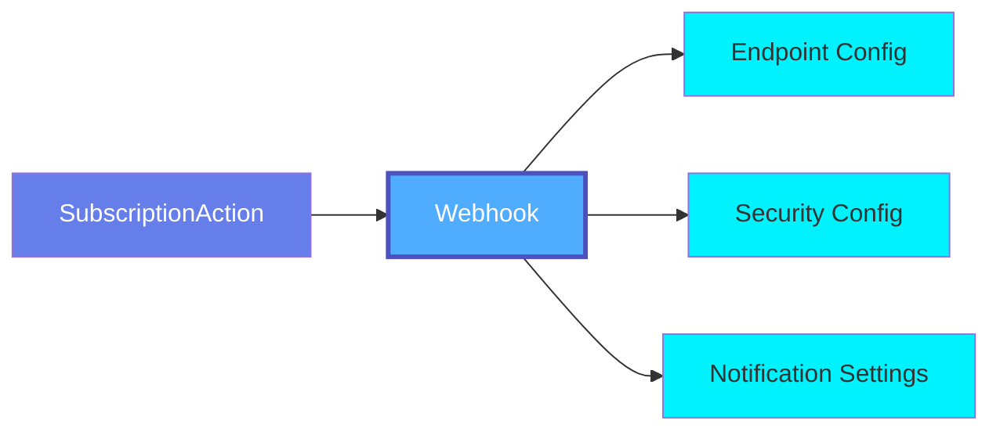

# Webhook

A **Webhook** in OpenMetadata is a subscription action configuration that defines how to send HTTP callbacks to external systems when events occur. It serves as a delivery mechanism within OpenMetadata's event subscription system.

## Overview

The Webhook schema provides configuration for:

- **HTTP Endpoint Configuration**: Define the target URL to receive event notifications
- **HTTP Method Selection**: Choose between POST (default) or PUT requests
- **Custom Headers**: Add authentication tokens and custom headers to requests
- **Query Parameters**: Include additional metadata in the webhook URL
- **HMAC Security**: Sign webhook payloads with SHA256 HMAC for verification
- **Recipient Targeting**: Control whether to notify admins, owners, or followers
- **Email Integration**: Optionally specify email receivers for notifications

As a `SubscriptionAction`, webhooks are used within:
- **Event Subscriptions**: React to entity lifecycle events (create, update, delete)
- **Alert Notifications**: Deliver data quality and operational alerts
- **Automated Workflows**: Trigger external processes based on metadata changes
- **Custom Integrations**: Connect to Slack, MS Teams, PagerDuty, or custom applications

## Hierarchy



**The Webhook schema implements the SubscriptionAction interface for delivering events.**

## Relationships

The Webhook schema is used as a configuration component in the event delivery system:

```mermaid
graph TD
    subgraph Webhook Configuration
        A[Webhook Config] --> B1[endpoint:<br/>Target URL]
        A --> B2[secretKey:<br/>HMAC Secret]
        A --> B3[headers:<br/>Custom Headers]
        A --> B4[queryParams:<br/>URL Parameters]
    end

    subgraph HTTP Settings
        A --> C1[httpMethod:<br/>POST/PUT]
    end

    subgraph Notification Settings
        A --> D1[sendToAdmins]
        A --> D2[sendToOwners]
        A --> D3[sendToFollowers]
        A --> D4[receivers:<br/>Email List]
    end

    subgraph Used By
        E1[Event Subscription] -.->|uses| A
        E2[Alert] -.->|uses| A
        E3[Notification] -.->|uses| A
    end

    subgraph Sends To
        A -.->|delivers to| F1[External System:<br/>Slack]
        A -.->|delivers to| F2[Application:<br/>Custom App]
        A -.->|delivers to| F3[Integration:<br/>PagerDuty]
        A -.->|delivers to| F4[Email Recipients]
    end

    style A fill:#4facfe,color:#fff,stroke:#4c51bf,stroke-width:3px
    style B1 fill:#00f2fe,color:#333
    style B2 fill:#00f2fe,color:#333
    style B3 fill:#00f2fe,color:#333
    style B4 fill:#00f2fe,color:#333
    style C1 fill:#00f2fe,color:#333
    style D1 fill:#43e97b,color:#333
    style D2 fill:#43e97b,color:#333
    style D3 fill:#43e97b,color:#333
    style D4 fill:#43e97b,color:#333
    style E1 fill:#667eea,color:#fff
    style E2 fill:#667eea,color:#fff
    style E3 fill:#667eea,color:#fff
    style F1 fill:#f5576c,color:#fff
    style F2 fill:#f5576c,color:#fff
    style F3 fill:#f5576c,color:#fff
    style F4 fill:#f5576c,color:#fff
```



**Key Components:**

- **Webhook Configuration**: Endpoint URL, security settings, and HTTP configuration
- **HTTP Settings**: Method selection (POST or PUT) for webhook delivery
- **Notification Settings**: Recipient targeting flags and email receivers
- **Used By**: Event subscriptions, alerts, and notifications that use webhook delivery
- **Sends To**: External systems and applications receiving webhook events

## Schema Specifications

=== "JSON Schema"

    ```json
    {
      "$id": "https://open-metadata.org/schema/entity/events/webhook.json",
      "$schema": "http://json-schema.org/draft-07/schema#",
      "title": "Webhook",
      "description": "This schema defines webhook for receiving events from OpenMetadata.",
      "type": "object",
      "javaType": "org.openmetadata.schema.type.Webhook",
      "javaInterfaces": [
        "org.openmetadata.schema.SubscriptionAction"
      ],
      "definitions": {
        "entityName": {
          "description": "Unique name of the application receiving webhook events.",
          "type": "string",
          "minLength": 1,
          "maxLength": 128,
          "pattern": "(?U)^[\\w'\\-.]+$"
        }
      },
      "properties": {
        "receivers": {
          "description": "List of receivers to send mail to",
          "type": "array",
          "items": {
            "type": "string"
          },
          "uniqueItems": true
        },
        "endpoint": {
          "description": "Endpoint to receive the webhook events over POST requests.",
          "type": "string",
          "format": "uri"
        },
        "secretKey": {
          "description": "Secret set by the webhook client used for computing HMAC SHA256 signature of webhook payload and sent in `X-OM-Signature` header in POST requests to publish the events.",
          "type": "string"
        },
        "headers": {
          "description": "Custom headers to be sent with the webhook request.",
          "type": "object",
          "existingJavaType": "java.util.Map<String, String>"
        },
        "queryParams": {
          "description": "Query parameters to be added to the webhook request URL.",
          "type": "object",
          "existingJavaType": "java.util.Map<String, String>"
        },
        "httpMethod": {
          "description": "HTTP operation to send the webhook request. Supports POST or PUT.",
          "type": "string",
          "enum": ["POST", "PUT"],
          "default": "POST"
        },
        "sendToAdmins": {
          "description": "Send the Event to Admins",
          "type": "boolean",
          "default": false
        },
        "sendToOwners": {
          "description": "Send the Event to Owners",
          "type": "boolean",
          "default": false
        },
        "sendToFollowers": {
          "description": "Send the Event to Followers",
          "type": "boolean",
          "default": false
        }
      },
      "additionalProperties": false
    }
    ```

=== "RDF (Turtle)"

    ```turtle
    @prefix om: <https://open-metadata.org/schema/> .
    @prefix om-type: <https://open-metadata.org/schema/type/> .
    @prefix om-webhook: <https://open-metadata.org/schema/entity/events/> .
    @prefix rdf: <http://www.w3.org/1999/02/22-rdf-syntax-ns#> .
    @prefix rdfs: <http://www.w3.org/2000/01/rdf-schema#> .
    @prefix owl: <http://www.w3.org/2002/07/owl#> .
    @prefix xsd: <http://www.w3.org/2001/XMLSchema#> .
    @prefix dcterms: <http://purl.org/dc/terms/> .

    # Webhook Class Definition
    om-webhook:Webhook a owl:Class ;
        rdfs:label "Webhook" ;
        rdfs:comment "Schema for receiving events from OpenMetadata" ;
        rdfs:subClassOf om-type:SubscriptionAction ;
        rdfs:isDefinedBy om: .

    # Properties
    om-webhook:receivers a owl:DatatypeProperty ;
        rdfs:label "receivers" ;
        rdfs:comment "List of receivers to send mail to" ;
        rdfs:domain om-webhook:Webhook ;
        rdfs:range xsd:string .

    om-webhook:endpoint a owl:DatatypeProperty ;
        rdfs:label "endpoint" ;
        rdfs:comment "Endpoint to receive the webhook events over POST requests" ;
        rdfs:domain om-webhook:Webhook ;
        rdfs:range xsd:anyURI .

    om-webhook:secretKey a owl:DatatypeProperty ;
        rdfs:label "secret key" ;
        rdfs:comment "Secret set by the webhook client used for computing HMAC SHA256 signature of webhook payload and sent in X-OM-Signature header" ;
        rdfs:domain om-webhook:Webhook ;
        rdfs:range xsd:string .

    om-webhook:headers a owl:DatatypeProperty ;
        rdfs:label "headers" ;
        rdfs:comment "Custom headers to be sent with the webhook request" ;
        rdfs:domain om-webhook:Webhook .

    om-webhook:queryParams a owl:DatatypeProperty ;
        rdfs:label "query parameters" ;
        rdfs:comment "Query parameters to be added to the webhook request URL" ;
        rdfs:domain om-webhook:Webhook .

    om-webhook:httpMethod a owl:DatatypeProperty ;
        rdfs:label "HTTP method" ;
        rdfs:comment "HTTP operation to send the webhook request. Supports POST or PUT" ;
        rdfs:domain om-webhook:Webhook ;
        rdfs:range xsd:string .

    om-webhook:sendToAdmins a owl:DatatypeProperty ;
        rdfs:label "send to admins" ;
        rdfs:comment "Send the Event to Admins" ;
        rdfs:domain om-webhook:Webhook ;
        rdfs:range xsd:boolean .

    om-webhook:sendToOwners a owl:DatatypeProperty ;
        rdfs:label "send to owners" ;
        rdfs:comment "Send the Event to Owners" ;
        rdfs:domain om-webhook:Webhook ;
        rdfs:range xsd:boolean .

    om-webhook:sendToFollowers a owl:DatatypeProperty ;
        rdfs:label "send to followers" ;
        rdfs:comment "Send the Event to Followers" ;
        rdfs:domain om-webhook:Webhook ;
        rdfs:range xsd:boolean .
    ```

=== "JSON-LD Context"

    ```json
    {
      "@context": {
        "@vocab": "https://open-metadata.org/schema/entity/events/",
        "rdf": "http://www.w3.org/1999/02/22-rdf-syntax-ns#",
        "rdfs": "http://www.w3.org/2000/01/rdf-schema#",
        "owl": "http://www.w3.org/2002/07/owl#",
        "xsd": "http://www.w3.org/2001/XMLSchema#",
        "dcterms": "http://purl.org/dc/terms/",
        "om": "https://open-metadata.org/schema/",

        "Webhook": {
          "@id": "om:Webhook",
          "@type": "@id"
        },
        "receivers": {
          "@id": "om:receivers",
          "@type": "xsd:string",
          "@container": "@set"
        },
        "endpoint": {
          "@id": "om:endpoint",
          "@type": "xsd:anyURI"
        },
        "secretKey": {
          "@id": "om:secretKey",
          "@type": "xsd:string"
        },
        "headers": {
          "@id": "om:headers"
        },
        "queryParams": {
          "@id": "om:queryParams"
        },
        "httpMethod": {
          "@id": "om:httpMethod",
          "@type": "xsd:string"
        },
        "sendToAdmins": {
          "@id": "om:sendToAdmins",
          "@type": "xsd:boolean"
        },
        "sendToOwners": {
          "@id": "om:sendToOwners",
          "@type": "xsd:boolean"
        },
        "sendToFollowers": {
          "@id": "om:sendToFollowers",
          "@type": "xsd:boolean"
        }
      }
    }
    ```

## Use Cases

### Slack Notifications

Send notifications to Slack webhook endpoint:

```json
{
  "endpoint": "https://hooks.slack.com/services/XXX/YYY/ZZZ",
  "headers": {
    "Content-Type": "application/json"
  },
  "httpMethod": "POST",
  "sendToAdmins": false,
  "sendToOwners": false,
  "sendToFollowers": false
}
```

### Data Quality Alerts

Send webhook notifications to PagerDuty:

```json
{
  "endpoint": "https://events.pagerduty.com/v2/enqueue",
  "headers": {
    "Authorization": "Token token=YOUR_API_KEY",
    "Content-Type": "application/json"
  },
  "httpMethod": "POST",
  "sendToAdmins": true,
  "sendToOwners": true,
  "sendToFollowers": false
}
```

### Custom Application Integration

Integrate with a custom application with HMAC signature:

```json
{
  "endpoint": "https://api.company.com/metadata/webhook",
  "secretKey": "your-hmac-secret-key",
  "headers": {
    "Authorization": "Bearer YOUR_TOKEN",
    "X-Custom-Header": "value"
  },
  "httpMethod": "POST",
  "sendToAdmins": false,
  "sendToOwners": false,
  "sendToFollowers": false
}
```

### Microsoft Teams Notifications

Send notifications to MS Teams:

```json
{
  "endpoint": "https://outlook.office.com/webhook/XXX",
  "headers": {
    "Content-Type": "application/json"
  },
  "httpMethod": "POST",
  "sendToAdmins": true,
  "sendToOwners": false,
  "sendToFollowers": false
}
```

### Owner and Follower Notifications

Notify entity owners and followers:

```json
{
  "endpoint": "https://api.company.com/notifications",
  "headers": {
    "Content-Type": "application/json"
  },
  "httpMethod": "POST",
  "sendToAdmins": false,
  "sendToOwners": true,
  "sendToFollowers": true
}
```

### Email Notifications with Receivers

Send email notifications to multiple receivers:

```json
{
  "receivers": [
    "admin@company.com",
    "data-team@company.com"
  ],
  "endpoint": "https://api.company.com/email-webhook",
  "headers": {
    "Content-Type": "application/json"
  },
  "httpMethod": "POST",
  "sendToAdmins": true,
  "sendToOwners": true,
  "sendToFollowers": false
}
```

### Webhook with Query Parameters and PUT Method

Configure webhook with custom query parameters using PUT:

```json
{
  "endpoint": "https://api.example.com/webhook",
  "queryParams": {
    "apiVersion": "v2",
    "source": "openmetadata",
    "format": "json"
  },
  "headers": {
    "Authorization": "Bearer YOUR_TOKEN",
    "Content-Type": "application/json"
  },
  "secretKey": "hmac-secret-key",
  "httpMethod": "PUT",
  "sendToAdmins": false,
  "sendToOwners": true,
  "sendToFollowers": true
}
```

## Webhook Configuration Properties

The webhook schema defines the configuration for receiving events from OpenMetadata:

| Property | Type | Required | Description |
|----------|------|----------|-------------|
| **receivers** | array[string] | No | List of email receivers to send notifications to |
| **endpoint** | string (URI) | No | Endpoint to receive webhook events over POST/PUT requests |
| **secretKey** | string | No | Secret key for computing HMAC SHA256 signature sent in `X-OM-Signature` header |
| **headers** | object | No | Custom headers to be sent with the webhook request |
| **queryParams** | object | No | Query parameters to be added to the webhook request URL |
| **httpMethod** | enum | No | HTTP operation to send the webhook request (POST or PUT), default: POST |
| **sendToAdmins** | boolean | No | Send the event to admins, default: false |
| **sendToOwners** | boolean | No | Send the event to entity owners, default: false |
| **sendToFollowers** | boolean | No | Send the event to entity followers, default: false |

## Webhook Payload

Example webhook payload sent to the configured endpoint:

```json
{
  "eventId": "123e4567-e89b-12d3-a456-426614174000",
  "eventType": "entityUpdated",
  "timestamp": 1705320000000,
  "entity": {
    "id": "456e7890-e89b-12d3-a456-426614174111",
    "type": "table",
    "name": "customers",
    "fullyQualifiedName": "snowflake_prod.sales.public.customers",
    "description": "Customer information table",
    "owner": {
      "type": "user",
      "name": "john.doe"
    },
    "tags": [
      {
        "tagFQN": "PII.Sensitive"
      }
    ]
  },
  "changeDescription": {
    "fieldsAdded": [],
    "fieldsUpdated": [
      {
        "name": "tags",
        "oldValue": [],
        "newValue": [
          {
            "tagFQN": "PII.Sensitive"
          }
        ]
      }
    ],
    "fieldsDeleted": []
  }
}
```

## Security

### HMAC Signature Verification

Webhooks include an HMAC SHA256 signature in the `X-OM-Signature` header when a `secretKey` is configured:

```python
import hmac
import hashlib

def verify_signature(payload, signature, secret_key):
    """
    Verify HMAC SHA256 signature from X-OM-Signature header

    Args:
        payload: The raw request body as string
        signature: The signature from X-OM-Signature header
        secret_key: The secretKey configured in webhook

    Returns:
        True if signature is valid, False otherwise
    """
    expected = hmac.new(
        secret_key.encode('utf-8'),
        payload.encode('utf-8'),
        hashlib.sha256
    ).hexdigest()
    return hmac.compare_digest(f"sha256={expected}", signature)
```

### Authentication Headers

Add custom authentication headers in the webhook configuration:

```json
{
  "endpoint": "https://api.company.com/webhook",
  "headers": {
    "Authorization": "Bearer YOUR_TOKEN",
    "X-API-Key": "YOUR_API_KEY"
  }
}
```

## Best Practices

### 1. Implement Idempotency
Handle duplicate events gracefully using the `eventId` in the payload.

### 2. Verify Signatures
Always verify HMAC SHA256 signatures from the `X-OM-Signature` header when using `secretKey` to ensure authenticity.

### 3. Handle Retries
Implement retry logic on the receiver side for transient failures and return appropriate HTTP status codes.

### 4. Secure Endpoints
Always use HTTPS endpoints and include authentication headers for secure webhook delivery.

### 5. Use Query Parameters
Leverage `queryParams` to add metadata or routing information to webhook requests.

### 6. Configure Notification Recipients
Use `sendToAdmins`, `sendToOwners`, and `sendToFollowers` flags to control who receives notifications.

### 7. Test Before Production
Test webhook configuration with a test endpoint before enabling in production.

### 8. Monitor Webhook Deliveries
Track webhook delivery success rates and monitor for failures in your receiving application.

## Integration with Subscriptions

The webhook schema is used as a `SubscriptionAction` in OpenMetadata's event subscription system. When configuring event subscriptions (alerts, notifications, etc.), you can specify webhook as the delivery mechanism with the properties defined in this schema.

Example usage in a subscription configuration:

```json
{
  "name": "TableChangeSubscription",
  "alertType": "notification",
  "trigger": {
    "entities": ["table"],
    "events": ["entityCreated", "entityUpdated"]
  },
  "destinations": [
    {
      "type": "webhook",
      "config": {
        "endpoint": "https://hooks.slack.com/services/XXX/YYY/ZZZ",
        "headers": {
          "Content-Type": "application/json"
        },
        "httpMethod": "POST",
        "secretKey": "your-secret-key",
        "sendToOwners": true
      }
    }
  ]
}
```

---

## HTTP Methods

The webhook configuration supports two HTTP methods:

### POST (Default)
Most webhook endpoints use POST to receive events. This is the default method.

```json
{
  "endpoint": "https://api.example.com/webhook",
  "httpMethod": "POST"
}
```

### PUT
Some systems may require PUT for idempotent event delivery:

```json
{
  "endpoint": "https://api.example.com/webhook",
  "httpMethod": "PUT"
}
```

## Related Schemas

- **[Event Subscription](./subscription.md)**: Subscription system that uses webhook as an action
- **[Alert](../data-quality/alert.md)**: Alerts that can use webhook for notifications
- **[Notification](./notification.md)**: Notification system that delivers via webhooks
- **[SubscriptionAction](./subscription-action.md)**: Parent interface for webhook configuration
