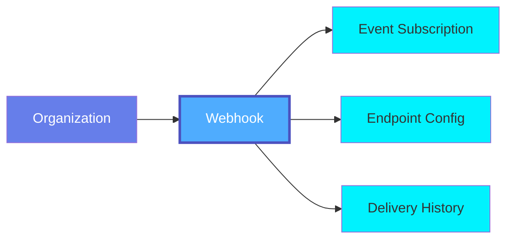

# Webhook

A **Webhook** in OpenMetadata enables real-time event notifications by sending HTTP callbacks to external systems when specific events occur. Webhooks allow integration with third-party tools, custom applications, and workflow automation platforms.

## Overview

Webhooks in OpenMetadata provide:

- **Real-time Notifications**: Instant delivery of event notifications as they occur
- **Event Filtering**: Subscribe to specific event types (entity created, updated, deleted)
- **Custom Integration**: Connect to any HTTP endpoint that can receive POST requests
- **Flexible Payloads**: Send complete entity metadata or customized payloads
- **Retry Logic**: Automatic retries on delivery failures with exponential backoff
- **Security**: Support for authentication headers, HMAC signatures, and SSL verification

Webhook events include:
- **Entity Lifecycle**: Create, update, delete events for all entity types
- **Metadata Changes**: Schema changes, ownership changes, tag updates
- **Data Quality**: Test results, quality alerts, anomaly detection
- **Access Events**: User access, policy violations
- **Pipeline Events**: Ingestion status, pipeline failures
- **Custom Events**: Application-specific events

## Hierarchy



**Click on any node to learn more about that entity.**

## Relationships

Webhooks have relationships with various entities in the metadata ecosystem:

```mermaid
graph TD
    subgraph Webhook Configuration
        A[Webhook:<br/>Slack Notifications] --> B1[Event Filter:<br/>Table Created]
        A --> B2[Event Filter:<br/>Test Failed]
        A --> B3[Endpoint:<br/>Slack API]
        A --> B4[Auth:<br/>Bearer Token]
    end

    subgraph Event Sources
        A -.->|monitors| C1[Table:<br/>All Tables]
        A -.->|monitors| C2[TestCase:<br/>Quality Tests]
        A -.->|monitors| C3[Pipeline:<br/>ETL Pipelines]
        A -.->|monitors| C4[Domain:<br/>Sales Domain]
    end

    subgraph Destinations
        A -.->|sends to| D1[External System:<br/>Slack]
        A -.->|sends to| D2[Application:<br/>Custom App]
        A -.->|sends to| D3[Integration:<br/>PagerDuty]
    end

    subgraph Governance
        A -.->|owned by| E1[User:<br/>Integration Admin]
        A -.->|managed by| E2[Team:<br/>DevOps]
        A -.->|in domain| E3[Domain:<br/>Operations]
        A -.->|tagged with| E4[Tag:<br/>Integration]
    end

    subgraph Delivery Tracking
        A -.->|generates| F1[DeliveryLog:<br/>2024-01-15 10:30]
        A -.->|generates| F2[DeliveryLog:<br/>2024-01-15 11:45]
        F1 -.->|status| G1[Success]
        F2 -.->|status| G2[Failed/Retry]
    end

    subgraph Related Webhooks
        A -.->|triggers| H1[Webhook:<br/>Downstream Alert]
        A -.->|fallback for| H2[Webhook:<br/>Backup Channel]
    end

    style A fill:#4facfe,color:#fff,stroke:#4c51bf,stroke-width:3px
    style B1 fill:#00f2fe,color:#333
    style B2 fill:#00f2fe,color:#333
    style B3 fill:#00f2fe,color:#333
    style B4 fill:#00f2fe,color:#333
    style C1 fill:#764ba2,color:#fff
    style C2 fill:#764ba2,color:#fff
    style C3 fill:#764ba2,color:#fff
    style C4 fill:#764ba2,color:#fff
    style D1 fill:#f5576c,color:#fff
    style D2 fill:#f5576c,color:#fff
    style D3 fill:#f5576c,color:#fff
    style E1 fill:#43e97b,color:#333
    style E2 fill:#43e97b,color:#333
    style E3 fill:#f093fb,color:#333
    style E4 fill:#fa709a,color:#fff
    style F1 fill:#ffd700,color:#333
    style F2 fill:#ffd700,color:#333
    style G1 fill:#43e97b,color:#333
    style G2 fill:#f5576c,color:#fff
    style H1 fill:#667eea,color:#fff
    style H2 fill:#667eea,color:#fff

    click A "#webhook" "Webhook"
    click C1 "../../data-assets/databases/table/" "Table"
    click C2 "../../data-quality/test-case/" "Test Case"
    click C3 "../../data-assets/pipelines/pipeline/" "Pipeline"
    click C4 "../../domains/domain/" "Domain"
    click E1 "../../teams-users/user/" "User"
    click E2 "../../teams-users/team/" "Team"
    click E3 "../../domains/domain/" "Domain"
    click E4 "../../governance/tag/" "Tag"
```



**Key Relationships:**

- **Webhook Configuration**: Event filters, endpoint configuration, and authentication
- **Event Sources**: Entities being monitored (Tables, Tests, Pipelines, Domains)
- **Destinations**: External systems receiving webhook notifications
- **Governance**: Ownership, team management, domain assignment, tags
- **Delivery Tracking**: Logs of webhook deliveries with success/failure status
- **Related Webhooks**: Triggered webhooks and fallback channels

## Schema Specifications

=== "JSON Schema"

    ```json
    {
      "$id": "https://open-metadata.org/schema/entity/events/webhook.json",
      "$schema": "http://json-schema.org/draft-07/schema#",
      "title": "Webhook",
      "description": "A Webhook enables real-time event notifications via HTTP callbacks.",
      "type": "object",
      "javaType": "org.openmetadata.schema.entity.events.Webhook",
      "javaInterfaces": [
        "org.openmetadata.schema.EntityInterface"
      ],
      "definitions": {
        "webhookType": {
          "description": "Type of webhook",
          "type": "string",
          "enum": [
            "Generic",
            "Slack",
            "MSTeams",
            "GoogleChat",
            "Custom"
          ],
          "javaEnums": [
            {
              "name": "Generic"
            },
            {
              "name": "Slack"
            },
            {
              "name": "MSTeams"
            },
            {
              "name": "GoogleChat"
            },
            {
              "name": "Custom"
            }
          ]
        },
        "status": {
          "description": "Status of the webhook",
          "type": "string",
          "enum": [
            "active",
            "disabled",
            "failed",
            "awaitingRetry",
            "retryLimitReached"
          ]
        },
        "eventFilter": {
          "type": "object",
          "description": "Filter for webhook events",
          "properties": {
            "eventType": {
              "description": "Type of event to subscribe to",
              "type": "string",
              "enum": [
                "entityCreated",
                "entityUpdated",
                "entitySoftDeleted",
                "entityDeleted"
              ]
            },
            "entities": {
              "description": "List of entities to filter",
              "type": "array",
              "items": {
                "type": "string"
              }
            },
            "include": {
              "description": "Filters to include entities",
              "type": "array",
              "items": {
                "type": "string"
              }
            },
            "exclude": {
              "description": "Filters to exclude entities",
              "type": "array",
              "items": {
                "type": "string"
              }
            }
          },
          "required": [
            "eventType"
          ],
          "additionalProperties": false
        },
        "failureDetails": {
          "type": "object",
          "description": "Details of webhook delivery failures",
          "properties": {
            "lastFailedAt": {
              "description": "Timestamp of last failure",
              "$ref": "../../../type/basic.json#/definitions/timestamp"
            },
            "lastFailedStatusCode": {
              "description": "HTTP status code of last failure",
              "type": "integer"
            },
            "lastFailedReason": {
              "description": "Reason for last failure",
              "type": "string"
            },
            "nextAttempt": {
              "description": "Timestamp of next retry attempt",
              "$ref": "../../../type/basic.json#/definitions/timestamp"
            }
          }
        },
        "webhookConfig": {
          "type": "object",
          "description": "Configuration for webhook endpoint",
          "properties": {
            "endpoint": {
              "description": "HTTP endpoint URL",
              "type": "string",
              "format": "uri"
            },
            "secretKey": {
              "description": "Secret key for HMAC signature",
              "type": "string"
            },
            "sendToAdmins": {
              "description": "Send notifications to all admins",
              "type": "boolean",
              "default": false
            },
            "sendToOwners": {
              "description": "Send notifications to entity owners",
              "type": "boolean",
              "default": false
            },
            "sendToFollowers": {
              "description": "Send notifications to entity followers",
              "type": "boolean",
              "default": false
            },
            "headers": {
              "description": "Custom headers to include in requests",
              "type": "object",
              "additionalProperties": {
                "type": "string"
              }
            },
            "timeout": {
              "description": "Request timeout in seconds",
              "type": "integer",
              "default": 10
            }
          },
          "required": [
            "endpoint"
          ],
          "additionalProperties": false
        }
      },
      "properties": {
        "id": {
          "description": "Unique identifier of the webhook",
          "$ref": "../../../type/basic.json#/definitions/uuid"
        },
        "name": {
          "description": "Name that identifies this webhook",
          "$ref": "../../../type/basic.json#/definitions/entityName"
        },
        "fullyQualifiedName": {
          "description": "Fully qualified name of the webhook",
          "$ref": "../../../type/basic.json#/definitions/fullyQualifiedEntityName"
        },
        "displayName": {
          "description": "Display name for the webhook",
          "type": "string"
        },
        "description": {
          "description": "Description of the webhook",
          "$ref": "../../../type/basic.json#/definitions/markdown"
        },
        "webhookType": {
          "$ref": "#/definitions/webhookType"
        },
        "status": {
          "$ref": "#/definitions/status"
        },
        "enabled": {
          "description": "Is the webhook enabled",
          "type": "boolean",
          "default": true
        },
        "batchSize": {
          "description": "Maximum number of events to send in a batch",
          "type": "integer",
          "default": 10
        },
        "eventFilters": {
          "description": "Filters for events to trigger webhook",
          "type": "array",
          "items": {
            "$ref": "#/definitions/eventFilter"
          }
        },
        "webhookConfig": {
          "$ref": "#/definitions/webhookConfig"
        },
        "failureDetails": {
          "$ref": "#/definitions/failureDetails"
        },
        "owner": {
          "description": "Owner of this webhook",
          "$ref": "../../../type/entityReference.json"
        },
        "tags": {
          "description": "Tags for this webhook",
          "type": "array",
          "items": {
            "$ref": "../../../type/tagLabel.json"
          },
          "default": null
        },
        "version": {
          "description": "Metadata version of the entity",
          "$ref": "../../../type/entityHistory.json#/definitions/entityVersion"
        },
        "updatedAt": {
          "description": "Last update time corresponding to the new version of the entity in Unix epoch time milliseconds",
          "$ref": "../../../type/basic.json#/definitions/timestamp"
        },
        "updatedBy": {
          "description": "User who made the update",
          "type": "string"
        },
        "href": {
          "description": "Link to this webhook resource",
          "$ref": "../../../type/basic.json#/definitions/href"
        },
        "changeDescription": {
          "description": "Change that led to this version of the entity",
          "$ref": "../../../type/entityHistory.json#/definitions/changeDescription"
        },
        "deleted": {
          "description": "When true indicates the entity has been soft deleted",
          "type": "boolean",
          "default": false
        },
        "domain": {
          "description": "Domain the webhook belongs to",
          "$ref": "../../../type/entityReference.json"
        }
      },
      "required": [
        "id",
        "name",
        "webhookType",
        "eventFilters",
        "webhookConfig"
      ],
      "additionalProperties": false
    }
    ```

=== "RDF (Turtle)"

    ```turtle
    @prefix om: <https://open-metadata.org/schema/> .
    @prefix om-entity: <https://open-metadata.org/schema/entity/> .
    @prefix om-webhook: <https://open-metadata.org/schema/entity/events/> .
    @prefix rdf: <http://www.w3.org/1999/02/22-rdf-syntax-ns#> .
    @prefix rdfs: <http://www.w3.org/2000/01/rdf-schema#> .
    @prefix owl: <http://www.w3.org/2002/07/owl#> .
    @prefix xsd: <http://www.w3.org/2001/XMLSchema#> .
    @prefix dcterms: <http://purl.org/dc/terms/> .
    @prefix skos: <http://www.w3.org/2004/02/skos/core#> .
    @prefix prov: <http://www.w3.org/ns/prov#> .

    # Webhook Class Definition
    om-webhook:Webhook a owl:Class ;
        rdfs:label "Webhook" ;
        rdfs:comment "Real-time event notification mechanism via HTTP callbacks" ;
        rdfs:subClassOf om-entity:Entity ;
        rdfs:isDefinedBy om: .

    # Webhook Type Class
    om-webhook:WebhookType a owl:Class ;
        rdfs:label "Webhook Type" ;
        rdfs:comment "Type of webhook (Generic, Slack, MSTeams, etc.)" ;
        rdfs:isDefinedBy om: .

    # Event Filter Class
    om-webhook:EventFilter a owl:Class ;
        rdfs:label "Event Filter" ;
        rdfs:comment "Filter configuration for webhook events" ;
        rdfs:isDefinedBy om: .

    # Webhook Status Class
    om-webhook:WebhookStatus a owl:Class ;
        rdfs:label "Webhook Status" ;
        rdfs:comment "Status of the webhook" ;
        rdfs:isDefinedBy om: .

    # Properties
    om-webhook:webhookType a owl:ObjectProperty ;
        rdfs:label "webhook type" ;
        rdfs:comment "Type of the webhook" ;
        rdfs:domain om-webhook:Webhook ;
        rdfs:range om-webhook:WebhookType .

    om-webhook:status a owl:ObjectProperty ;
        rdfs:label "status" ;
        rdfs:comment "Current status of the webhook" ;
        rdfs:domain om-webhook:Webhook ;
        rdfs:range om-webhook:WebhookStatus .

    om-webhook:enabled a owl:DatatypeProperty ;
        rdfs:label "enabled" ;
        rdfs:comment "Indicates if the webhook is enabled" ;
        rdfs:domain om-webhook:Webhook ;
        rdfs:range xsd:boolean .

    om-webhook:endpoint a owl:DatatypeProperty ;
        rdfs:label "endpoint" ;
        rdfs:comment "HTTP endpoint URL to send events" ;
        rdfs:domain om-webhook:Webhook ;
        rdfs:range xsd:anyURI .

    om-webhook:hasEventFilter a owl:ObjectProperty ;
        rdfs:label "has event filter" ;
        rdfs:comment "Event filters for the webhook" ;
        rdfs:domain om-webhook:Webhook ;
        rdfs:range om-webhook:EventFilter .

    om-webhook:monitors a owl:ObjectProperty ;
        rdfs:label "monitors" ;
        rdfs:comment "Entities monitored by the webhook" ;
        rdfs:domain om-webhook:Webhook ;
        rdfs:range om-entity:Entity .

    om-webhook:sendsTo a owl:ObjectProperty ;
        rdfs:label "sends to" ;
        rdfs:comment "External system receiving webhook notifications" ;
        rdfs:domain om-webhook:Webhook .

    om-webhook:batchSize a owl:DatatypeProperty ;
        rdfs:label "batch size" ;
        rdfs:comment "Maximum events per batch" ;
        rdfs:domain om-webhook:Webhook ;
        rdfs:range xsd:integer .

    om-webhook:timeout a owl:DatatypeProperty ;
        rdfs:label "timeout" ;
        rdfs:comment "Request timeout in seconds" ;
        rdfs:domain om-webhook:Webhook ;
        rdfs:range xsd:integer .

    # Webhook Type Individuals
    om-webhook:Generic a om-webhook:WebhookType ;
        rdfs:label "Generic" ;
        skos:definition "Generic webhook with custom payload" .

    om-webhook:Slack a om-webhook:WebhookType ;
        rdfs:label "Slack" ;
        skos:definition "Slack-formatted webhook" .

    om-webhook:MSTeams a om-webhook:WebhookType ;
        rdfs:label "MS Teams" ;
        skos:definition "Microsoft Teams webhook" .

    om-webhook:GoogleChat a om-webhook:WebhookType ;
        rdfs:label "Google Chat" ;
        skos:definition "Google Chat webhook" .

    # Webhook Status Individuals
    om-webhook:Active a om-webhook:WebhookStatus ;
        rdfs:label "Active" ;
        skos:definition "Webhook is active and delivering events" .

    om-webhook:Disabled a om-webhook:WebhookStatus ;
        rdfs:label "Disabled" ;
        skos:definition "Webhook is disabled" .

    om-webhook:Failed a om-webhook:WebhookStatus ;
        rdfs:label "Failed" ;
        skos:definition "Webhook delivery failed" .

    om-webhook:AwaitingRetry a om-webhook:WebhookStatus ;
        rdfs:label "Awaiting Retry" ;
        skos:definition "Webhook is waiting to retry after failure" .
    ```

=== "JSON-LD Context"

    ```json
    {
      "@context": {
        "@vocab": "https://open-metadata.org/schema/entity/events/",
        "rdf": "http://www.w3.org/1999/02/22-rdf-syntax-ns#",
        "rdfs": "http://www.w3.org/2000/01/rdf-schema#",
        "owl": "http://www.w3.org/2002/07/owl#",
        "xsd": "http://www.w3.org/2001/XMLSchema#",
        "dcterms": "http://purl.org/dc/terms/",
        "skos": "http://www.w3.org/2004/02/skos/core#",
        "prov": "http://www.w3.org/ns/prov#",
        "om": "https://open-metadata.org/schema/",

        "Webhook": {
          "@id": "om:Webhook",
          "@type": "@id"
        },
        "id": {
          "@id": "om:id",
          "@type": "xsd:string"
        },
        "name": {
          "@id": "om:name",
          "@type": "xsd:string"
        },
        "fullyQualifiedName": {
          "@id": "om:fullyQualifiedName",
          "@type": "xsd:string"
        },
        "displayName": {
          "@id": "om:displayName",
          "@type": "xsd:string"
        },
        "description": {
          "@id": "dcterms:description",
          "@type": "xsd:string"
        },
        "webhookType": {
          "@id": "om:webhookType",
          "@type": "@id"
        },
        "status": {
          "@id": "om:status",
          "@type": "@id"
        },
        "enabled": {
          "@id": "om:enabled",
          "@type": "xsd:boolean"
        },
        "batchSize": {
          "@id": "om:batchSize",
          "@type": "xsd:integer"
        },
        "eventFilters": {
          "@id": "om:hasEventFilter",
          "@type": "@id",
          "@container": "@set"
        },
        "monitors": {
          "@id": "om:monitors",
          "@type": "@id",
          "@container": "@set"
        },
        "sendsTo": {
          "@id": "om:sendsTo",
          "@type": "@id"
        },
        "owner": {
          "@id": "om:owner",
          "@type": "@id"
        },
        "tags": {
          "@id": "om:tags",
          "@type": "@id",
          "@container": "@set"
        },
        "domain": {
          "@id": "om:domain",
          "@type": "@id"
        },
        "version": {
          "@id": "om:version",
          "@type": "xsd:string"
        },
        "updatedAt": {
          "@id": "dcterms:modified",
          "@type": "xsd:dateTime"
        },
        "updatedBy": {
          "@id": "prov:wasAttributedTo",
          "@type": "xsd:string"
        },
        "href": {
          "@id": "om:href",
          "@type": "xsd:anyURI"
        }
      }
    }
    ```

## Use Cases

### Slack Notifications

Send notifications to Slack when tables are created or updated:

```json
{
  "name": "SlackTableNotifications",
  "displayName": "Slack Table Notifications",
  "webhookType": "Slack",
  "description": "Notify Slack channel when tables are created or updated",
  "enabled": true,
  "eventFilters": [
    {
      "eventType": "entityCreated",
      "entities": ["table"]
    },
    {
      "eventType": "entityUpdated",
      "entities": ["table"],
      "include": ["tags", "owner", "description"]
    }
  ],
  "webhookConfig": {
    "endpoint": "https://hooks.slack.com/services/XXX/YYY/ZZZ",
    "headers": {
      "Content-Type": "application/json"
    },
    "timeout": 10
  },
  "batchSize": 1,
  "owner": {
    "type": "team",
    "name": "DataEngineering"
  }
}
```

### Data Quality Alerts

Send webhook notifications when data quality tests fail:

```json
{
  "name": "QualityTestWebhook",
  "displayName": "Data Quality Webhook",
  "webhookType": "Generic",
  "description": "Send alerts to PagerDuty when quality tests fail",
  "enabled": true,
  "eventFilters": [
    {
      "eventType": "entityUpdated",
      "entities": ["testCase"],
      "include": ["testCaseResult"]
    }
  ],
  "webhookConfig": {
    "endpoint": "https://events.pagerduty.com/v2/enqueue",
    "headers": {
      "Authorization": "Token token=YOUR_API_KEY",
      "Content-Type": "application/json"
    },
    "timeout": 15
  },
  "batchSize": 5,
  "owner": {
    "type": "team",
    "name": "DataQuality"
  },
  "tags": [
    {
      "tagFQN": "Integration.PagerDuty"
    }
  ]
}
```

### Custom Application Integration

Integrate with a custom application for metadata changes:

```json
{
  "name": "CustomAppIntegration",
  "displayName": "Custom Application Webhook",
  "webhookType": "Custom",
  "description": "Send all metadata changes to custom application",
  "enabled": true,
  "eventFilters": [
    {
      "eventType": "entityCreated",
      "entities": ["*"]
    },
    {
      "eventType": "entityUpdated",
      "entities": ["*"]
    },
    {
      "eventType": "entityDeleted",
      "entities": ["*"]
    }
  ],
  "webhookConfig": {
    "endpoint": "https://api.company.com/metadata/webhook",
    "secretKey": "your-hmac-secret-key",
    "headers": {
      "Authorization": "Bearer YOUR_TOKEN",
      "X-Custom-Header": "value"
    },
    "timeout": 30
  },
  "batchSize": 10,
  "owner": {
    "type": "user",
    "name": "integration.admin"
  },
  "domain": {
    "type": "domain",
    "name": "Operations"
  }
}
```

### Microsoft Teams Notifications

Send notifications to MS Teams for critical entity changes:

```json
{
  "name": "MSTeamsAlerts",
  "displayName": "MS Teams Critical Alerts",
  "webhookType": "MSTeams",
  "description": "Send critical alerts to MS Teams",
  "enabled": true,
  "eventFilters": [
    {
      "eventType": "entityDeleted",
      "entities": ["table", "dashboard", "pipeline"]
    },
    {
      "eventType": "entityUpdated",
      "entities": ["policy"],
      "include": ["rules"]
    }
  ],
  "webhookConfig": {
    "endpoint": "https://outlook.office.com/webhook/XXX",
    "timeout": 10
  },
  "batchSize": 1,
  "owner": {
    "type": "team",
    "name": "Governance"
  }
}
```

### Owner and Follower Notifications

Notify owners and followers of entity changes:

```json
{
  "name": "OwnerFollowerNotifications",
  "displayName": "Owner & Follower Notifications",
  "webhookType": "Generic",
  "description": "Notify entity owners and followers of changes",
  "enabled": true,
  "eventFilters": [
    {
      "eventType": "entityUpdated",
      "entities": ["table", "dashboard"],
      "include": ["description", "tags", "tier"]
    }
  ],
  "webhookConfig": {
    "endpoint": "https://api.company.com/notifications",
    "sendToOwners": true,
    "sendToFollowers": true,
    "timeout": 10
  },
  "batchSize": 5,
  "owner": {
    "type": "team",
    "name": "DataGovernance"
  }
}
```

### Domain-Specific Webhook

Send notifications only for specific domains:

```json
{
  "name": "SalesDomainWebhook",
  "displayName": "Sales Domain Notifications",
  "webhookType": "Slack",
  "description": "Notify Sales team of changes in Sales domain",
  "enabled": true,
  "eventFilters": [
    {
      "eventType": "entityCreated",
      "entities": ["table", "dashboard"],
      "include": ["domain:Sales"]
    },
    {
      "eventType": "entityUpdated",
      "entities": ["table", "dashboard"],
      "include": ["domain:Sales"]
    }
  ],
  "webhookConfig": {
    "endpoint": "https://hooks.slack.com/services/SALES/XXX/YYY",
    "timeout": 10
  },
  "batchSize": 3,
  "owner": {
    "type": "team",
    "name": "Sales"
  },
  "domain": {
    "type": "domain",
    "name": "Sales"
  }
}
```

## Event Types

| Event Type | Description | Example Use Case |
|------------|-------------|------------------|
| **entityCreated** | Fired when a new entity is created | Welcome notifications, auto-tagging |
| **entityUpdated** | Fired when an entity is updated | Change tracking, approval workflows |
| **entitySoftDeleted** | Fired when an entity is soft deleted | Retention workflows, archival |
| **entityDeleted** | Fired when an entity is permanently deleted | Audit logging, cleanup tasks |

## Webhook Payload

Example webhook payload sent to the endpoint:

```json
{
  "eventId": "123e4567-e89b-12d3-a456-426614174000",
  "eventType": "entityUpdated",
  "timestamp": 1705320000000,
  "entity": {
    "id": "456e7890-e89b-12d3-a456-426614174111",
    "type": "table",
    "name": "customers",
    "fullyQualifiedName": "snowflake_prod.sales.public.customers",
    "description": "Customer information table",
    "owner": {
      "type": "user",
      "name": "john.doe"
    },
    "tags": [
      {
        "tagFQN": "PII.Sensitive"
      }
    ]
  },
  "changeDescription": {
    "fieldsAdded": [],
    "fieldsUpdated": [
      {
        "name": "tags",
        "oldValue": [],
        "newValue": [
          {
            "tagFQN": "PII.Sensitive"
          }
        ]
      }
    ],
    "fieldsDeleted": []
  },
  "webhookName": "SlackTableNotifications",
  "signature": "sha256=abc123..."
}
```

## Security

### HMAC Signature Verification

Webhooks can include an HMAC signature in the `X-OpenMetadata-Signature` header:

```python
import hmac
import hashlib

def verify_signature(payload, signature, secret_key):
    expected = hmac.new(
        secret_key.encode('utf-8'),
        payload.encode('utf-8'),
        hashlib.sha256
    ).hexdigest()
    return hmac.compare_digest(f"sha256={expected}", signature)
```

### Authentication Headers

Add custom authentication headers:

```json
{
  "webhookConfig": {
    "endpoint": "https://api.company.com/webhook",
    "headers": {
      "Authorization": "Bearer YOUR_TOKEN",
      "X-API-Key": "YOUR_API_KEY"
    }
  }
}
```

## Retry Logic

Webhooks implement exponential backoff for failed deliveries:

- **Initial retry**: After 1 minute
- **Second retry**: After 5 minutes
- **Third retry**: After 15 minutes
- **Fourth retry**: After 1 hour
- **Fifth retry**: After 4 hours
- **Final retry**: After 12 hours

After all retries are exhausted, the webhook status changes to `retryLimitReached`.

## Best Practices

### 1. Use Specific Event Filters
Filter events to only what you need to avoid overwhelming your endpoint.

### 2. Implement Idempotency
Handle duplicate events gracefully using the `eventId`.

### 3. Verify Signatures
Always verify HMAC signatures to ensure authenticity.

### 4. Handle Retries
Implement retry logic on the receiver side for transient failures.

### 5. Monitor Webhook Health
Track delivery success rates and failure patterns.

### 6. Use Batching
Enable batching for high-volume events to reduce HTTP overhead.

### 7. Secure Endpoints
Use HTTPS and authentication for webhook endpoints.

### 8. Test Before Enabling
Test webhook configuration with a test endpoint before production use.

## Custom Properties

This entity supports custom properties through the `extension` field.
Common custom properties include:

- **Data Classification**: Sensitivity level
- **Cost Center**: Billing allocation
- **Retention Period**: Data retention requirements
- **Application Owner**: Owning application/team

See [Custom Properties](../metadata-specifications/custom-properties.md)
for details on defining and using custom properties.

---

## API Operations

### Create Webhook

```http
POST /api/v1/webhooks
Content-Type: application/json

{
  "name": "SampleWebhook",
  "webhookType": "Generic",
  "eventFilters": [...],
  "webhookConfig": {...}
}
```

### Get Webhook by ID

```http
GET /api/v1/webhooks/{id}
```

### Update Webhook

```http
PATCH /api/v1/webhooks/{id}
Content-Type: application/json-patch+json

[
  {
    "op": "replace",
    "path": "/enabled",
    "value": false
  }
]
```

### Delete Webhook

```http
DELETE /api/v1/webhooks/{id}
```

### List Webhooks

```http
GET /api/v1/webhooks?webhookType=Slack&status=active
```

### Test Webhook

```http
POST /api/v1/webhooks/{id}/test
```

### Get Webhook Delivery Logs

```http
GET /api/v1/webhooks/{id}/logs?startDate=2024-01-01&endDate=2024-01-31
```

## Related Entities

- **[Alert](../data-quality/alert.md)**: Alerts that can trigger webhooks
- **[Policy](../governance/policy.md)**: Policies that can send violation webhooks
- **[TestCase](../data-quality/test-case.md)**: Test cases that trigger quality webhooks
- **[Pipeline](../data-assets/pipelines/pipeline.md)**: Pipelines that send status webhooks
- **[Table](../data-assets/databases/table.md)**: Tables monitored by webhooks
- **[User](../teams-users/user.md)**: Users owning webhooks
- **[Team](../teams-users/team.md)**: Teams managing webhooks
- **[Domain](../domains/domain.md)**: Domains for organizing webhooks
