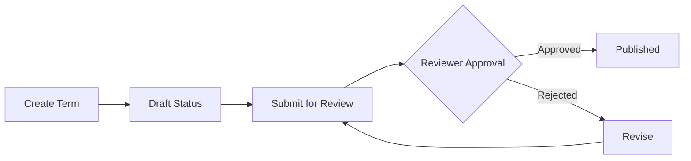

# Governance

Comprehensive governance framework for data classification, tagging, and business glossaries.

## Overview

OpenMetadata provides a robust governance framework that enables organizations to:

- **Classify data assets** using hierarchical taxonomies
- **Tag sensitive data** for compliance (PII, PHI, financial data)
- **Define business glossaries** with standardized terminology
- **Apply governance policies** consistently across all assets
- **Track data lineage** for compliance and impact analysis
- **Control access** based on classifications and tags

The governance framework integrates with all data assets, enabling consistent metadata management across databases, dashboards, pipelines, ML models, and more.

---

## Core Governance Entities

### Classifications

**Schema**: [`schemas/entity/classification/classification.json`](https://github.com/open-metadata/OpenMetadataStandards/blob/main/schemas/entity/classification/classification.json)

Classifications are hierarchical taxonomies that contain tags for categorizing data assets.

**Properties**:

- **Identity**: Name, display name, fully qualified name
- **Description**: Purpose and usage guidelines
- **Term Count**: Total number of tags in the hierarchy
- **Usage Count**: How many times tags from this classification are used
- **Provider**: System or user-defined
  - `System` - Built-in classifications (cannot be deleted)
  - `User` - Custom classifications
- **Mutually Exclusive**: Whether only one tag from this classification can be applied
- **Disabled**: Flag to disable system classifications without deleting

**Built-in System Classifications**:

1. **PII (Personally Identifiable Information)**:
   ```
   PII
   ├── PII.Sensitive
   │   ├── PII.Sensitive.Email
   │   ├── PII.Sensitive.SSN
   │   ├── PII.Sensitive.Phone
   │   ├── PII.Sensitive.Address
   │   ├── PII.Sensitive.CreditCard
   │   └── PII.Sensitive.DriversLicense
   └── PII.NonSensitive
       ├── PII.NonSensitive.Name
       ├── PII.NonSensitive.Gender
       └── PII.NonSensitive.DateOfBirth
   ```

2. **PHI (Protected Health Information)**:
   ```
   PHI
   ├── PHI.PatientID
   ├── PHI.MedicalRecordNumber
   ├── PHI.Diagnosis
   ├── PHI.Prescription
   └── PHI.HealthPlan
   ```

3. **Tier (Data Importance)**:
   ```
   Tier
   ├── Tier.Gold (Critical business data)
   ├── Tier.Silver (Important data)
   └── Tier.Bronze (Nice to have)
   ```

4. **Retention**:
   ```
   Retention
   ├── Retention.30Days
   ├── Retention.90Days
   ├── Retention.1Year
   ├── Retention.3Years
   └── Retention.7Years
   ```

5. **Compliance**:
   ```
   Compliance
   ├── Compliance.GDPR
   ├── Compliance.CCPA
   ├── Compliance.HIPAA
   ├── Compliance.SOX
   └── Compliance.PCI-DSS
   ```

**Example Classification**:

```json
{
  "name": "PII",
  "displayName": "Personally Identifiable Information",
  "description": "Tags for identifying and protecting personal data under GDPR, CCPA, and other privacy regulations",
  "provider": "System",
  "mutuallyExclusive": false,
  "disabled": false,
  "termCount": 15,
  "usageCount": 2847
}
```

---

### Tags

**Schema**: [`schemas/entity/classification/tag.json`](https://github.com/open-metadata/OpenMetadataStandards/blob/main/schemas/entity/classification/tag.json)

Tags are individual terms within classifications used to label and categorize data assets and their fields.

**Properties**:

- **Identity**:
  - Name: Simple name of the tag
  - Display Name: Human-readable name
  - Fully Qualified Name: Full path (e.g., `PII.Sensitive.Email`)

- **Organization**:
  - **Classification**: Parent classification this tag belongs to
  - **Parent**: Parent tag (for hierarchical tags)
  - **Children**: Child tags under this tag

- **Styling**: Visual appearance (color, icon)
- **Usage Count**: How many assets use this tag
- **Deprecated**: Flag for phasing out tags

**Tag Hierarchy Example**:

```json
{
  "name": "Email",
  "displayName": "Email Address",
  "fullyQualifiedName": "PII.Sensitive.Email",
  "description": "Email addresses that can identify individuals",
  "classification": {
    "id": "pii-uuid",
    "type": "classification",
    "name": "PII"
  },
  "parent": {
    "id": "sensitive-uuid",
    "type": "tag",
    "name": "Sensitive"
  },
  "style": {
    "color": "#FF6B6B",
    "iconURL": "https://example.com/icons/email.svg"
  },
  "usageCount": 234,
  "deprecated": false
}
```

**How Tags Attach to Data Assets**:

Tags can be applied at multiple levels:

1. **Asset Level** (Table, Dashboard, Pipeline, etc.):
   ```json
   {
     "name": "customers",
     "tags": [
       {"tagFQN": "Tier.Gold"},
       {"tagFQN": "Compliance.GDPR"}
     ]
   }
   ```

2. **Column Level** (for Tables):
   ```json
   {
     "name": "email",
     "dataType": "VARCHAR",
     "tags": [
       {"tagFQN": "PII.Sensitive.Email"},
       {"tagFQN": "Compliance.GDPR"}
     ]
   }
   ```

3. **Field Level** (for Topics, Containers):
   ```json
   {
     "name": "user_profile",
     "messageSchema": {
       "schemaFields": [
         {
           "name": "ssn",
           "tags": [{"tagFQN": "PII.Sensitive.SSN"}]
         }
       ]
     }
   }
   ```

---

### Glossaries

**Schema**: [`schemas/entity/data/glossary.json`](https://github.com/open-metadata/OpenMetadataStandards/blob/main/schemas/entity/data/glossary.json)

Glossaries are collections of business terms that standardize terminology across the organization.

**Properties**:

- **Identity**: Name, display name, description
- **Reviewers**: Users who approve glossary changes
- **Owners**: Users responsible for the glossary
- **Tags**: Tags applied to the glossary itself
- **Term Count**: Number of terms in the glossary
- **Usage Count**: How often terms are used

**Common Glossary Types**:

1. **Business Glossary**: Core business concepts
2. **Technical Glossary**: Technical terms and definitions
3. **Domain Glossaries**: Domain-specific terminology (Finance, Marketing, etc.)
4. **Compliance Glossary**: Regulatory and compliance terms

**Example Glossary**:

```json
{
  "name": "BusinessGlossary",
  "displayName": "Enterprise Business Glossary",
  "description": "Standardized business terminology for the organization",
  "reviewers": [
    {
      "id": "user-uuid",
      "type": "user",
      "name": "jane.smith"
    }
  ],
  "owners": [
    {
      "id": "team-uuid",
      "type": "team",
      "name": "data-governance"
    }
  ],
  "termCount": 156,
  "usageCount": 892
}
```

---

### Glossary Terms

**Schema**: [`schemas/entity/data/glossaryTerm.json`](https://github.com/open-metadata/OpenMetadataStandards/blob/main/schemas/entity/data/glossaryTerm.json)

Glossary Terms are individual business definitions within a glossary.

**Properties**:

- **Identity**:
  - Name: Preferred term name
  - Display Name: Presentation name
  - Fully Qualified Name: `glossary.parentTerm.term`

- **Definition**:
  - Description: Full business definition
  - Synonyms: Alternative names for the same concept

- **Relationships**:
  - **Glossary**: Parent glossary
  - **Parent Term**: Parent term for hierarchical organization
  - **Children**: Sub-terms under this term
  - **Related Terms**: Semantically related terms

- **References**: Links to external glossaries or standards
- **Reviewers**: Users who approve term changes
- **Owners**: Users responsible for the term
- **Tags**: Tags applied to the term
- **Status**: Draft, Approved, Deprecated

**Example Glossary Term**:

```json
{
  "name": "Customer",
  "displayName": "Customer",
  "fullyQualifiedName": "BusinessGlossary.Customer",
  "description": "An individual or organization that purchases goods or services from the company. Includes both active customers (purchased within 12 months) and inactive customers.",
  "synonyms": ["Client", "Buyer", "Purchaser"],
  "glossary": {
    "id": "glossary-uuid",
    "type": "glossary",
    "name": "BusinessGlossary"
  },
  "parent": null,
  "children": [
    {
      "id": "term-uuid-1",
      "type": "glossaryTerm",
      "name": "ActiveCustomer"
    },
    {
      "id": "term-uuid-2",
      "type": "glossaryTerm",
      "name": "InactiveCustomer"
    }
  ],
  "relatedTerms": [
    {
      "id": "term-uuid-3",
      "type": "glossaryTerm",
      "name": "Order"
    },
    {
      "id": "term-uuid-4",
      "type": "glossaryTerm",
      "name": "Revenue"
    }
  ],
  "reviewers": [
    {
      "id": "user-uuid",
      "type": "user",
      "name": "business.analyst"
    }
  ],
  "status": "Approved"
}
```

**How Glossary Terms Attach to Data Assets**:

Terms provide business context to technical assets:

```json
{
  "name": "customers",
  "description": "Customer master table",
  "glossaryTerms": [
    {"fullyQualifiedName": "BusinessGlossary.Customer"}
  ],
  "columns": [
    {
      "name": "customer_lifetime_value",
      "glossaryTerms": [
        {"fullyQualifiedName": "BusinessGlossary.CustomerLifetimeValue"}
      ]
    }
  ]
}
```

When users view the `customers` table, they see the linked business definition of "Customer", bridging technical and business understanding.

---

## Governance Workflows

### Classification and Tagging

**1. Automated Classification**:

OpenMetadata can automatically detect and tag sensitive data:

```yaml
# PII Detection Configuration
piiClassification:
  enabled: true
  patterns:
    email:
      regex: '^[a-zA-Z0-9._%+-]+@[a-zA-Z0-9.-]+\.[a-zA-Z]{2,}$'
      tag: PII.Sensitive.Email
    ssn:
      regex: '^\d{3}-\d{2}-\d{4}$'
      tag: PII.Sensitive.SSN
    creditCard:
      regex: '^\d{4}[- ]?\d{4}[- ]?\d{4}[- ]?\d{4}$'
      tag: PII.Sensitive.CreditCard
```

**2. Manual Tagging**:

Users can manually apply tags:

```json
POST /api/v1/tables/{id}/tags

{
  "tags": [
    {"tagFQN": "Tier.Gold"},
    {"tagFQN": "Compliance.GDPR"}
  ]
}
```

**3. Propagation**:

Tags can propagate through lineage:

```
Table A [PII.Sensitive.Email]
  ↓ lineage
Table B ← Inherits [PII.Sensitive.Email]
  ↓ lineage
Dashboard ← Warns about PII data
```

---

### Glossary Management

**1. Term Creation and Approval**:



**2. Term Assignment**:

```json
PATCH /api/v1/tables/{id}

{
  "glossaryTerms": [
    {
      "fullyQualifiedName": "BusinessGlossary.Customer"
    }
  ]
}
```

**3. Term Discovery**:

Users search for business terms:
- Search by term name
- Browse glossary hierarchy
- Find assets using a term
- See related terms

---

## Governance Use Cases

### Use Case 1: GDPR Compliance

**Objective**: Identify and protect all personal data under GDPR.

**Steps**:

1. **Apply PII tags** to all columns containing personal data:
   ```
   customers.email → PII.Sensitive.Email
   customers.name → PII.NonSensitive.Name
   customers.address → PII.Sensitive.Address
   ```

2. **Add compliance tag**:
   ```
   customers table → Compliance.GDPR
   ```

3. **Set retention policy**:
   ```
   customers table → Retention.3Years
   ```

4. **Configure access policy**:
   ```yaml
   policy:
     name: "GDPR Data Access"
     rules:
       - resources: ["table"]
         conditions:
           - "hasTag('Compliance.GDPR')"
         operations: ["ViewAll"]
         effect: "allow"
         principals: ["role:DataPrivacyOfficer"]
   ```

5. **Track lineage**:
   - Find all downstream assets using GDPR data
   - Apply appropriate tags and policies
   - Document data flows for GDPR Article 30

---

### Use Case 2: Data Catalog with Business Context

**Objective**: Help users find and understand data using business terminology.

**Steps**:

1. **Create business glossary**:
   ```
   BusinessGlossary
   ├── Customer
   ├── Order
   ├── Product
   ├── Revenue
   └── Churn
   ```

2. **Define each term** with clear business definitions

3. **Link terms to assets**:
   ```
   dim_customers → BusinessGlossary.Customer
   fact_orders → BusinessGlossary.Order
   churn_score → BusinessGlossary.Churn
   ```

4. **Enable discovery**:
   - Users search "Customer"
   - See glossary definition
   - Find all related tables, dashboards, ML models
   - Understand business context immediately

---

### Use Case 3: Data Tiering and Lifecycle

**Objective**: Classify data by importance and apply appropriate retention.

**Steps**:

1. **Apply tier tags**:
   ```
   Critical tables → Tier.Gold
   Important tables → Tier.Silver
   Optional tables → Tier.Bronze
   ```

2. **Set retention policies**:
   ```
   Tier.Gold → Retention.7Years
   Tier.Silver → Retention.3Years
   Tier.Bronze → Retention.90Days
   ```

3. **Configure quality checks**:
   ```
   Tier.Gold → Run tests every hour
   Tier.Silver → Run tests daily
   Tier.Bronze → Run tests weekly
   ```

4. **Allocate resources**:
   ```
   Tier.Gold → High-performance storage, daily backups
   Tier.Silver → Standard storage, weekly backups
   Tier.Bronze → Archive storage, no backups
   ```

---

### Use Case 4: Sensitive Data Discovery

**Objective**: Find all sensitive data across the organization.

**Query**:

```sql
-- Find all columns tagged with PII.Sensitive
SELECT
  table_fqn,
  column_name,
  tag_fqn
FROM column_tags
WHERE tag_fqn LIKE 'PII.Sensitive%'
```

**Results**:

```
customers.email → PII.Sensitive.Email
users.ssn → PII.Sensitive.SSN
payments.credit_card → PII.Sensitive.CreditCard
employees.salary → PII.Sensitive.Financial
```

**Actions**:

1. Review access policies for each
2. Ensure encryption at rest and in transit
3. Configure data masking for non-privileged users
4. Set up audit logging
5. Document in data map for privacy compliance

---

## Tag vs Glossary Term: When to Use

### Use Tags For:

- **Classification**: Categorizing data (PII, Tier, Compliance)
- **Technical Metadata**: Data types, formats, quality tiers
- **Policy Enforcement**: Access control, retention, encryption
- **Automated Detection**: Pattern-based tagging
- **Hierarchical Taxonomies**: Structured classification systems

**Example**: Tagging `email` column as `PII.Sensitive.Email` to enforce access policies.

### Use Glossary Terms For:

- **Business Definitions**: What "Customer" means in your organization
- **Semantic Relationships**: How "Revenue" relates to "Order"
- **Domain Knowledge**: Industry-specific terminology
- **Data Dictionary**: Standardized definitions across teams
- **User Discovery**: Helping users find data by business concept

**Example**: Linking `customers` table to the "Customer" glossary term to provide business context.

### Use Both Together:

```json
{
  "name": "customers",
  "description": "Customer master table",

  // Business context
  "glossaryTerms": [
    {"fullyQualifiedName": "BusinessGlossary.Customer"}
  ],

  // Governance and compliance
  "tags": [
    {"tagFQN": "Tier.Gold"},
    {"tagFQN": "Compliance.GDPR"}
  ],

  "columns": [
    {
      "name": "email",

      // Business meaning
      "glossaryTerms": [
        {"fullyQualifiedName": "BusinessGlossary.EmailAddress"}
      ],

      // Classification and policy
      "tags": [
        {"tagFQN": "PII.Sensitive.Email"},
        {"tagFQN": "Compliance.GDPR"}
      ]
    }
  ]
}
```

---

## Governance Metrics and Reporting

### Coverage Metrics

- **Tag Coverage**: % of assets with at least one tag
- **PII Coverage**: % of potential PII columns tagged
- **Glossary Coverage**: % of assets with glossary terms
- **Compliance Coverage**: % of assets with compliance tags

### Quality Metrics

- **Tag Accuracy**: % of correctly applied tags (via audits)
- **Term Usage**: How often each glossary term is used
- **Orphaned Terms**: Glossary terms with no asset usage
- **Deprecated Tags**: Usage of deprecated tags (should be 0)

### Compliance Metrics

- **GDPR Asset Count**: Number of assets with GDPR data
- **Retention Compliance**: % of assets with retention policies
- **Access Policy Coverage**: % of sensitive assets with policies
- **Lineage Completeness**: % of assets with documented lineage

---

## API Examples

### Create Classification

```json
POST /api/v1/classifications

{
  "name": "DataSensitivity",
  "displayName": "Data Sensitivity",
  "description": "Classification for data sensitivity levels",
  "mutuallyExclusive": true,
  "provider": "User"
}
```

### Create Tag

```json
POST /api/v1/classifications/{classificationId}/tags

{
  "name": "Confidential",
  "displayName": "Confidential",
  "description": "Highly sensitive data requiring strict access control",
  "style": {
    "color": "#FF0000"
  }
}
```

### Create Glossary

```json
POST /api/v1/glossaries

{
  "name": "BusinessGlossary",
  "displayName": "Enterprise Business Glossary",
  "description": "Standardized business terminology",
  "reviewers": [
    {"id": "user-uuid", "type": "user"}
  ]
}
```

### Create Glossary Term

```json
POST /api/v1/glossaryTerms

{
  "name": "Customer",
  "displayName": "Customer",
  "description": "An individual or organization that purchases goods or services",
  "synonyms": ["Client", "Buyer"],
  "glossary": {
    "id": "glossary-uuid",
    "type": "glossary"
  }
}
```

### Apply Tags to Table

```json
PATCH /api/v1/tables/{tableId}

{
  "tags": [
    {"tagFQN": "Tier.Gold"},
    {"tagFQN": "Compliance.GDPR"}
  ]
}
```

### Link Glossary Term to Table

```json
PATCH /api/v1/tables/{tableId}

{
  "glossaryTerms": [
    {"fullyQualifiedName": "BusinessGlossary.Customer"}
  ]
}
```

---

## Best Practices

### Classification Design

1. **Keep It Simple**: Start with essential classifications (PII, Tier, Compliance)
2. **Use Hierarchies**: Organize tags in logical parent-child relationships
3. **System vs Custom**: Use system classifications when possible, custom for specific needs
4. **Mutually Exclusive**: Set appropriately (Tier is mutually exclusive, PII is not)

### Tagging Strategy

1. **Automate When Possible**: Use pattern detection for common tags (email, SSN)
2. **Tag at Right Level**: Column-level for PII, table-level for Tier
3. **Consistent Application**: Apply tags consistently across similar assets
4. **Regular Audits**: Review and correct tag accuracy periodically

### Glossary Management

1. **Clear Definitions**: Write precise, unambiguous business definitions
2. **Approval Process**: Require review for term changes
3. **Ownership**: Assign owners to glossaries and terms
4. **Regular Review**: Update terms as business evolves
5. **Link Liberally**: Connect terms to all relevant assets

### Governance Process

1. **Start Small**: Begin with critical data domains
2. **Iterate**: Expand governance coverage incrementally
3. **Measure**: Track coverage and compliance metrics
4. **Educate**: Train users on tagging and glossary usage
5. **Automate**: Use policies to enforce governance rules

---

## Related Documentation

- **[Data Assets](entity/data-assets.md)** - Assets that governance applies to
- **[Data Quality](data-quality.md)** - Quality tests and profiling
- **[Policies and Roles](entity/policies-roles.md)** - Access control and policies
- **[Lineage](../rdf/provenance/lineage.md)** - Data lineage for compliance
- **[Teams and Users](entity/teams-users.md)** - Organizational structure
