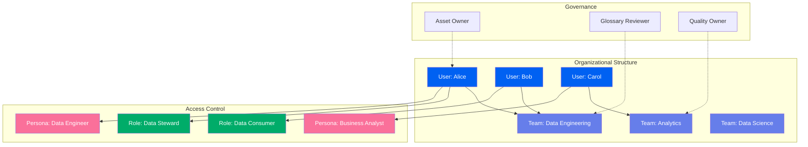
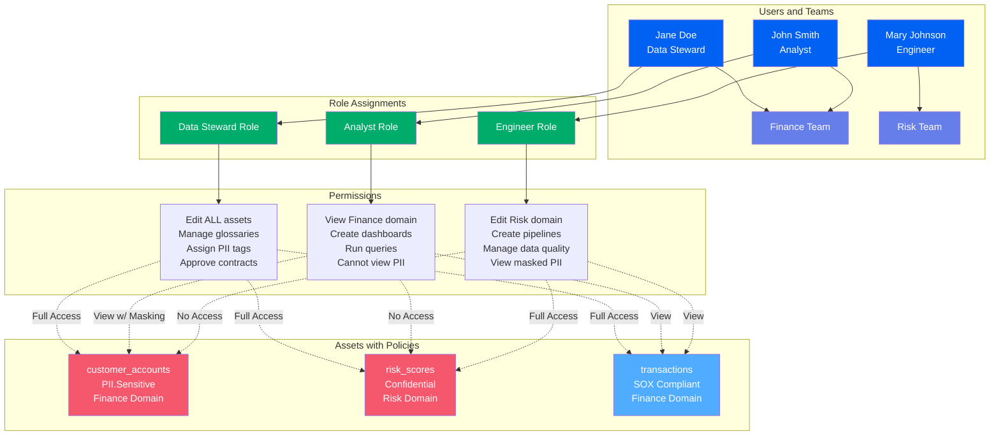
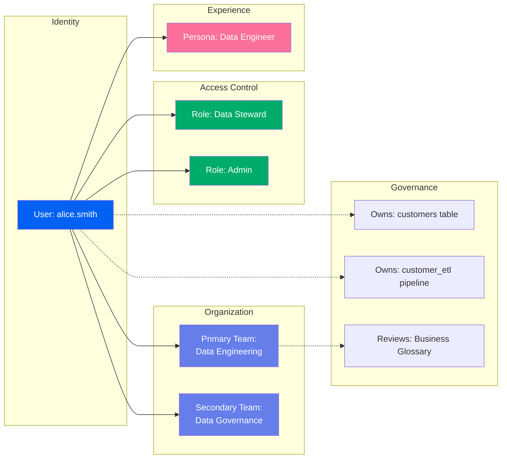
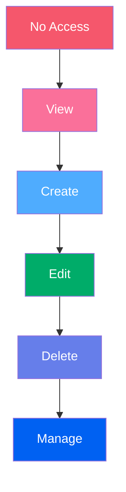

# Teams & Users

**Identity, access control, and organizational structure for data governance**

Teams & Users in OpenMetadata provide a comprehensive framework for managing identity, roles, permissions, and organizational structure. This framework enables fine-grained access control, ownership tracking, and role-based data governance across your entire data ecosystem.

---

## Hierarchy Overview

OpenMetadata's identity and access framework consists of four interconnected entities:



---

## Why This Hierarchy?

### User
**Purpose**: Individual person or service account with access to the data platform

A User represents an individual (or bot/service account) who interacts with data assets. Users have authentication credentials, belong to teams, have roles that grant permissions, and can own data assets.

**Examples**:

- `alice.smith` - Data engineer user account
- `bob.jones` - Analytics team member
- `airflow-prod-bot` - Service account for Airflow
- `tableau-service` - Service account for Tableau integration

**Why needed**: Users are the atomic unit of identity. Every action (creating assets, running queries, viewing dashboards) is associated with a user for:
- **Accountability**: Track who did what
- **Access Control**: Grant/deny permissions
- **Collaboration**: Enable communication and knowledge sharing
- **Auditing**: Maintain compliance records

**User Attributes**:

- **Authentication**: Email, SSO integration (OAuth, SAML)
- **Profile**: Name, bio, timezone, profile picture
- **Teams**: Team memberships
- **Roles**: Assigned roles granting permissions
- **Personas**: User archetypes for tailored experiences
- **Ownership**: Assets owned by this user

[**View User Specification →**](user.md){ .md-button }

---

### Team
**Purpose**: Organizational group of users with shared responsibilities

A Team represents a department, project group, or functional area within your organization. Teams can own data assets collectively, have assigned reviewers for governance workflows, and hierarchically organize into parent-child structures.

**Examples**:

- `DataEngineering` - Data platform team
- `Analytics` - Business analytics team
- `DataScience` - ML and data science team
- `Finance` - Finance department
- `Marketing` - Marketing department

**Why needed**: Teams enable:
- **Collective Ownership**: Assets owned by team, not individual
- **Scalability**: Manage permissions for groups, not individuals
- **Organization**: Mirror company structure in metadata
- **Responsibility**: Clear accountability for data domains
- **Continuity**: Ownership persists when individuals leave

**Team Structure**:

- **Hierarchical**: Teams can have parent teams
  ```
  DataPlatform (parent)
  ├── DataEngineering (child)
  ├── Analytics (child)
  └── DataScience (child)
  ```

- **Flat**: Teams at same level
  ```
  Sales
  Marketing
  Finance
  ```

[**View Team Specification →**](team.md){ .md-button }

---

### Role
**Purpose**: Collection of permissions defining what users can do

A Role is a set of permissions that grant access to specific operations. Roles implement role-based access control (RBAC), allowing you to grant permissions to users based on their responsibilities rather than managing individual permissions.

**Examples**:

- `DataSteward` - Can edit metadata, manage glossaries, assign tags
- `DataConsumer` - Can view assets, run queries, create dashboards
- `Admin` - Full administrative permissions
- `DataQualityManager` - Can create and manage data quality tests

**Why needed**: Roles enable:
- **Simplified Permission Management**: Assign role instead of individual permissions
- **Consistency**: Same permissions for all users with same role
- **Scalability**: Add users to roles instead of granting permissions one-by-one
- **Separation of Duties**: Ensure appropriate access levels
- **Least Privilege**: Grant minimum permissions needed

**Permission Types**:

- **View**: Read-only access to assets
- **Edit**: Modify metadata, descriptions, tags
- **Create**: Create new assets
- **Delete**: Remove assets
- **Manage**: Full control including permissions

**Permission Scope**:

- **Global**: Across all assets
- **Domain**: Within a specific domain
- **Asset**: On specific tables, dashboards, etc.

[**View Role Specification →**](role.md){ .md-button }

---

### Persona
**Purpose**: User archetype defining interface customization and recommended workflows

A Persona represents a user archetype (data engineer, analyst, scientist) that customizes the user experience. Personas tailor the UI, recommended actions, and default views to match how different user types work with data.

**Examples**:

- `DataEngineer` - Focus on pipelines, data quality, lineage
- `BusinessAnalyst` - Focus on dashboards, reports, glossaries
- `DataScientist` - Focus on ML models, feature engineering, notebooks
- `DataSteward` - Focus on governance, quality, compliance

**Why needed**: Personas enable:
- **Tailored UX**: Show relevant features to each user type
- **Productivity**: Default to most common workflows
- **Onboarding**: Guide new users to relevant features
- **Simplified Navigation**: Hide unnecessary features
- **Role Clarity**: Reinforce user's primary function

**Persona Customizations**:

- **Landing Page**: Default view when logging in
- **Navigation**: Highlighted menu items
- **Recommendations**: Suggested assets and actions
- **Tutorials**: Role-specific onboarding guides

[**View Persona Specification →**](persona.md){ .md-button }

---

## Common Patterns

### Pattern 1: Team Hierarchy

```
Organization: DataPlatform
├── Team: DataEngineering
│   ├── User: alice.smith (Lead)
│   ├── User: bob.jones (Engineer)
│   └── User: carol.white (Engineer)
├── Team: Analytics
│   ├── User: david.brown (Manager)
│   └── User: emma.davis (Analyst)
└── Team: DataScience
    ├── User: frank.miller (Scientist)
    └── User: grace.wilson (Scientist)
```

Hierarchical organization mirroring company structure.

### Pattern 2: Role-Based Permissions

```
User: alice.smith
├── Team: DataEngineering
├── Roles:
│   ├── DataSteward (can edit all metadata)
│   └── Admin (full platform access)
└── Persona: DataEngineer
```

Combine team membership with roles for fine-grained access control.

### Pattern 3: Domain Ownership

```
Domain: Sales
├── Owner: Team: Analytics
├── Assets:
│   ├── Database: sales_data (Owner: alice.smith)
│   ├── Dashboard: sales_metrics (Owner: Team: Analytics)
│   └── Glossary: SalesTerms (Owner: david.brown)
└── Reviewers:
    └── Team: DataGovernance
```

Domains owned by teams with asset-level owners and governance reviewers.

---

## Real-World Example: E-Commerce Company

Here's how an e-commerce company structures teams, users, roles, and ownership:

```mermaid
graph TB
    subgraph "Teams"
        T1[Data Platform Team]
        T2[Analytics Team]
        T3[ML Team]
        T4[Data Governance Team]

        T1 --> T1A[Data Engineering]
        T1 --> T1B[Data Infrastructure]
    end

    subgraph "Users"
        U1[Alice - Data Engineer]
        U2[Bob - Analytics Engineer]
        U3[Carol - ML Engineer]
        U4[David - Data Steward]

        U1 --> T1A
        U2 --> T2
        U3 --> T3
        U4 --> T4
    end

    subgraph "Roles & Permissions"
        R1[Data Steward Role]
        R2[Data Consumer Role]
        R3[Admin Role]

        R1 --> RP1[Edit Metadata<br/>Manage Glossaries<br/>Assign Tags]
        R2 --> RP2[View Assets<br/>Run Queries<br/>Create Dashboards]
        R3 --> RP3[Full Platform Access]

        U1 --> R1
        U1 --> R3
        U2 --> R1
        U3 --> R2
        U4 --> R1
    end

    subgraph "Personas"
        P1[Data Engineer Persona]
        P2[Business Analyst Persona]
        P3[Data Scientist Persona]

        U1 --> P1
        U2 --> P2
        U3 --> P3
    end

    subgraph "Asset Ownership"
        A1[customers table<br/>Owner: Alice]
        A2[revenue dashboard<br/>Owner: Analytics Team]
        A3[churn model<br/>Owner: Carol]
        A4[Business Glossary<br/>Owner: Data Governance]

        U1 -.->|owns| A1
        T2 -.->|owns| A2
        U3 -.->|owns| A3
        T4 -.->|owns| A4
    end

    style T1 fill:#667eea,color:#fff
    style T2 fill:#667eea,color:#fff
    style T3 fill:#667eea,color:#fff
    style T4 fill:#667eea,color:#fff
    style U1 fill:#0061f2,color:#fff
    style U2 fill:#0061f2,color:#fff
    style U3 fill:#0061f2,color:#fff
    style U4 fill:#0061f2,color:#fff
    style R1 fill:#00ac69,color:#fff
    style R2 fill:#00ac69,color:#fff
    style R3 fill:#00ac69,color:#fff
    style P1 fill:#fa709a,color:#fff
    style P2 fill:#fa709a,color:#fff
    style P3 fill:#fa709a,color:#fff
    style A1 fill:#4facfe,color:#fff
    style A2 fill:#6900c7,color:#fff
    style A3 fill:#f5576c,color:#fff
    style A4 fill:#764ba2,color:#fff
```



**Organization Structure**:

1. **Teams**: Four primary teams aligned with company structure
   - Data Platform (with sub-teams for Engineering and Infrastructure)
   - Analytics
   - Machine Learning
   - Data Governance

2. **Users**: Individual team members with clear team assignments
   - Alice: Data engineer in Data Engineering team
   - Bob: Analytics engineer in Analytics team
   - Carol: ML engineer in ML team
   - David: Data steward in Governance team

3. **Roles**: Three primary roles with distinct permissions
   - **Data Steward**: Can edit metadata, manage governance (Alice, Bob, David)
   - **Data Consumer**: Can view and use data (Carol)
   - **Admin**: Full platform access (Alice only)

4. **Personas**: User experience tailored to role
   - **Data Engineer**: Pipeline-focused interface (Alice)
   - **Business Analyst**: Dashboard-focused interface (Bob)
   - **Data Scientist**: ML-focused interface (Carol)

5. **Ownership**: Clear accountability for assets
   - Individual ownership: Alice owns `customers` table, Carol owns ML model
   - Team ownership: Analytics team collectively owns revenue dashboard
   - Governance ownership: Data Governance owns Business Glossary

---

## Comprehensive Access Control Example

Fine-grained access control for a financial services company:



**Access Control Rules**:

1. **Jane (Data Steward)**:
   - Full access to all assets
   - Can manage governance metadata
   - Can approve data contracts
   - Can view and assign PII tags

2. **John (Analyst - Finance Team)**:
   - Can view Finance domain assets
   - PII columns automatically masked
   - Cannot access Risk domain
   - Can create dashboards and run queries

3. **Mary (Engineer - Risk Team)**:
   - Full access to Risk domain
   - Can view (but not edit) Finance assets
   - Views PII with masking
   - Can create pipelines and quality tests

**Policy Enforcement**:

- **Tag-Based**: PII tags trigger automatic masking
- **Domain-Based**: Users see only their domain by default
- **Role-Based**: Permissions determined by assigned roles
- **Asset-Based**: Individual assets can have custom policies

---

## User & Team Relationships

Understanding how users, teams, roles, and personas interact:



**Relationship Types**:

| Relationship | Description | Example |
|--------------|-------------|---------|
| **User → Team** | Team membership | alice.smith is in Data Engineering team |
| **User → Role** | Role assignment | alice.smith has Data Steward role |
| **User → Persona** | UX customization | alice.smith uses Data Engineer persona |
| **User → Asset** | Individual ownership | alice.smith owns customers table |
| **Team → Asset** | Team ownership | Data Engineering owns all ETL pipelines |
| **Team → Glossary** | Review responsibility | Data Governance reviews glossary changes |
| **Role → Permission** | Access grants | Data Steward role can edit metadata |

---

## Permission Model

OpenMetadata uses a hierarchical permission model:

### Permission Levels



| Level | Permissions |
|-------|-------------|
| **No Access** | Cannot see asset |
| **View** | Can see asset and metadata |
| **Create** | Can create new assets |
| **Edit** | Can modify metadata, add tags, descriptions |
| **Delete** | Can remove assets |
| **Manage** | Full control including permissions |

### Permission Scopes

```yaml
permissions:
  - resource: Database
    scope: ALL
    permissions: [View, Edit]
    description: "Can view and edit all databases"

  - resource: Table
    scope: DOMAIN
    domain: Finance
    permissions: [View, Edit, Delete]
    description: "Full access to Finance domain tables"

  - resource: Dashboard
    scope: OWNER
    permissions: [View, Edit, Delete, Manage]
    description: "Full control of owned dashboards"

  - resource: Glossary
    scope: SPECIFIC
    entities: [BusinessGlossary, FinanceGlossary]
    permissions: [View, Edit]
    description: "Can edit specific glossaries"
```

---

## Entity Specifications

Each entity in the teams & users framework has complete specifications:

| Entity | Description | Specification |
|--------|-------------|---------------|
| **User** | Individual identity | [View Spec](user.md) |
| **Team** | Organizational group | [View Spec](team.md) |
| **Role** | Permission collection | [View Spec](role.md) |
| **Persona** | User archetype | [View Spec](persona.md) |

Each specification includes:
- Complete field reference
- JSON Schema definition
- RDF/OWL ontology representation
- JSON-LD context and examples
- RBAC implementation details
- API operations

---

## Best Practices

### 1. Mirror Organization Structure
Create teams that match your company's organizational chart for clear ownership.

### 2. Use Team Ownership for Shared Assets
Assign team ownership rather than individual ownership for assets that outlive individual tenure.

### 3. Implement Least Privilege
Grant minimum permissions required for each role. Start restrictive, expand as needed.

### 4. Leverage Personas
Customize user experience based on primary job function to improve productivity.

### 5. Define Clear Role Boundaries
Document what each role can do and ensure roles have distinct, non-overlapping purposes.

### 6. Regular Access Reviews
Quarterly review of user roles and permissions to ensure appropriate access levels.

### 7. Service Account Management
Create service accounts (bots) for automated systems with limited, specific permissions.

### 8. Onboarding Workflows
Establish processes for granting access to new users based on role and team.

---

## Authentication & SSO

OpenMetadata supports multiple authentication methods:

### Authentication Methods

- **Basic Auth**: Username/password (development only)
- **OAuth 2.0**: Google, GitHub, Okta integration
- **SAML**: Enterprise SSO (Azure AD, Okta, OneLogin)
- **LDAP/AD**: Active Directory integration
- **JWT**: Custom token-based authentication

### SSO Configuration Example

```yaml
authentication:
  provider: okta
  config:
    clientId: ${OKTA_CLIENT_ID}
    issuer: https://company.okta.com
    audience: openmetadata
    scopes: [openid, profile, email, groups]

authorization:
  roleMapping:
    - oktaGroup: "data-engineers"
      omRole: "DataSteward"
    - oktaGroup: "analysts"
      omRole: "DataConsumer"
    - oktaGroup: "admins"
      omRole: "Admin"

teamMapping:
  - oktaGroup: "data-platform"
    omTeam: "DataEngineering"
  - oktaGroup: "analytics"
    omTeam: "Analytics"
```

---

## Next Steps

1. **Explore specifications** - Click through each entity above
2. **See examples** - Check out [teams & users examples](../examples/teams-users/index.md)
3. **Implementation guide** - Learn [how to configure RBAC](../getting-started/teams-users.md)
4. **SSO setup** - Review [authentication configuration](../getting-started/authentication.md)
