# Persona

**Job function associated with a user**

---

## Overview

The **Persona** entity defines a job function associated with a user. Examples include Data Engineer or Data Consumer as personas of users in the metadata world. Personas help categorize users based on their professional roles and responsibilities.

---

## Relationship Diagram

```mermaid
graph TB
    subgraph "Personas"
        P1[Persona<br/>Data Engineer<br/><i>Job Function</i>]
        P2[Persona<br/>Data Analyst<br/><i>Job Function</i>]
        P3[Persona<br/>Data Steward<br/><i>Job Function</i>]
        P4[Persona<br/>Data Consumer<br/><i>Default: true</i>]
    end

    subgraph "Assigned Users - Data Engineer"
        USR1[User<br/>john.doe<br/><i>Senior Data Engineer</i>]
        USR2[User<br/>jane.smith<br/><i>Data Engineer</i>]

        P1 -.->|users| USR1
        P1 -.->|users| USR2
    end

    subgraph "Assigned Users - Data Analyst"
        USR3[User<br/>alice.wilson<br/><i>Business Analyst</i>]
        USR4[User<br/>bob.analyst<br/><i>Data Analyst</i>]

        P2 -.->|users| USR3
        P2 -.->|users| USR4
    end

    subgraph "Domains - Data Engineer"
        DOM1[Domain<br/>Engineering<br/><i>Data Platform</i>]
        DOM2[Domain<br/>Infrastructure<br/><i>Core Systems</i>]

        P1 -.->|domains| DOM1
        P1 -.->|domains| DOM2
    end

    subgraph "Domains - Data Analyst"
        DOM3[Domain<br/>Analytics<br/><i>Business Intelligence</i>]
        DOM4[Domain<br/>Sales<br/><i>Sales Analytics</i>]

        P2 -.->|domains| DOM3
        P2 -.->|domains| DOM4
    end

    subgraph "UI Customization"
        UI1[UICustomization<br/>Engineer Dashboard<br/><i>Reference</i>]
        UI2[UICustomization<br/>Analyst Dashboard<br/><i>Reference</i>]

        P1 -->|uiCustomization| UI1
        P2 -->|uiCustomization| UI2
    end

    %% Styling
    classDef personaStyle fill:#EC4899,stroke:#DB2777,color:#fff,stroke-width:3px
    classDef userStyle fill:#059669,stroke:#047857,color:#fff,stroke-width:2px
    classDef domainStyle fill:#F59E0B,stroke:#D97706,color:#000,stroke-width:2px
    classDef uiStyle fill:#8B5CF6,stroke:#7C3AED,color:#fff,stroke-width:2px

    class P1,P2,P3,P4 personaStyle
    class USR1,USR2,USR3,USR4 userStyle
    class DOM1,DOM2,DOM3,DOM4 domainStyle
    class UI1,UI2 uiStyle
```



**Key Relationships:**

- **User Assignment**: Users are assigned to personas to represent their job functions
- **Domains**: Personas can be associated with specific data domains (inherited when not set)
- **UI Customization**: Personas can reference UI customization configurations
- **Default Persona**: A system-wide default persona can be set for users without assigned personas

**Example Personas:**
- **Data Engineer** - Engineers building data pipelines and infrastructure
- **Data Analyst** - Analysts performing data analysis and creating reports
- **Data Steward** - Stewards managing data governance and quality
- **Data Consumer** - General users consuming data products

---

## Schema Specifications

View the complete Persona schema in your preferred format:

=== "JSON Schema"

    **Complete JSON Schema Definition**

    ```json
    {
      "$id": "https://open-metadata.org/schema/entity/teams/persona.json",
      "$schema": "http://json-schema.org/draft-07/schema#",
      "title": "Persona",
      "description": "This schema defines the Persona entity. A `Persona` is a job function associated with a user. An Example, Data Engineer or Data Consumer is a Persona of a user in Metadata world.",
      "type": "object",
      "javaType": "org.openmetadata.schema.entity.teams.Persona",
      "javaInterfaces": ["org.openmetadata.schema.EntityInterface"],
      "properties": {
        "id": {
          "$ref": "../../type/basic.json#/definitions/uuid"
        },
        "name": {
          "description": "A unique name of Persona. Example 'data engineer'",
          "$ref": "../../type/basic.json#/definitions/entityName"
        },
        "fullyQualifiedName": {
          "description": "FullyQualifiedName same as `name`.",
          "$ref": "../../type/basic.json#/definitions/fullyQualifiedEntityName"
        },
        "displayName": {
          "description": "Name used for display purposes. Example 'Data Steward'.",
          "type": "string"
        },
        "description": {
          "description": "Description of the persona.",
          "$ref": "../../type/basic.json#/definitions/markdown"
        },
        "updatedAt": {
          "description": "Last update time corresponding to the new version of the entity in Unix epoch time milliseconds.",
          "$ref": "../../type/basic.json#/definitions/timestamp"
        },
        "updatedBy": {
          "description": "User who made the update.",
          "type": "string"
        },
        "impersonatedBy": {
          "description": "Bot user that performed the action on behalf of the actual user.",
          "$ref": "../../type/basic.json#/definitions/impersonatedBy"
        },
        "href": {
          "description": "Link to the resource corresponding to this entity.",
          "$ref": "../../type/basic.json#/definitions/href"
        },
        "uiCustomization": {
          "description": "Reference to the UI customization configuration.",
          "$ref": "../../type/entityReference.json"
        },
        "users": {
          "description": "Users that are assigned a persona.",
          "$ref": "../../type/entityReferenceList.json",
          "default": null
        },
        "version": {
          "description": "Metadata version of the entity.",
          "$ref": "../../type/entityHistory.json#/definitions/entityVersion"
        },
        "changeDescription": {
          "description": "Change that lead to this version of the entity.",
          "$ref": "../../type/entityHistory.json#/definitions/changeDescription"
        },
        "incrementalChangeDescription": {
          "description": "Change that lead to this version of the entity.",
          "$ref": "../../type/entityHistory.json#/definitions/changeDescription"
        },
        "domains": {
          "description": "Domains the asset belongs to. When not set, the asset inherits the domain from the parent it belongs to.",
          "$ref": "../../type/entityReferenceList.json"
        },
        "default": {
          "description": "When true, this persona is the system-wide default persona that will be applied to users who don't have any persona assigned or no default persona set.",
          "type": "boolean",
          "default": false
        }
      },
      "required": ["id", "name"],
      "additionalProperties": false
    }
    ```

    **[View Full JSON Schema →](https://github.com/open-metadata/OpenMetadata/blob/main/openmetadata-spec/src/main/resources/json/schema/entity/teams/persona.json)**

=== "RDF"

    **RDF/OWL Ontology Definition**

    ```turtle
    @prefix om: <https://open-metadata.org/schema/> .
    @prefix rdfs: <http://www.w3.org/2000/01/rdf-schema#> .
    @prefix owl: <http://www.w3.org/2002/07/owl#> .
    @prefix xsd: <http://www.w3.org/2001/XMLSchema#> .

    # Persona Class Definition
    om:Persona a owl:Class ;
        rdfs:subClassOf om:Entity ;
        rdfs:label "Persona" ;
        rdfs:comment "A job function associated with a user. Example: Data Engineer or Data Consumer is a Persona of a user in Metadata world." .

    # Properties
    om:personaName a owl:DatatypeProperty ;
        rdfs:domain om:Persona ;
        rdfs:range xsd:string ;
        rdfs:label "name" ;
        rdfs:comment "A unique name of Persona. Example 'data engineer'" .

    om:personaDisplayName a owl:DatatypeProperty ;
        rdfs:domain om:Persona ;
        rdfs:range xsd:string ;
        rdfs:label "displayName" ;
        rdfs:comment "Name used for display purposes. Example 'Data Steward'." .

    om:personaDescription a owl:DatatypeProperty ;
        rdfs:domain om:Persona ;
        rdfs:range xsd:string ;
        rdfs:label "description" ;
        rdfs:comment "Description of the persona" .

    om:personaDefault a owl:DatatypeProperty ;
        rdfs:domain om:Persona ;
        rdfs:range xsd:boolean ;
        rdfs:label "default" ;
        rdfs:comment "System-wide default persona applied to users without assigned personas" .

    om:hasUICustomization a owl:ObjectProperty ;
        rdfs:domain om:Persona ;
        rdfs:range om:UICustomization ;
        rdfs:label "uiCustomization" ;
        rdfs:comment "Reference to the UI customization configuration" .

    om:hasDomain a owl:ObjectProperty ;
        rdfs:domain om:Persona ;
        rdfs:range om:Domain ;
        rdfs:label "domains" ;
        rdfs:comment "Domains the persona belongs to. Inherited when not set" .

    om:hasUser a owl:ObjectProperty ;
        rdfs:domain om:Persona ;
        rdfs:range om:User ;
        rdfs:label "users" ;
        rdfs:comment "Users that are assigned a persona" .

    # Example Instance
    ex:dataEngineerPersona a om:Persona ;
        om:personaName "data_engineer" ;
        om:personaDisplayName "Data Engineer" ;
        om:personaDescription "Persona for data engineers building data pipelines and infrastructure" ;
        om:personaDefault false ;
        om:hasUICustomization ex:engineerUIConfig ;
        om:hasDomain ex:engineeringDomain ;
        om:hasUser ex:johnDoe .
    ```

    **[View Full RDF Ontology →](https://github.com/open-metadata/OpenMetadataStandards/blob/main/rdf/ontology/openmetadata.ttl)**

=== "JSON-LD"

    **JSON-LD Context and Example**

    ```json
    {
      "@context": {
        "@vocab": "https://open-metadata.org/schema/",
        "om": "https://open-metadata.org/schema/",
        "rdfs": "http://www.w3.org/2000/01/rdf-schema#",
        "xsd": "http://www.w3.org/2001/XMLSchema#",

        "Persona": "om:Persona",
        "name": {
          "@id": "om:personaName",
          "@type": "xsd:string"
        },
        "fullyQualifiedName": {
          "@id": "om:fullyQualifiedName",
          "@type": "xsd:string"
        },
        "displayName": {
          "@id": "om:personaDisplayName",
          "@type": "xsd:string"
        },
        "description": {
          "@id": "om:personaDescription",
          "@type": "xsd:string"
        },
        "default": {
          "@id": "om:personaDefault",
          "@type": "xsd:boolean"
        },
        "uiCustomization": {
          "@id": "om:hasUICustomization",
          "@type": "@id"
        },
        "domains": {
          "@id": "om:hasDomain",
          "@type": "@id",
          "@container": "@set"
        },
        "users": {
          "@id": "om:hasUser",
          "@type": "@id",
          "@container": "@set"
        },
        "updatedAt": {
          "@id": "om:updatedAt",
          "@type": "xsd:long"
        },
        "updatedBy": {
          "@id": "om:updatedBy",
          "@type": "xsd:string"
        }
      }
    }
    ```

    **Example JSON-LD Instance**:

    ```json
    {
      "@context": "https://open-metadata.org/context/persona.jsonld",
      "@type": "Persona",
      "@id": "https://example.com/personas/data_engineer",

      "name": "data_engineer",
      "fullyQualifiedName": "data_engineer",
      "displayName": "Data Engineer",
      "description": "Persona for data engineers building data pipelines and infrastructure",
      "default": false,

      "uiCustomization": {
        "@id": "https://example.com/ui-customization/engineer-dashboard",
        "@type": "UICustomization"
      },

      "domains": [
        {
          "@id": "https://example.com/domains/engineering",
          "@type": "Domain",
          "name": "Engineering"
        },
        {
          "@id": "https://example.com/domains/infrastructure",
          "@type": "Domain",
          "name": "Infrastructure"
        }
      ],

      "users": [
        {
          "@id": "https://example.com/users/john.doe",
          "@type": "User",
          "name": "john.doe"
        },
        {
          "@id": "https://example.com/users/jane.smith",
          "@type": "User",
          "name": "jane.smith"
        }
      ],

      "updatedAt": 1704240000000,
      "updatedBy": "admin"
    }
    ```

    **[View Full JSON-LD Context →](https://github.com/open-metadata/OpenMetadataStandards/blob/main/rdf/contexts/persona.jsonld)**

---

## Use Cases

- Categorize users by their job function (e.g., Data Engineer, Data Consumer)
- Associate users with specific personas for role-based organization
- Link personas to relevant data domains for domain-based access patterns
- Reference UI customization configurations for persona-specific interfaces
- Set system-wide default persona for users without assigned personas
- Track and manage user job functions across the organization

---

## JSON Schema Specification

### Core Properties

#### `id` (uuid)
**Type**: `string` (UUID format)
**Required**: Yes (system-generated)
**Description**: Unique identifier for this persona instance
**Reference**: `../../type/basic.json#/definitions/uuid`

```json
{
  "id": "e5f6a7b8-c9d0-4e1f-2a3b-4c5d6e7f8a9b"
}
```

---

#### `name` (entityName)
**Type**: `string`
**Required**: Yes
**Description**: A unique name of Persona. Example 'data engineer'
**Reference**: `../../type/basic.json#/definitions/entityName`

```json
{
  "name": "data_engineer"
}
```

---

#### `fullyQualifiedName` (fullyQualifiedEntityName)
**Type**: `string`
**Required**: No (system-generated)
**Description**: FullyQualifiedName same as `name`.
**Reference**: `../../type/basic.json#/definitions/fullyQualifiedEntityName`

```json
{
  "fullyQualifiedName": "data_engineer"
}
```

---

#### `displayName`
**Type**: `string`
**Required**: No
**Description**: Name used for display purposes. Example 'Data Steward'.

```json
{
  "displayName": "Data Engineer"
}
```

---

#### `description` (markdown)
**Type**: `string` (Markdown format)
**Required**: No
**Description**: Description of the persona.
**Reference**: `../../type/basic.json#/definitions/markdown`

```json
{
  "description": "Persona for data engineers building data pipelines and infrastructure"
}
```

---

#### `href`
**Type**: `string` (URI format)
**Required**: No (system-generated)
**Description**: Link to the resource corresponding to this entity.
**Reference**: `../../type/basic.json#/definitions/href`

```json
{
  "href": "https://example.com/api/v1/personas/e5f6a7b8-c9d0-4e1f-2a3b-4c5d6e7f8a9b"
}
```

---

### Configuration Properties

#### `default`
**Type**: `boolean`
**Required**: No
**Default**: `false`
**Description**: When true, this persona is the system-wide default persona that will be applied to users who don't have any persona assigned or no default persona set.

```json
{
  "default": false
}
```

---

#### `uiCustomization` (EntityReference)
**Type**: `object` (EntityReference)
**Required**: No
**Description**: Reference to the UI customization configuration.
**Reference**: `../../type/entityReference.json`

```json
{
  "uiCustomization": {
    "id": "ui-config-uuid",
    "type": "uiCustomization",
    "name": "engineer_dashboard",
    "fullyQualifiedName": "engineer_dashboard"
  }
}
```

---

### Association Properties

#### `domains` (EntityReferenceList)
**Type**: `array` of Domain references
**Required**: No
**Description**: Domains the asset belongs to. When not set, the asset inherits the domain from the parent it belongs to.
**Reference**: `../../type/entityReferenceList.json`

```json
{
  "domains": [
    {
      "id": "domain-uuid-1",
      "type": "domain",
      "name": "Engineering",
      "fullyQualifiedName": "Engineering"
    },
    {
      "id": "domain-uuid-2",
      "type": "domain",
      "name": "Infrastructure",
      "fullyQualifiedName": "Infrastructure"
    }
  ]
}
```

---

#### `users` (EntityReferenceList)
**Type**: `array` of User references
**Required**: No
**Default**: `null`
**Description**: Users that are assigned a persona.
**Reference**: `../../type/entityReferenceList.json`

```json
{
  "users": [
    {
      "id": "user-uuid-1",
      "type": "user",
      "name": "john.doe",
      "displayName": "John Doe"
    },
    {
      "id": "user-uuid-2",
      "type": "user",
      "name": "jane.smith",
      "displayName": "Jane Smith"
    }
  ]
}
```

---

### Metadata Properties

#### `version` (entityVersion)
**Type**: `number`
**Required**: No (system-managed)
**Description**: Metadata version of the entity.
**Reference**: `../../type/entityHistory.json#/definitions/entityVersion`

```json
{
  "version": 0.1
}
```

---

#### `updatedAt` (timestamp)
**Type**: `integer` (Unix epoch milliseconds)
**Required**: No (system-managed)
**Description**: Last update time corresponding to the new version of the entity in Unix epoch time milliseconds.
**Reference**: `../../type/basic.json#/definitions/timestamp`

```json
{
  "updatedAt": 1704240000000
}
```

---

#### `updatedBy`
**Type**: `string`
**Required**: No (system-managed)
**Description**: User who made the update.

```json
{
  "updatedBy": "admin"
}
```

---

#### `impersonatedBy`
**Type**: `object`
**Required**: No
**Description**: Bot user that performed the action on behalf of the actual user.
**Reference**: `../../type/basic.json#/definitions/impersonatedBy`

```json
{
  "impersonatedBy": {
    "id": "bot-uuid",
    "type": "bot",
    "name": "automation_bot"
  }
}
```

---

#### `changeDescription`
**Type**: `object`
**Required**: No (system-managed)
**Description**: Change that lead to this version of the entity.
**Reference**: `../../type/entityHistory.json#/definitions/changeDescription`

```json
{
  "changeDescription": {
    "fieldsAdded": [],
    "fieldsUpdated": [
      {
        "name": "displayName",
        "oldValue": "Engineer",
        "newValue": "Data Engineer"
      }
    ],
    "fieldsDeleted": [],
    "previousVersion": 0.1
  }
}
```

---

#### `incrementalChangeDescription`
**Type**: `object`
**Required**: No (system-managed)
**Description**: Change that lead to this version of the entity.
**Reference**: `../../type/entityHistory.json#/definitions/changeDescription`

```json
{
  "incrementalChangeDescription": {
    "fieldsAdded": [],
    "fieldsUpdated": [],
    "fieldsDeleted": [],
    "previousVersion": 0.1
  }
}
```

---

## Complete Example

```json
{
  "id": "e5f6a7b8-c9d0-4e1f-2a3b-4c5d6e7f8a9b",
  "name": "data_engineer",
  "fullyQualifiedName": "data_engineer",
  "displayName": "Data Engineer",
  "description": "Persona for data engineers building data pipelines and infrastructure",
  "href": "https://example.com/api/v1/personas/e5f6a7b8-c9d0-4e1f-2a3b-4c5d6e7f8a9b",
  "default": false,
  "uiCustomization": {
    "id": "ui-config-uuid-1",
    "type": "uiCustomization",
    "name": "engineer_dashboard",
    "fullyQualifiedName": "engineer_dashboard"
  },
  "domains": [
    {
      "id": "domain-uuid-1",
      "type": "domain",
      "name": "Engineering",
      "fullyQualifiedName": "Engineering"
    },
    {
      "id": "domain-uuid-2",
      "type": "domain",
      "name": "Infrastructure",
      "fullyQualifiedName": "Infrastructure"
    }
  ],
  "users": [
    {
      "id": "user-uuid-1",
      "type": "user",
      "name": "john.doe",
      "displayName": "John Doe"
    },
    {
      "id": "user-uuid-2",
      "type": "user",
      "name": "jane.smith",
      "displayName": "Jane Smith"
    }
  ],
  "version": 0.1,
  "updatedAt": 1704240000000,
  "updatedBy": "admin"
}
```

---

## Common Persona Examples

### Data Engineer Persona

```json
{
  "id": "persona-uuid-1",
  "name": "data_engineer",
  "displayName": "Data Engineer",
  "description": "Persona for data engineers building data pipelines and infrastructure",
  "default": false,
  "domains": [
    {
      "id": "domain-uuid-1",
      "type": "domain",
      "name": "Engineering"
    }
  ],
  "uiCustomization": {
    "id": "ui-config-1",
    "type": "uiCustomization",
    "name": "engineer_dashboard"
  }
}
```

### Data Analyst Persona

```json
{
  "id": "persona-uuid-2",
  "name": "data_analyst",
  "displayName": "Data Analyst",
  "description": "Persona for data analysts performing analysis and creating reports",
  "default": false,
  "domains": [
    {
      "id": "domain-uuid-2",
      "type": "domain",
      "name": "Analytics"
    },
    {
      "id": "domain-uuid-3",
      "type": "domain",
      "name": "Sales"
    }
  ]
}
```

### Data Consumer Persona (Default)

```json
{
  "id": "persona-uuid-3",
  "name": "data_consumer",
  "displayName": "Data Consumer",
  "description": "Default persona for general data consumers",
  "default": true,
  "domains": []
}
```

### Data Steward Persona

```json
{
  "id": "persona-uuid-4",
  "name": "data_steward",
  "displayName": "Data Steward",
  "description": "Persona for data stewards managing governance and quality",
  "default": false,
  "domains": [
    {
      "id": "domain-uuid-4",
      "type": "domain",
      "name": "Governance"
    }
  ]
}
```

---

## RDF Representation

### Ontology Class

```turtle
@prefix om: <https://open-metadata.org/schema/> .
@prefix rdfs: <http://www.w3.org/2000/01/rdf-schema#> .
@prefix owl: <http://www.w3.org/2002/07/owl#> .

om:Persona a owl:Class ;
    rdfs:subClassOf om:Entity ;
    rdfs:label "Persona" ;
    rdfs:comment "A job function associated with a user" ;
    om:hasProperties [
        om:personaName "string" ;
        om:personaDisplayName "string" ;
        om:personaDescription "string" ;
        om:personaDefault "boolean" ;
        om:hasUICustomization "UICustomization" ;
        om:hasDomain "Domain[]" ;
        om:hasUser "User[]" ;
    ] .
```

### Instance Example

```turtle
@prefix om: <https://open-metadata.org/schema/> .
@prefix ex: <https://example.com/> .

ex:dataEngineerPersona a om:Persona ;
    om:personaName "data_engineer" ;
    om:personaDisplayName "Data Engineer" ;
    om:personaDescription "Persona for data engineers building data pipelines and infrastructure" ;
    om:personaDefault false ;
    om:hasUICustomization ex:engineerUIConfig ;
    om:hasDomain ex:engineeringDomain ;
    om:hasUser ex:johnDoe .
```

---

## JSON-LD Context

```json
{
  "@context": {
    "@vocab": "https://open-metadata.org/schema/",
    "Persona": "om:Persona",
    "name": "om:personaName",
    "displayName": "om:personaDisplayName",
    "description": "om:personaDescription",
    "default": {
      "@id": "om:personaDefault",
      "@type": "xsd:boolean"
    },
    "uiCustomization": {
      "@id": "om:hasUICustomization",
      "@type": "@id"
    },
    "domains": {
      "@id": "om:hasDomain",
      "@type": "@id",
      "@container": "@set"
    },
    "users": {
      "@id": "om:hasUser",
      "@type": "@id",
      "@container": "@set"
    }
  }
}
```

### JSON-LD Example

```json
{
  "@context": "https://open-metadata.org/context/persona.jsonld",
  "@type": "Persona",
  "@id": "https://example.com/personas/data_engineer",
  "name": "data_engineer",
  "displayName": "Data Engineer",
  "description": "Persona for data engineers building data pipelines and infrastructure",
  "default": false,
  "uiCustomization": {
    "@id": "https://example.com/ui-customization/engineer-dashboard",
    "@type": "UICustomization"
  },
  "domains": [
    {
      "@id": "https://example.com/domains/engineering",
      "@type": "Domain"
    }
  ],
  "users": [
    {
      "@id": "https://example.com/users/john.doe",
      "@type": "User"
    }
  ]
}
```

---

## Relationships

### Associated Entities
- **User**: Users that are assigned a persona
- **Domain**: Domains the persona belongs to (inherited when not set)
- **UICustomization**: Reference to UI customization configuration

---

## API Operations

### Create Persona

```http
POST /api/v1/personas
Content-Type: application/json

{
  "name": "data_engineer",
  "displayName": "Data Engineer",
  "description": "Persona for data engineers building data pipelines and infrastructure",
  "default": false
}
```

### Get Persona

```http
GET /api/v1/personas/name/data_engineer?fields=users,domains,uiCustomization
```

### Update Persona

```http
PATCH /api/v1/personas/{id}
Content-Type: application/json-patch+json

[
  {
    "op": "add",
    "path": "/domains/-",
    "value": {"id": "domain-uuid", "type": "domain"}
  }
]
```

### Assign Persona to Users

```http
PUT /api/v1/personas/{id}/users
Content-Type: application/json

{
  "users": [
    {"id": "user-uuid-1", "type": "user"},
    {"id": "user-uuid-2", "type": "user"}
  ]
}
```

### Set as Default Persona

```http
PATCH /api/v1/personas/{id}
Content-Type: application/json-patch+json

[
  {
    "op": "replace",
    "path": "/default",
    "value": true
  }
]
```

---

## Related Documentation

- **[User](user.md)** - User entity
- **[Domain](../governance/domain.md)** - Data domain
- **[Teams](team.md)** - Team entity
