# Persona

**User archetypes for tailored experiences and workflows**

---

## Overview

The **Persona** entity represents user archetypes that define tailored experiences, workflows, and UI preferences. Personas help customize the platform interface based on user roles and responsibilities, providing relevant features and information to different user types.

---

## Relationship Diagram

```mermaid
graph TB
    subgraph "Built-in Personas"
        ANALYST[Persona<br/>Analyst<br/><i>Data Analysis & Reporting</i>]
        ENGINEER[Persona<br/>Engineer<br/><i>Data Pipeline & Infrastructure</i>]
        SCIENTIST[Persona<br/>Scientist<br/><i>ML & Advanced Analytics</i>]
        EXECUTIVE[Persona<br/>Executive<br/><i>KPIs & Business Metrics</i>]
        STEWARD[Persona<br/>Steward<br/><i>Data Governance & Quality</i>]
    end

    subgraph "Custom Personas"
        CUSTOM1[Persona<br/>BusinessAnalyst<br/><i>Custom</i>]
        CUSTOM2[Persona<br/>ProductManager<br/><i>Custom</i>]
    end

    subgraph "Assigned Users - Analyst"
        USR1[User<br/>jane.doe<br/><i>Data Analyst</i>]
        USR2[User<br/>john.smith<br/><i>Business Analyst</i>]
        USR3[User<br/>alice.wilson<br/><i>Senior Analyst</i>]

        ANALYST -.->|assigned to| USR1
        ANALYST -.->|assigned to| USR2
        ANALYST -.->|assigned to| USR3
        USR1 -->|default persona| ANALYST
    end

    subgraph "Assigned Users - Engineer"
        USR4[User<br/>bob.engineer<br/><i>Data Engineer</i>]
        USR5[User<br/>carol.dev<br/><i>Platform Engineer</i>]

        ENGINEER -.->|assigned to| USR4
        ENGINEER -.->|assigned to| USR5
        USR4 -->|default persona| ENGINEER
    end

    subgraph "UI Preferences - Analyst Persona"
        UI1[Landing Page<br/>/dashboards<br/><i>Default View</i>]
        UI2[Favorite Views<br/>MyDashboards<br/>PopularTables<br/>RecentQueries]
        UI3[Default Filters<br/>Tier: Gold, Silver<br/>Domain: Analytics]
        UI4[Widgets<br/>Activity Feed<br/>Top Tables<br/>Trending Assets]

        ANALYST -->|configures| UI1
        ANALYST -->|configures| UI2
        ANALYST -->|configures| UI3
        ANALYST -->|configures| UI4
    end

    subgraph "Relevant Domains - Analyst"
        DOM1[Domain<br/>Analytics<br/><i>Primary Domain</i>]
        DOM2[Domain<br/>Sales<br/><i>Relevant Domain</i>]
        DOM3[Domain<br/>Marketing<br/><i>Relevant Domain</i>]

        ANALYST -.->|relevant| DOM1
        ANALYST -.->|relevant| DOM2
        ANALYST -.->|relevant| DOM3
    end

    subgraph "Featured Assets - Analyst"
        DASH1[Dashboard<br/>Sales Overview<br/><i>Tableau</i>]
        DASH2[Dashboard<br/>Customer Analytics<br/><i>Tableau</i>]
        TBL1[Table<br/>customers<br/><i>postgres_prod.public</i>]
        TBL2[Table<br/>orders<br/><i>postgres_prod.public</i>]
        TBL3[Table<br/>revenue<br/><i>postgres_prod.public</i>]

        ANALYST -.->|features| DASH1
        ANALYST -.->|features| DASH2
        ANALYST -.->|features| TBL1
        ANALYST -.->|features| TBL2
        ANALYST -.->|features| TBL3
    end

    subgraph "Recommended Workflows - Analyst"
        WF1[Workflow<br/>Create Dashboard<br/><i>6 Steps</i>]
        WF2[Workflow<br/>Explore Data<br/><i>6 Steps</i>]
        WF3[Workflow<br/>Request Access<br/><i>6 Steps</i>]
        WF4[Workflow<br/>Generate Report<br/><i>5 Steps</i>]

        ANALYST -->|recommends| WF1
        ANALYST -->|recommends| WF2
        ANALYST -->|recommends| WF3
        ANALYST -->|recommends| WF4
    end

    subgraph "Featured Assets - Engineer"
        PIPE1[Pipeline<br/>customer_etl<br/><i>Airflow</i>]
        PIPE2[Pipeline<br/>analytics_sync<br/><i>Airflow</i>]
        TBL4[Table<br/>staging_data<br/><i>postgres_dev</i>]
        CONT1[Container<br/>raw_data<br/><i>S3 Bucket</i>]

        ENGINEER -.->|features| PIPE1
        ENGINEER -.->|features| PIPE2
        ENGINEER -.->|features| TBL4
        ENGINEER -.->|features| CONT1
    end

    subgraph "Relevant Tags - Analyst"
        TAG1[Tag<br/>Tier.Gold<br/><i>High Priority</i>]
        TAG2[Tag<br/>Domain.Analytics<br/><i>Domain Tag</i>]
        TAG3[Tag<br/>Priority.High<br/><i>Business Critical</i>]
        TAG4[Tag<br/>Sensitive.PII<br/><i>Data Classification</i>]

        ANALYST -.->|relevant| TAG1
        ANALYST -.->|relevant| TAG2
        ANALYST -.->|relevant| TAG3
        ANALYST -.->|relevant| TAG4
    end

    subgraph "Featured Assets - Scientist"
        ML1[MLModel<br/>churn_predictor<br/><i>Production</i>]
        ML2[MLModel<br/>recommendation_engine<br/><i>Staging</i>]
        NB1[Notebook<br/>feature_engineering<br/><i>Jupyter</i>]
        TOPIC1[Topic<br/>model_predictions<br/><i>Kafka</i>]

        SCIENTIST -.->|features| ML1
        SCIENTIST -.->|features| ML2
        SCIENTIST -.->|features| NB1
        SCIENTIST -.->|features| TOPIC1
    end

    subgraph "UI Preferences - Executive"
        UI5[Landing Page<br/>/executive-summary<br/><i>High-level View</i>]
        UI6[Widgets<br/>Business KPIs<br/>Revenue Metrics<br/>Key Trends]

        EXECUTIVE -->|configures| UI5
        EXECUTIVE -->|configures| UI6
    end

    %% Styling
    classDef personaStyle fill:#EC4899,stroke:#DB2777,color:#fff,stroke-width:3px
    classDef customPersonaStyle fill:#F472B6,stroke:#EC4899,color:#fff,stroke-width:2px
    classDef userStyle fill:#059669,stroke:#047857,color:#fff,stroke-width:2px
    classDef uiStyle fill:#8B5CF6,stroke:#7C3AED,color:#fff,stroke-width:2px
    classDef domainStyle fill:#F59E0B,stroke:#D97706,color:#000,stroke-width:2px
    classDef dashboardStyle fill:#2563EB,stroke:#1E40AF,color:#fff,stroke-width:2px
    classDef tableStyle fill:#06B6D4,stroke:#0891B2,color:#fff,stroke-width:2px
    classDef workflowStyle fill:#10B981,stroke:#059669,color:#fff,stroke-width:2px
    classDef pipelineStyle fill:#6366F1,stroke:#4F46E5,color:#fff,stroke-width:2px
    classDef tagStyle fill:#EF4444,stroke:#DC2626,color:#fff,stroke-width:2px
    classDef mlStyle fill:#A855F7,stroke:#9333EA,color:#fff,stroke-width:2px

    class ANALYST,ENGINEER,SCIENTIST,EXECUTIVE,STEWARD personaStyle
    class CUSTOM1,CUSTOM2 customPersonaStyle
    class USR1,USR2,USR3,USR4,USR5 userStyle
    class UI1,UI2,UI3,UI4,UI5,UI6 uiStyle
    class DOM1,DOM2,DOM3 domainStyle
    class DASH1,DASH2 dashboardStyle
    class TBL1,TBL2,TBL3,TBL4 tableStyle
    class WF1,WF2,WF3,WF4 workflowStyle
    class PIPE1,PIPE2,CONT1 pipelineStyle
    class TAG1,TAG2,TAG3,TAG4 tagStyle
    class ML1,ML2,NB1,TOPIC1 mlStyle
```



**Key Relationships:**

- **User Assignment**: Users can have multiple personas, with one set as default
- **UI Preferences**: Each persona defines custom landing pages, favorite views, filters, and dashboard widgets
- **Relevant Domains**: Personas associated with specific data domains for focused access
- **Featured Assets**: Curated list of important assets for each persona type (dashboards, tables, pipelines, ML models)
- **Relevant Tags**: Tags that help filter and discover assets relevant to the persona
- **Recommended Workflows**: Step-by-step guides for common tasks specific to each persona
- **Tailored Experience**: Personas customize the entire user experience based on role and responsibilities

**Common Personas:**
- **Analyst** - Data analysts performing analysis and creating reports
- **Engineer** - Data engineers building pipelines and infrastructure
- **Scientist** - Data scientists developing ML models
- **Executive** - Executives viewing dashboards and KPIs
- **Steward** - Data stewards managing governance and quality

---

## Schema Specifications

View the complete Persona schema in your preferred format:

=== "JSON Schema"

    **Complete JSON Schema Definition**

    ```json
    {
      "$id": "https://open-metadata.org/schema/entity/teams/persona.json",
      "$schema": "http://json-schema.org/draft-07/schema#",
      "title": "Persona",
      "description": "A `Persona` represents a user archetype that defines tailored experiences and workflows.",
      "type": "object",
      "javaType": "org.openmetadata.schema.entity.teams.Persona",

      "definitions": {
        "personaType": {
          "description": "Type of persona",
          "type": "string",
          "enum": [
            "Analyst",
            "Engineer",
            "Scientist",
            "Executive",
            "Steward",
            "Custom"
          ]
        },
        "uiPreferences": {
          "type": "object",
          "properties": {
            "landingPage": {
              "type": "string",
              "description": "Default landing page"
            },
            "favoriteViews": {
              "type": "array",
              "items": {"type": "string"}
            },
            "defaultFilters": {
              "type": "object",
              "description": "Default filters for data assets"
            },
            "widgets": {
              "type": "array",
              "items": {
                "type": "object",
                "properties": {
                  "name": {"type": "string"},
                  "type": {"type": "string"},
                  "config": {"type": "object"}
                }
              }
            }
          }
        }
      },

      "properties": {
        "id": {
          "description": "Unique identifier",
          "$ref": "../../type/basic.json#/definitions/uuid"
        },
        "name": {
          "description": "Persona name",
          "$ref": "../../type/basic.json#/definitions/entityName"
        },
        "fullyQualifiedName": {
          "description": "Fully qualified persona name",
          "$ref": "../../type/basic.json#/definitions/fullyQualifiedEntityName"
        },
        "displayName": {
          "description": "Display name",
          "type": "string"
        },
        "description": {
          "description": "Persona description",
          "$ref": "../../type/basic.json#/definitions/markdown"
        },
        "personaType": {
          "$ref": "#/definitions/personaType"
        },
        "uiPreferences": {
          "$ref": "#/definitions/uiPreferences"
        },
        "domains": {
          "description": "Relevant data domains for this persona",
          "type": "array",
          "items": {
            "$ref": "../../type/entityReference.json"
          }
        },
        "featuredAssets": {
          "description": "Featured data assets for this persona",
          "type": "array",
          "items": {
            "$ref": "../../type/entityReference.json"
          }
        },
        "relevantTags": {
          "description": "Tags relevant to this persona",
          "type": "array",
          "items": {
            "$ref": "../../type/tagLabel.json"
          }
        },
        "users": {
          "description": "Users assigned to this persona",
          "type": "array",
          "items": {
            "$ref": "../../type/entityReference.json"
          }
        },
        "workflows": {
          "description": "Recommended workflows for this persona",
          "type": "array",
          "items": {
            "type": "object",
            "properties": {
              "name": {"type": "string"},
              "description": {"type": "string"},
              "steps": {
                "type": "array",
                "items": {"type": "string"}
              }
            }
          }
        },
        "version": {
          "description": "Metadata version",
          "$ref": "../../type/entityHistory.json#/definitions/entityVersion"
        }
      },

      "required": ["id", "name", "personaType"]
    }
    ```

    **[View Full JSON Schema →](https://github.com/open-metadata/OpenMetadataStandards/blob/main/schemas/entity/teams/persona.json)**

=== "RDF"

    **RDF/OWL Ontology Definition**

    ```turtle
    @prefix om: <https://open-metadata.org/schema/> .
    @prefix rdfs: <http://www.w3.org/2000/01/rdf-schema#> .
    @prefix owl: <http://www.w3.org/2001/XMLSchema#> .
    @prefix xsd: <http://www.w3.org/2001/XMLSchema#> .

    # Persona Class Definition
    om:Persona a owl:Class ;
        rdfs:subClassOf om:Entity ;
        rdfs:label "Persona" ;
        rdfs:comment "User archetype defining tailored experiences and workflows" .

    # Properties
    om:personaName a owl:DatatypeProperty ;
        rdfs:domain om:Persona ;
        rdfs:range xsd:string ;
        rdfs:label "name" ;
        rdfs:comment "Name of the persona" .

    om:personaType a owl:DatatypeProperty ;
        rdfs:domain om:Persona ;
        rdfs:range om:PersonaType ;
        rdfs:label "personaType" ;
        rdfs:comment "Type: Analyst, Engineer, Scientist, etc." .

    om:landingPage a owl:DatatypeProperty ;
        rdfs:domain om:Persona ;
        rdfs:range xsd:string ;
        rdfs:label "landingPage" ;
        rdfs:comment "Default landing page for persona" .

    om:relevantDomain a owl:ObjectProperty ;
        rdfs:domain om:Persona ;
        rdfs:range om:Domain ;
        rdfs:label "relevantDomain" ;
        rdfs:comment "Data domains relevant to this persona" .

    om:featuredAsset a owl:ObjectProperty ;
        rdfs:domain om:Persona ;
        rdfs:range om:DataAsset ;
        rdfs:label "featuredAsset" ;
        rdfs:comment "Featured assets for this persona" .

    om:relevantTag a owl:ObjectProperty ;
        rdfs:domain om:Persona ;
        rdfs:range om:Tag ;
        rdfs:label "relevantTag" ;
        rdfs:comment "Tags relevant to this persona" .

    om:assignedUser a owl:ObjectProperty ;
        rdfs:domain om:Persona ;
        rdfs:range om:User ;
        rdfs:label "assignedUser" ;
        rdfs:comment "Users assigned this persona" .

    om:hasWorkflow a owl:ObjectProperty ;
        rdfs:domain om:Persona ;
        rdfs:range om:Workflow ;
        rdfs:label "hasWorkflow" ;
        rdfs:comment "Recommended workflows" .

    # Persona Type Enumeration
    om:PersonaType a owl:Class ;
        owl:oneOf (
            om:AnalystPersona
            om:EngineerPersona
            om:ScientistPersona
            om:ExecutivePersona
            om:StewardPersona
            om:CustomPersona
        ) .

    # Example Instance
    ex:analystPersona a om:Persona ;
        om:personaName "Analyst" ;
        om:displayName "Data Analyst" ;
        om:personaType om:AnalystPersona ;
        om:landingPage "/dashboards" ;
        om:relevantDomain ex:analyticsDomain ;
        om:featuredAsset ex:salesDashboard ;
        om:assignedUser ex:janeDoe .
    ```

    **[View Full RDF Ontology →](https://github.com/open-metadata/OpenMetadataStandards/blob/main/rdf/ontology/openmetadata.ttl)**

=== "JSON-LD"

    **JSON-LD Context and Example**

    ```json
    {
      "@context": {
        "@vocab": "https://open-metadata.org/schema/",
        "om": "https://open-metadata.org/schema/",
        "rdfs": "http://www.w3.org/2000/01/rdf-schema#",
        "xsd": "http://www.w3.org/2001/XMLSchema#",

        "Persona": "om:Persona",
        "name": {
          "@id": "om:personaName",
          "@type": "xsd:string"
        },
        "fullyQualifiedName": {
          "@id": "om:fullyQualifiedName",
          "@type": "xsd:string"
        },
        "displayName": {
          "@id": "om:displayName",
          "@type": "xsd:string"
        },
        "description": {
          "@id": "om:description",
          "@type": "xsd:string"
        },
        "personaType": {
          "@id": "om:personaType",
          "@type": "@vocab"
        },
        "domains": {
          "@id": "om:relevantDomain",
          "@type": "@id",
          "@container": "@set"
        },
        "featuredAssets": {
          "@id": "om:featuredAsset",
          "@type": "@id",
          "@container": "@set"
        },
        "relevantTags": {
          "@id": "om:relevantTag",
          "@type": "@id",
          "@container": "@set"
        },
        "users": {
          "@id": "om:assignedUser",
          "@type": "@id",
          "@container": "@set"
        },
        "workflows": {
          "@id": "om:hasWorkflow",
          "@type": "@id",
          "@container": "@set"
        }
      }
    }
    ```

    **Example JSON-LD Instance**:

    ```json
    {
      "@context": "https://open-metadata.org/context/persona.jsonld",
      "@type": "Persona",
      "@id": "https://example.com/personas/analyst",

      "name": "Analyst",
      "fullyQualifiedName": "Analyst",
      "displayName": "Data Analyst",
      "description": "Persona for data analysts who create reports, perform analysis, and explore data",
      "personaType": "Analyst",

      "uiPreferences": {
        "landingPage": "/dashboards",
        "favoriteViews": ["MyDashboards", "PopularTables", "RecentQueries"],
        "defaultFilters": {
          "tags": ["Tier.Gold", "Domain.Analytics"]
        }
      },

      "domains": [
        {
          "@id": "https://example.com/domains/analytics",
          "@type": "Domain",
          "name": "Analytics"
        },
        {
          "@id": "https://example.com/domains/sales",
          "@type": "Domain",
          "name": "Sales"
        }
      ],

      "featuredAssets": [
        {
          "@id": "https://example.com/dashboards/sales-overview",
          "@type": "Dashboard",
          "name": "Sales Overview"
        },
        {
          "@id": "https://example.com/tables/customers",
          "@type": "Table",
          "name": "customers"
        }
      ],

      "users": [
        {
          "@id": "https://example.com/users/jane.doe",
          "@type": "User",
          "name": "jane.doe"
        }
      ]
    }
    ```

    **[View Full JSON-LD Context →](https://github.com/open-metadata/OpenMetadataStandards/blob/main/rdf/contexts/persona.jsonld)**

---

## Use Cases

- Customize user experience based on role and responsibilities
- Provide tailored landing pages and navigation
- Feature relevant data assets and domains
- Recommend workflows and best practices
- Configure default filters and views
- Personalize dashboard widgets and metrics
- Guide users through common tasks
- Improve discoverability of relevant resources

---

## JSON Schema Specification

### Core Properties

#### `id` (uuid)
**Type**: `string` (UUID format)
**Required**: Yes (system-generated)
**Description**: Unique identifier for this persona instance

```json
{
  "id": "e5f6a7b8-c9d0-4e1f-2a3b-4c5d6e7f8a9b"
}
```

---

#### `name` (entityName)
**Type**: `string`
**Required**: Yes
**Pattern**: `^[^.]*$` (no dots allowed)
**Min Length**: 1
**Max Length**: 128
**Description**: Persona name (unique)

```json
{
  "name": "Analyst"
}
```

---

#### `fullyQualifiedName` (fullyQualifiedEntityName)
**Type**: `string`
**Required**: Yes (system-generated)
**Description**: Fully qualified persona name

```json
{
  "fullyQualifiedName": "Analyst"
}
```

---

#### `displayName`
**Type**: `string`
**Required**: No
**Description**: Human-readable display name

```json
{
  "displayName": "Data Analyst"
}
```

---

#### `description` (markdown)
**Type**: `string` (Markdown format)
**Required**: No
**Description**: Persona description and purpose

```json
{
  "description": "# Data Analyst Persona\n\nDesigned for users who create reports, perform analysis, and explore data to derive insights."
}
```

---

### Persona Type Properties

#### `personaType` (PersonaType enum)
**Type**: `string` enum
**Required**: Yes
**Allowed Values**:

- `Analyst` - Data analysts creating reports and performing analysis
- `Engineer` - Data engineers building pipelines and infrastructure
- `Scientist` - Data scientists developing ML models
- `Executive` - Executives viewing dashboards and KPIs
- `Steward` - Data stewards managing governance and quality
- `Custom` - Custom persona type

```json
{
  "personaType": "Analyst"
}
```

---

### UI Preferences Properties

#### `uiPreferences`
**Type**: `object`
**Required**: No
**Description**: User interface customization preferences

**Properties**:

| Property | Type | Required | Description |
|----------|------|----------|-------------|
| `landingPage` | string | No | Default landing page URL |
| `favoriteViews` | string[] | No | Favorite views and pages |
| `defaultFilters` | object | No | Default filters for data assets |
| `widgets` | object[] | No | Dashboard widgets configuration |

```json
{
  "uiPreferences": {
    "landingPage": "/dashboards",
    "favoriteViews": [
      "MyDashboards",
      "PopularTables",
      "RecentQueries",
      "TrendingAssets"
    ],
    "defaultFilters": {
      "tags": ["Tier.Gold", "Domain.Analytics"],
      "tiers": ["Gold", "Silver"],
      "domains": ["Analytics", "Sales"]
    },
    "widgets": [
      {
        "name": "MyActivity",
        "type": "activity-feed",
        "config": {
          "limit": 10,
          "showFollowing": true
        }
      },
      {
        "name": "TopTables",
        "type": "popular-assets",
        "config": {
          "assetType": "table",
          "limit": 5
        }
      }
    ]
  }
}
```

---

### Relevance Properties

#### `domains[]` (EntityReference[])
**Type**: `array` of Domain references
**Required**: No
**Description**: Data domains relevant to this persona

```json
{
  "domains": [
    {
      "id": "domain-uuid-1",
      "type": "domain",
      "name": "Analytics",
      "fullyQualifiedName": "Analytics"
    },
    {
      "id": "domain-uuid-2",
      "type": "domain",
      "name": "Sales",
      "fullyQualifiedName": "Sales"
    }
  ]
}
```

---

#### `featuredAssets[]` (EntityReference[])
**Type**: `array` of asset references
**Required**: No
**Description**: Featured data assets for this persona

```json
{
  "featuredAssets": [
    {
      "id": "dashboard-uuid",
      "type": "dashboard",
      "name": "Sales Overview",
      "fullyQualifiedName": "tableau.SalesOverview"
    },
    {
      "id": "table-uuid",
      "type": "table",
      "name": "customers",
      "fullyQualifiedName": "postgres_prod.ecommerce.public.customers"
    },
    {
      "id": "pipeline-uuid",
      "type": "pipeline",
      "name": "daily_metrics_pipeline"
    }
  ]
}
```

---

#### `relevantTags[]` (TagLabel[])
**Type**: `array` of tag labels
**Required**: No
**Description**: Tags relevant to this persona

```json
{
  "relevantTags": [
    {
      "tagFQN": "Tier.Gold",
      "source": "Classification"
    },
    {
      "tagFQN": "Domain.Analytics",
      "source": "Classification"
    },
    {
      "tagFQN": "Priority.High",
      "source": "Classification"
    }
  ]
}
```

---

### User Assignment Properties

#### `users[]` (EntityReference[])
**Type**: `array` of User references
**Required**: No
**Description**: Users assigned to this persona

```json
{
  "users": [
    {
      "id": "user-uuid-1",
      "type": "user",
      "name": "jane.doe",
      "displayName": "Jane Doe"
    },
    {
      "id": "user-uuid-2",
      "type": "user",
      "name": "john.analyst",
      "displayName": "John Analyst"
    }
  ]
}
```

---

### Workflow Properties

#### `workflows[]`
**Type**: `array` of workflow objects
**Required**: No
**Description**: Recommended workflows for this persona

**Workflow Object Properties**:

| Property | Type | Required | Description |
|----------|------|----------|-------------|
| `name` | string | Yes | Workflow name |
| `description` | string | No | Workflow description |
| `steps` | string[] | Yes | Workflow steps |

```json
{
  "workflows": [
    {
      "name": "CreateDashboard",
      "description": "Steps to create a new dashboard",
      "steps": [
        "Navigate to Dashboards page",
        "Click 'Create Dashboard'",
        "Select data source",
        "Add visualizations",
        "Configure filters",
        "Save and publish"
      ]
    },
    {
      "name": "ExploreData",
      "description": "Steps to explore and analyze data",
      "steps": [
        "Search for table by name or tag",
        "Review table schema and description",
        "Check data quality metrics",
        "View sample data",
        "Run SQL query",
        "Export results"
      ]
    },
    {
      "name": "RequestAccess",
      "description": "Steps to request data access",
      "steps": [
        "Find the data asset you need",
        "Click 'Request Access'",
        "Select access level required",
        "Provide business justification",
        "Submit request to owner",
        "Wait for approval"
      ]
    }
  ]
}
```

---

### Versioning Properties

#### `version` (entityVersion)
**Type**: `number`
**Required**: Yes (system-managed)
**Description**: Metadata version number

```json
{
  "version": 1.0
}
```

---

#### `updatedAt` (timestamp)
**Type**: `integer` (Unix epoch milliseconds)
**Required**: Yes (system-managed)
**Description**: Last update timestamp

```json
{
  "updatedAt": 1704240000000
}
```

---

#### `updatedBy` (string)
**Type**: `string`
**Required**: Yes (system-managed)
**Description**: User who made the update

```json
{
  "updatedBy": "admin"
}
```

---

## Complete Example

```json
{
  "id": "e5f6a7b8-c9d0-4e1f-2a3b-4c5d6e7f8a9b",
  "name": "Analyst",
  "fullyQualifiedName": "Analyst",
  "displayName": "Data Analyst",
  "description": "# Data Analyst Persona\n\nDesigned for users who create reports, perform analysis, and explore data to derive insights.",
  "personaType": "Analyst",
  "uiPreferences": {
    "landingPage": "/dashboards",
    "favoriteViews": [
      "MyDashboards",
      "PopularTables",
      "RecentQueries"
    ],
    "defaultFilters": {
      "tags": ["Tier.Gold", "Domain.Analytics"],
      "tiers": ["Gold", "Silver"]
    },
    "widgets": [
      {
        "name": "MyActivity",
        "type": "activity-feed",
        "config": {
          "limit": 10
        }
      },
      {
        "name": "TopTables",
        "type": "popular-assets",
        "config": {
          "assetType": "table",
          "limit": 5
        }
      }
    ]
  },
  "domains": [
    {
      "id": "domain-uuid-1",
      "type": "domain",
      "name": "Analytics"
    },
    {
      "id": "domain-uuid-2",
      "type": "domain",
      "name": "Sales"
    }
  ],
  "featuredAssets": [
    {
      "type": "dashboard",
      "name": "Sales Overview",
      "fullyQualifiedName": "tableau.SalesOverview"
    },
    {
      "type": "table",
      "name": "customers",
      "fullyQualifiedName": "postgres_prod.ecommerce.public.customers"
    }
  ],
  "relevantTags": [
    {"tagFQN": "Tier.Gold"},
    {"tagFQN": "Domain.Analytics"}
  ],
  "users": [
    {
      "id": "user-uuid",
      "type": "user",
      "name": "jane.doe"
    }
  ],
  "workflows": [
    {
      "name": "CreateDashboard",
      "description": "Steps to create a new dashboard",
      "steps": [
        "Navigate to Dashboards page",
        "Click 'Create Dashboard'",
        "Select data source",
        "Add visualizations",
        "Save and publish"
      ]
    }
  ],
  "version": 1.0,
  "updatedAt": 1704240000000,
  "updatedBy": "admin"
}
```

---

## Common Persona Examples

### Analyst Persona

```json
{
  "name": "Analyst",
  "displayName": "Data Analyst",
  "personaType": "Analyst",
  "uiPreferences": {
    "landingPage": "/dashboards",
    "favoriteViews": ["MyDashboards", "PopularTables"]
  },
  "domains": ["Analytics", "Sales"],
  "workflows": [
    {
      "name": "CreateDashboard",
      "steps": ["Find data", "Build visualizations", "Publish dashboard"]
    }
  ]
}
```

### Engineer Persona

```json
{
  "name": "Engineer",
  "displayName": "Data Engineer",
  "personaType": "Engineer",
  "uiPreferences": {
    "landingPage": "/pipelines",
    "favoriteViews": ["MyPipelines", "DataQuality", "Lineage"]
  },
  "domains": ["DataPlatform"],
  "workflows": [
    {
      "name": "BuildPipeline",
      "steps": ["Define requirements", "Create pipeline", "Add quality tests", "Deploy"]
    }
  ]
}
```

### Executive Persona

```json
{
  "name": "Executive",
  "displayName": "Executive",
  "personaType": "Executive",
  "uiPreferences": {
    "landingPage": "/executive-summary",
    "favoriteViews": ["KeyMetrics", "Trends"],
    "widgets": [
      {
        "name": "BusinessKPIs",
        "type": "metrics-summary"
      }
    ]
  },
  "featuredAssets": [
    {"type": "dashboard", "name": "Executive Dashboard"}
  ]
}
```

---

## RDF Representation

### Ontology Class

```turtle
@prefix om: <https://open-metadata.org/schema/> .
@prefix rdfs: <http://www.w3.org/2000/01/rdf-schema#> .
@prefix owl: <http://www.w3.org/2001/XMLSchema#> .

om:Persona a owl:Class ;
    rdfs:subClassOf om:Entity ;
    rdfs:label "Persona" ;
    rdfs:comment "User archetype for tailored experiences" ;
    om:hasProperties [
        om:name "string" ;
        om:personaType "PersonaType" ;
        om:domains "Domain[]" ;
        om:featuredAssets "DataAsset[]" ;
        om:users "User[]" ;
    ] .
```

### Instance Example

```turtle
@prefix om: <https://open-metadata.org/schema/> .
@prefix ex: <https://example.com/> .

ex:analystPersona a om:Persona ;
    om:personaName "Analyst" ;
    om:displayName "Data Analyst" ;
    om:personaType om:AnalystPersona ;
    om:landingPage "/dashboards" ;
    om:relevantDomain ex:analyticsDomain ;
    om:featuredAsset ex:salesDashboard ;
    om:assignedUser ex:janeDoe .
```

---

## JSON-LD Context

```json
{
  "@context": {
    "@vocab": "https://open-metadata.org/schema/",
    "Persona": "om:Persona",
    "name": "om:personaName",
    "personaType": {
      "@id": "om:personaType",
      "@type": "@vocab"
    },
    "domains": {
      "@id": "om:relevantDomain",
      "@type": "@id",
      "@container": "@set"
    },
    "users": {
      "@id": "om:assignedUser",
      "@type": "@id",
      "@container": "@set"
    }
  }
}
```

### JSON-LD Example

```json
{
  "@context": "https://open-metadata.org/context/persona.jsonld",
  "@type": "Persona",
  "@id": "https://example.com/personas/analyst",
  "name": "Analyst",
  "personaType": "Analyst",
  "domains": [
    {
      "@id": "https://example.com/domains/analytics",
      "@type": "Domain"
    }
  ],
  "users": [
    {
      "@id": "https://example.com/users/jane.doe",
      "@type": "User"
    }
  ]
}
```

---

## Relationships

### Associated Entities
- **User**: Users assigned this persona
- **Domain**: Relevant data domains
- **DataAsset**: Featured assets
- **Tag**: Relevant tags
- **Workflow**: Recommended workflows

---

## Custom Properties

This entity supports custom properties through the `extension` field.
Common custom properties include:

- **Data Classification**: Sensitivity level
- **Cost Center**: Billing allocation
- **Retention Period**: Data retention requirements
- **Application Owner**: Owning application/team

See [Custom Properties](../metadata-specifications/custom-properties.md)
for details on defining and using custom properties.

---

## API Operations

### Create Persona

```http
POST /api/v1/personas
Content-Type: application/json

{
  "name": "Analyst",
  "displayName": "Data Analyst",
  "personaType": "Analyst",
  "uiPreferences": {
    "landingPage": "/dashboards"
  }
}
```

### Get Persona

```http
GET /api/v1/personas/name/Analyst?fields=users,domains,featuredAssets
```

### Update Persona

```http
PATCH /api/v1/personas/{id}
Content-Type: application/json-patch+json

[
  {
    "op": "add",
    "path": "/featuredAssets/-",
    "value": {"id": "asset-uuid", "type": "dashboard"}
  }
]
```

### Assign Persona to User

```http
PUT /api/v1/users/{userId}/personas
Content-Type: application/json

{
  "personas": [
    {"id": "persona-uuid", "type": "persona"}
  ]
}
```

### Set Default Persona

```http
PUT /api/v1/users/{userId}/defaultPersona
Content-Type: application/json

{
  "defaultPersona": {
    "id": "persona-uuid",
    "type": "persona"
  }
}
```

---

## Related Documentation

- **[User](user.md)** - User entity
- **[Domain](../governance/domain.md)** - Data domain
- **[UI Customization](../ui/customization.md)** - Interface customization
- **[Workflows](../workflows/overview.md)** - User workflows
- **[User Experience](../ui/user-experience.md)** - UX design
