# Role

**Permissions and policies for user authorization**

---

## Overview

The **Role** entity represents a collection of permissions and policies that define what actions users can perform. Roles are assigned to users and teams to control access to data assets and platform features.

---

## Relationship Diagram

```mermaid
graph TB
    subgraph "System Roles"
        ADMIN[Role<br/>Admin<br/><i>System Role</i>]
        STEWARD[Role<br/>DataSteward<br/><i>System Role</i>]
        ENGINEER[Role<br/>DataEngineer<br/><i>System Role</i>]
        SCIENTIST[Role<br/>DataScientist<br/><i>System Role</i>]
        CONSUMER[Role<br/>DataConsumer<br/><i>System Role</i>]
    end

    subgraph "Custom Roles"
        CUSTOM1[Role<br/>MLEngineer<br/><i>Custom Role</i>]
        CUSTOM2[Role<br/>DataAnalyst<br/><i>Custom Role</i>]
        CUSTOM3[Role<br/>BusinessUser<br/><i>Custom Role</i>]
    end

    subgraph "Role Policies"
        POL1[Policy<br/>DataAccessPolicy<br/><i>Read/Write Tables</i>]
        POL2[Policy<br/>PipelineManagement<br/><i>CRUD Pipelines</i>]
        POL3[Policy<br/>DashboardAccess<br/><i>View Dashboards</i>]
        POL4[Policy<br/>GovernancePolicy<br/><i>Edit Tags/Terms</i>]
        POL5[Policy<br/>AdminPolicy<br/><i>Full Access</i>]

        ADMIN -->|includes| POL5
        STEWARD -->|includes| POL4
        STEWARD -->|includes| POL1
        ENGINEER -->|includes| POL1
        ENGINEER -->|includes| POL2
        SCIENTIST -->|includes| POL1
        SCIENTIST -->|includes| POL3
        CONSUMER -->|includes| POL3
        CUSTOM1 -->|includes| POL1
        CUSTOM1 -->|includes| POL2
    end

    subgraph "Access Rules - DataEngineer Role"
        RULE1[Rule<br/>TableAccess<br/><i>Read, Update, EditTags</i>]
        RULE2[Rule<br/>PipelineFullAccess<br/><i>CRUD Operations</i>]
        RULE3[Rule<br/>DashboardView<br/><i>Read Only</i>]
        RULE4[Rule<br/>DataProfileView<br/><i>View Profiles</i>]

        ENGINEER -.->|defines| RULE1
        ENGINEER -.->|defines| RULE2
        ENGINEER -.->|defines| RULE3
        ENGINEER -.->|defines| RULE4
    end

    subgraph "Assigned to Users"
        USR1[User<br/>jane.doe<br/><i>Data Engineer</i>]
        USR2[User<br/>john.smith<br/><i>Data Steward</i>]
        USR3[User<br/>alice.wilson<br/><i>Data Scientist</i>]
        USR4[User<br/>bob.johnson<br/><i>Business User</i>]

        ENGINEER -.->|assigned to| USR1
        STEWARD -.->|assigned to| USR2
        SCIENTIST -.->|assigned to| USR3
        CONSUMER -.->|assigned to| USR4
        CUSTOM1 -.->|assigned to| USR1
    end

    subgraph "Assigned to Teams"
        TEAM1[Team<br/>Data Engineering<br/><i>Default Role: DataEngineer</i>]
        TEAM2[Team<br/>Data Governance<br/><i>Default Role: DataSteward</i>]
        TEAM3[Team<br/>Analytics<br/><i>Default Role: DataAnalyst</i>]
        TEAM4[Team<br/>Business Intelligence<br/><i>Default Role: DataConsumer</i>]

        ENGINEER -.->|default for| TEAM1
        STEWARD -.->|default for| TEAM2
        CUSTOM2 -.->|default for| TEAM3
        CONSUMER -.->|default for| TEAM4
    end

    subgraph "Resource Permissions - Examples"
        RES1[Resource<br/>Tables<br/><i>Read, Update, EditTags</i>]
        RES2[Resource<br/>Pipelines<br/><i>Create, Read, Update, Delete</i>]
        RES3[Resource<br/>Dashboards<br/><i>Read Only</i>]
        RES4[Resource<br/>Glossary<br/><i>Create, Edit Terms</i>]
        RES5[Resource<br/>ML Models<br/><i>Read, Update</i>]
        RES6[Resource<br/>Topics<br/><i>Read, ViewSchema</i>]

        RULE1 -.->|grants access| RES1
        RULE2 -.->|grants access| RES2
        RULE3 -.->|grants access| RES3
    end

    subgraph "Operations - DataEngineer Permissions"
        OP1[Create<br/>New Pipelines]
        OP2[Read<br/>All Tables]
        OP3[Update<br/>Table Metadata]
        OP4[EditTags<br/>Tag Management]
        OP5[EditOwner<br/>Change Ownership]
        OP6[ViewDataProfile<br/>Data Profiling]
        OP7[EditDescription<br/>Documentation]

        ENGINEER -.->|allows| OP1
        ENGINEER -.->|allows| OP2
        ENGINEER -.->|allows| OP3
        ENGINEER -.->|allows| OP4
        ENGINEER -.->|allows| OP5
        ENGINEER -.->|allows| OP6
        ENGINEER -.->|allows| OP7
    end

    subgraph "Conditional Access"
        COND1[Condition<br/>Owner Only<br/><i>Edit if owner</i>]
        COND2[Condition<br/>No PII<br/><i>Deny ViewSampleData</i>]
        COND3[Condition<br/>Domain Access<br/><i>Based on domain</i>]

        RULE1 -.->|condition| COND1
        RULE1 -.->|condition| COND2
        STEWARD -.->|condition| COND3
    end

    %% Styling
    classDef systemRoleStyle fill:#6366F1,stroke:#4F46E5,color:#fff,stroke-width:3px
    classDef customRoleStyle fill:#8B5CF6,stroke:#7C3AED,color:#fff,stroke-width:2px
    classDef policyStyle fill:#10B981,stroke:#059669,color:#fff,stroke-width:2px
    classDef ruleStyle fill:#14B8A6,stroke:#0D9488,color:#fff,stroke-width:2px
    classDef userStyle fill:#059669,stroke:#047857,color:#fff,stroke-width:2px
    classDef teamStyle fill:#A78BFA,stroke:#8B5CF6,color:#000,stroke-width:2px
    classDef resourceStyle fill:#2563EB,stroke:#1E40AF,color:#fff,stroke-width:2px
    classDef operationStyle fill:#F59E0B,stroke:#D97706,color:#000,stroke-width:2px
    classDef conditionStyle fill:#EF4444,stroke:#DC2626,color:#fff,stroke-width:2px

    class ADMIN,STEWARD,ENGINEER,SCIENTIST,CONSUMER systemRoleStyle
    class CUSTOM1,CUSTOM2,CUSTOM3 customRoleStyle
    class POL1,POL2,POL3,POL4,POL5 policyStyle
    class RULE1,RULE2,RULE3,RULE4 ruleStyle
    class USR1,USR2,USR3,USR4 userStyle
    class TEAM1,TEAM2,TEAM3,TEAM4 teamStyle
    class RES1,RES2,RES3,RES4,RES5,RES6 resourceStyle
    class OP1,OP2,OP3,OP4,OP5,OP6,OP7 operationStyle
    class COND1,COND2,COND3 conditionStyle
```



**Key Relationships:**

- **System vs Custom Roles**: Pre-defined system roles (Admin, DataSteward, etc.) vs custom user-defined roles
- **Policies**: Roles include one or more policies that define access rules
- **Access Rules**: Detailed rules specifying resources, operations, and effects (Allow/Deny)
- **User Assignment**: Roles assigned directly to individual users
- **Team Assignment**: Roles assigned as default roles for teams (all members inherit)
- **Resource Permissions**: Roles grant access to specific resource types (Tables, Pipelines, Dashboards, etc.)
- **Operations**: Granular operations allowed (Create, Read, Update, Delete, EditTags, ViewSampleData, etc.)
- **Conditional Access**: Rules can include conditions for context-based access control

**Common Roles:**
- **Admin** - Full system administration
- **DataSteward** - Data governance and quality management
- **DataEngineer** - Build and maintain data pipelines
- **DataScientist** - Access data for analysis and modeling
- **DataConsumer** - Read-only access to data assets

---

## Schema Specifications

View the complete Role schema in your preferred format:

=== "JSON Schema"

    **Complete JSON Schema Definition**

    ```json
    {
      "$id": "https://open-metadata.org/schema/entity/teams/role.json",
      "$schema": "http://json-schema.org/draft-07/schema#",
      "title": "Role",
      "description": "A `Role` defines a set of permissions and policies that can be assigned to users and teams.",
      "type": "object",
      "javaType": "org.openmetadata.schema.entity.teams.Role",

      "definitions": {
        "roleType": {
          "description": "Type of role",
          "type": "string",
          "enum": [
            "System",
            "Custom"
          ]
        }
      },

      "properties": {
        "id": {
          "description": "Unique identifier",
          "$ref": "../../type/basic.json#/definitions/uuid"
        },
        "name": {
          "description": "Role name",
          "$ref": "../../type/basic.json#/definitions/entityName"
        },
        "fullyQualifiedName": {
          "description": "Fully qualified role name",
          "$ref": "../../type/basic.json#/definitions/fullyQualifiedEntityName"
        },
        "displayName": {
          "description": "Display name",
          "type": "string"
        },
        "description": {
          "description": "Role description",
          "$ref": "../../type/basic.json#/definitions/markdown"
        },
        "roleType": {
          "$ref": "#/definitions/roleType"
        },
        "policies": {
          "description": "Policies associated with this role",
          "type": "array",
          "items": {
            "$ref": "../../type/entityReference.json"
          }
        },
        "rules": {
          "description": "Access control rules",
          "type": "array",
          "items": {
            "type": "object",
            "properties": {
              "name": {
                "type": "string"
              },
              "resources": {
                "type": "array",
                "items": {"type": "string"}
              },
              "operations": {
                "type": "array",
                "items": {
                  "type": "string",
                  "enum": [
                    "Create", "Read", "Update", "Delete",
                    "ViewAll", "EditAll", "EditOwner",
                    "EditTags", "EditDescription", "EditLineage",
                    "EditCustomFields", "EditTests", "EditQueries",
                    "ViewUsage", "ViewTests", "ViewQueries",
                    "ViewSampleData", "ViewDataProfile"
                  ]
                }
              },
              "effect": {
                "type": "string",
                "enum": ["Allow", "Deny"]
              },
              "condition": {
                "type": "string",
                "description": "Condition expression for rule"
              }
            },
            "required": ["name", "resources", "operations", "effect"]
          }
        },
        "users": {
          "description": "Users assigned this role",
          "type": "array",
          "items": {
            "$ref": "../../type/entityReference.json"
          }
        },
        "teams": {
          "description": "Teams assigned this role",
          "type": "array",
          "items": {
            "$ref": "../../type/entityReference.json"
          }
        },
        "version": {
          "description": "Metadata version",
          "$ref": "../../type/entityHistory.json#/definitions/entityVersion"
        }
      },

      "required": ["id", "name", "policies"]
    }
    ```

    **[View Full JSON Schema →](https://github.com/open-metadata/OpenMetadataStandards/blob/main/schemas/entity/teams/role.json)**

=== "RDF"

    **RDF/OWL Ontology Definition**

    ```turtle
    @prefix om: <https://open-metadata.org/schema/> .
    @prefix rdfs: <http://www.w3.org/2000/01/rdf-schema#> .
    @prefix owl: <http://www.w3.org/2001/XMLSchema#> .
    @prefix xsd: <http://www.w3.org/2001/XMLSchema#> .

    # Role Class Definition
    om:Role a owl:Class ;
        rdfs:subClassOf om:Entity ;
        rdfs:label "Role" ;
        rdfs:comment "A set of permissions and policies for authorization" .

    # Properties
    om:roleName a owl:DatatypeProperty ;
        rdfs:domain om:Role ;
        rdfs:range xsd:string ;
        rdfs:label "name" ;
        rdfs:comment "Name of the role" .

    om:roleType a owl:DatatypeProperty ;
        rdfs:domain om:Role ;
        rdfs:range om:RoleType ;
        rdfs:label "roleType" ;
        rdfs:comment "Type: System or Custom" .

    om:includesPolicy a owl:ObjectProperty ;
        rdfs:domain om:Role ;
        rdfs:range om:Policy ;
        rdfs:label "includesPolicy" ;
        rdfs:comment "Policies included in this role" .

    om:hasRule a owl:ObjectProperty ;
        rdfs:domain om:Role ;
        rdfs:range om:AccessRule ;
        rdfs:label "hasRule" ;
        rdfs:comment "Access control rules" .

    om:assignedToUser a owl:ObjectProperty ;
        rdfs:domain om:Role ;
        rdfs:range om:User ;
        rdfs:label "assignedToUser" ;
        rdfs:comment "Users assigned this role" .

    om:assignedToTeam a owl:ObjectProperty ;
        rdfs:domain om:Role ;
        rdfs:range om:Team ;
        rdfs:label "assignedToTeam" ;
        rdfs:comment "Teams assigned this role" .

    # Role Type Enumeration
    om:RoleType a owl:Class ;
        owl:oneOf (
            om:SystemRole
            om:CustomRole
        ) .

    # Access Rule Class
    om:AccessRule a owl:Class ;
        rdfs:label "AccessRule" ;
        rdfs:comment "Defines access permissions for resources" .

    om:ruleResources a owl:DatatypeProperty ;
        rdfs:domain om:AccessRule ;
        rdfs:range xsd:string ;
        rdfs:label "resources" .

    om:ruleOperations a owl:DatatypeProperty ;
        rdfs:domain om:AccessRule ;
        rdfs:range xsd:string ;
        rdfs:label "operations" .

    om:ruleEffect a owl:DatatypeProperty ;
        rdfs:domain om:AccessRule ;
        rdfs:range om:Effect ;
        rdfs:label "effect" .

    # Example Instance
    ex:dataEngineerRole a om:Role ;
        om:roleName "DataEngineer" ;
        om:displayName "Data Engineer" ;
        om:roleType om:SystemRole ;
        om:includesPolicy ex:dataAccessPolicy ;
        om:includesPolicy ex:pipelineManagementPolicy ;
        om:assignedToUser ex:janeDoe ;
        om:assignedToTeam ex:dataEngineeringTeam .
    ```

    **[View Full RDF Ontology →](https://github.com/open-metadata/OpenMetadataStandards/blob/main/rdf/ontology/openmetadata.ttl)**

=== "JSON-LD"

    **JSON-LD Context and Example**

    ```json
    {
      "@context": {
        "@vocab": "https://open-metadata.org/schema/",
        "om": "https://open-metadata.org/schema/",
        "rdfs": "http://www.w3.org/2000/01/rdf-schema#",
        "xsd": "http://www.w3.org/2001/XMLSchema#",

        "Role": "om:Role",
        "name": {
          "@id": "om:roleName",
          "@type": "xsd:string"
        },
        "fullyQualifiedName": {
          "@id": "om:fullyQualifiedName",
          "@type": "xsd:string"
        },
        "displayName": {
          "@id": "om:displayName",
          "@type": "xsd:string"
        },
        "description": {
          "@id": "om:description",
          "@type": "xsd:string"
        },
        "roleType": {
          "@id": "om:roleType",
          "@type": "@vocab"
        },
        "policies": {
          "@id": "om:includesPolicy",
          "@type": "@id",
          "@container": "@set"
        },
        "rules": {
          "@id": "om:hasRule",
          "@type": "@id",
          "@container": "@set"
        },
        "users": {
          "@id": "om:assignedToUser",
          "@type": "@id",
          "@container": "@set"
        },
        "teams": {
          "@id": "om:assignedToTeam",
          "@type": "@id",
          "@container": "@set"
        }
      }
    }
    ```

    **Example JSON-LD Instance**:

    ```json
    {
      "@context": "https://open-metadata.org/context/role.jsonld",
      "@type": "Role",
      "@id": "https://example.com/roles/data-engineer",

      "name": "DataEngineer",
      "fullyQualifiedName": "DataEngineer",
      "displayName": "Data Engineer",
      "description": "Role for data engineers with permissions to manage data pipelines and infrastructure",
      "roleType": "System",

      "policies": [
        {
          "@id": "https://example.com/policies/data-access",
          "@type": "Policy",
          "name": "DataAccess"
        },
        {
          "@id": "https://example.com/policies/pipeline-management",
          "@type": "Policy",
          "name": "PipelineManagement"
        }
      ],

      "rules": [
        {
          "name": "TableAccess",
          "resources": ["table"],
          "operations": ["Read", "Update", "EditDescription", "EditOwner", "EditTags"],
          "effect": "Allow"
        },
        {
          "name": "PipelineManagement",
          "resources": ["pipeline"],
          "operations": ["Create", "Read", "Update", "Delete"],
          "effect": "Allow"
        }
      ],

      "users": [
        {
          "@id": "https://example.com/users/jane.doe",
          "@type": "User",
          "name": "jane.doe"
        }
      ],

      "teams": [
        {
          "@id": "https://example.com/teams/data-engineering",
          "@type": "Team",
          "name": "DataEngineering"
        }
      ]
    }
    ```

    **[View Full JSON-LD Context →](https://github.com/open-metadata/OpenMetadataStandards/blob/main/rdf/contexts/role.jsonld)**

---

## Use Cases

- Define granular access control for data assets
- Assign roles to users and teams for authorization
- Implement role-based access control (RBAC)
- Create custom roles for specific use cases
- Manage permissions across different resource types
- Enforce data governance policies through roles
- Separate read and write permissions
- Control access to sensitive data and operations

---

## JSON Schema Specification

### Core Properties

#### `id` (uuid)
**Type**: `string` (UUID format)
**Required**: Yes (system-generated)
**Description**: Unique identifier for this role instance

```json
{
  "id": "c3d4e5f6-a7b8-4c9d-0e1f-2a3b4c5d6e7f"
}
```

---

#### `name` (entityName)
**Type**: `string`
**Required**: Yes
**Pattern**: `^[^.]*$` (no dots allowed)
**Min Length**: 1
**Max Length**: 128
**Description**: Role name (unique)

```json
{
  "name": "DataEngineer"
}
```

---

#### `fullyQualifiedName` (fullyQualifiedEntityName)
**Type**: `string`
**Required**: Yes (system-generated)
**Description**: Fully qualified role name

```json
{
  "fullyQualifiedName": "DataEngineer"
}
```

---

#### `displayName`
**Type**: `string`
**Required**: No
**Description**: Human-readable display name

```json
{
  "displayName": "Data Engineer"
}
```

---

#### `description` (markdown)
**Type**: `string` (Markdown format)
**Required**: No
**Description**: Role description and purpose

```json
{
  "description": "# Data Engineer Role\n\nProvides permissions for data engineers to manage data pipelines, tables, and infrastructure."
}
```

---

### Role Type Properties

#### `roleType` (RoleType enum)
**Type**: `string` enum
**Required**: No (default: `Custom`)
**Allowed Values**:

- `System` - Built-in system role (cannot be deleted)
- `Custom` - User-defined custom role

```json
{
  "roleType": "System"
}
```

---

### Policy and Rule Properties

#### `policies[]` (EntityReference[])
**Type**: `array` of Policy references
**Required**: Yes
**Description**: Policies associated with this role

```json
{
  "policies": [
    {
      "id": "policy-uuid-1",
      "type": "policy",
      "name": "DataAccessPolicy",
      "fullyQualifiedName": "DataAccessPolicy"
    },
    {
      "id": "policy-uuid-2",
      "type": "policy",
      "name": "PipelineManagementPolicy",
      "fullyQualifiedName": "PipelineManagementPolicy"
    }
  ]
}
```

---

#### `rules[]` (AccessRule[])
**Type**: `array` of rule objects
**Required**: No
**Description**: Access control rules defining permissions

**Rule Object Properties**:

| Property | Type | Required | Description |
|----------|------|----------|-------------|
| `name` | string | Yes | Rule name |
| `resources` | string[] | Yes | Resource types (table, pipeline, dashboard, etc.) |
| `operations` | string[] | Yes | Allowed operations |
| `effect` | enum | Yes | Allow or Deny |
| `condition` | string | No | Conditional expression |

**Available Operations**:

- `Create` - Create new entities
- `Read` - Read entity data
- `Update` - Update entity
- `Delete` - Delete entity
- `ViewAll` - View all entities
- `EditAll` - Edit all entities
- `EditOwner` - Change ownership
- `EditTags` - Modify tags
- `EditDescription` - Edit descriptions
- `EditLineage` - Modify lineage
- `EditCustomFields` - Edit custom properties
- `EditTests` - Manage data quality tests
- `EditQueries` - Edit queries
- `ViewUsage` - View usage statistics
- `ViewTests` - View test results
- `ViewQueries` - View queries
- `ViewSampleData` - View sample data
- `ViewDataProfile` - View data profiles

**Example**:

```json
{
  "rules": [
    {
      "name": "TableReadWrite",
      "resources": ["table"],
      "operations": ["Read", "Update", "EditDescription", "EditOwner", "EditTags"],
      "effect": "Allow"
    },
    {
      "name": "PipelineFullAccess",
      "resources": ["pipeline"],
      "operations": ["Create", "Read", "Update", "Delete"],
      "effect": "Allow"
    },
    {
      "name": "DashboardReadOnly",
      "resources": ["dashboard"],
      "operations": ["Read", "ViewAll"],
      "effect": "Allow"
    },
    {
      "name": "SensitiveDataRestriction",
      "resources": ["table"],
      "operations": ["ViewSampleData"],
      "effect": "Deny",
      "condition": "hasPIITag(resource)"
    }
  ]
}
```

---

### Assignment Properties

#### `users[]` (EntityReference[])
**Type**: `array` of User references
**Required**: No
**Description**: Users assigned this role

```json
{
  "users": [
    {
      "id": "user-uuid-1",
      "type": "user",
      "name": "jane.doe",
      "displayName": "Jane Doe"
    },
    {
      "id": "user-uuid-2",
      "type": "user",
      "name": "john.smith",
      "displayName": "John Smith"
    }
  ]
}
```

---

#### `teams[]` (EntityReference[])
**Type**: `array` of Team references
**Required**: No
**Description**: Teams assigned this role

```json
{
  "teams": [
    {
      "id": "team-uuid",
      "type": "team",
      "name": "DataEngineering",
      "displayName": "Data Engineering Team"
    }
  ]
}
```

---

### Versioning Properties

#### `version` (entityVersion)
**Type**: `number`
**Required**: Yes (system-managed)
**Description**: Metadata version number

```json
{
  "version": 1.2
}
```

---

#### `updatedAt` (timestamp)
**Type**: `integer` (Unix epoch milliseconds)
**Required**: Yes (system-managed)
**Description**: Last update timestamp

```json
{
  "updatedAt": 1704240000000
}
```

---

#### `updatedBy` (string)
**Type**: `string`
**Required**: Yes (system-managed)
**Description**: User who made the update

```json
{
  "updatedBy": "admin"
}
```

---

## Complete Example

```json
{
  "id": "c3d4e5f6-a7b8-4c9d-0e1f-2a3b4c5d6e7f",
  "name": "DataEngineer",
  "fullyQualifiedName": "DataEngineer",
  "displayName": "Data Engineer",
  "description": "# Data Engineer Role\n\nProvides permissions for data engineers to manage data pipelines, tables, and infrastructure.",
  "roleType": "System",
  "policies": [
    {
      "id": "policy-uuid-1",
      "type": "policy",
      "name": "DataAccessPolicy"
    },
    {
      "id": "policy-uuid-2",
      "type": "policy",
      "name": "PipelineManagementPolicy"
    }
  ],
  "rules": [
    {
      "name": "TableAccess",
      "resources": ["table"],
      "operations": ["Read", "Update", "EditDescription", "EditOwner", "EditTags", "ViewDataProfile"],
      "effect": "Allow"
    },
    {
      "name": "PipelineManagement",
      "resources": ["pipeline"],
      "operations": ["Create", "Read", "Update", "Delete"],
      "effect": "Allow"
    },
    {
      "name": "DashboardView",
      "resources": ["dashboard"],
      "operations": ["Read", "ViewAll"],
      "effect": "Allow"
    }
  ],
  "users": [
    {
      "id": "user-uuid-1",
      "type": "user",
      "name": "jane.doe",
      "displayName": "Jane Doe"
    }
  ],
  "teams": [
    {
      "id": "team-uuid",
      "type": "team",
      "name": "DataEngineering",
      "displayName": "Data Engineering Team"
    }
  ],
  "version": 1.2,
  "updatedAt": 1704240000000,
  "updatedBy": "admin"
}
```

---

## Common Role Examples

### Admin Role

```json
{
  "name": "Admin",
  "displayName": "Administrator",
  "description": "Full system administration access",
  "roleType": "System",
  "rules": [
    {
      "name": "FullAccess",
      "resources": ["all"],
      "operations": ["Create", "Read", "Update", "Delete", "EditAll", "ViewAll"],
      "effect": "Allow"
    }
  ]
}
```

### Data Steward Role

```json
{
  "name": "DataSteward",
  "displayName": "Data Steward",
  "description": "Data governance and quality management",
  "roleType": "System",
  "rules": [
    {
      "name": "GovernanceAccess",
      "resources": ["table", "dashboard", "pipeline"],
      "operations": ["Read", "EditTags", "EditDescription", "EditOwner", "EditTests", "ViewAll"],
      "effect": "Allow"
    },
    {
      "name": "GlossaryManagement",
      "resources": ["glossary", "glossaryTerm"],
      "operations": ["Create", "Read", "Update", "Delete"],
      "effect": "Allow"
    }
  ]
}
```

### Data Consumer Role

```json
{
  "name": "DataConsumer",
  "displayName": "Data Consumer",
  "description": "Read-only access to data assets",
  "roleType": "System",
  "rules": [
    {
      "name": "ReadOnlyAccess",
      "resources": ["table", "dashboard", "pipeline"],
      "operations": ["Read", "ViewAll"],
      "effect": "Allow"
    },
    {
      "name": "NoSensitiveData",
      "resources": ["table"],
      "operations": ["ViewSampleData"],
      "effect": "Deny",
      "condition": "hasPIITag(resource)"
    }
  ]
}
```

---

## RDF Representation

### Ontology Class

```turtle
@prefix om: <https://open-metadata.org/schema/> .
@prefix rdfs: <http://www.w3.org/2000/01/rdf-schema#> .
@prefix owl: <http://www.w3.org/2001/XMLSchema#> .

om:Role a owl:Class ;
    rdfs:subClassOf om:Entity ;
    rdfs:label "Role" ;
    rdfs:comment "Set of permissions and policies" ;
    om:hasProperties [
        om:name "string" ;
        om:roleType "RoleType" ;
        om:policies "Policy[]" ;
        om:rules "AccessRule[]" ;
        om:users "User[]" ;
        om:teams "Team[]" ;
    ] .
```

### Instance Example

```turtle
@prefix om: <https://open-metadata.org/schema/> .
@prefix ex: <https://example.com/> .

ex:dataEngineerRole a om:Role ;
    om:roleName "DataEngineer" ;
    om:displayName "Data Engineer" ;
    om:roleType om:SystemRole ;
    om:includesPolicy ex:dataAccessPolicy ;
    om:includesPolicy ex:pipelineManagementPolicy ;
    om:assignedToUser ex:janeDoe ;
    om:assignedToTeam ex:dataEngineeringTeam .
```

---

## JSON-LD Context

```json
{
  "@context": {
    "@vocab": "https://open-metadata.org/schema/",
    "Role": "om:Role",
    "name": "om:roleName",
    "roleType": {
      "@id": "om:roleType",
      "@type": "@vocab"
    },
    "policies": {
      "@id": "om:includesPolicy",
      "@type": "@id",
      "@container": "@set"
    },
    "users": {
      "@id": "om:assignedToUser",
      "@type": "@id",
      "@container": "@set"
    }
  }
}
```

### JSON-LD Example

```json
{
  "@context": "https://open-metadata.org/context/role.jsonld",
  "@type": "Role",
  "@id": "https://example.com/roles/data-engineer",
  "name": "DataEngineer",
  "displayName": "Data Engineer",
  "roleType": "System",
  "policies": [
    {
      "@id": "https://example.com/policies/data-access",
      "@type": "Policy"
    }
  ],
  "users": [
    {
      "@id": "https://example.com/users/jane.doe",
      "@type": "User"
    }
  ]
}
```

---

## Relationships

### Associated Entities
- **Policy**: Policies included in the role
- **User**: Users assigned this role
- **Team**: Teams assigned this role
- **AccessRule**: Permission rules

---

## Custom Properties

This entity supports custom properties through the `extension` field.
Common custom properties include:

- **Data Classification**: Sensitivity level
- **Cost Center**: Billing allocation
- **Retention Period**: Data retention requirements
- **Application Owner**: Owning application/team

See [Custom Properties](../metadata-specifications/custom-properties.md)
for details on defining and using custom properties.

---

## API Operations

### Create Role

```http
POST /api/v1/roles
Content-Type: application/json

{
  "name": "DataEngineer",
  "displayName": "Data Engineer",
  "description": "Role for data engineers",
  "policies": ["policy-uuid"]
}
```

### Get Role

```http
GET /api/v1/roles/name/DataEngineer?fields=policies,users,teams
```

### Update Role

```http
PATCH /api/v1/roles/{id}
Content-Type: application/json-patch+json

[
  {
    "op": "add",
    "path": "/policies/-",
    "value": {"id": "policy-uuid", "type": "policy"}
  }
]
```

### Assign Role to User

```http
PUT /api/v1/users/{userId}/roles
Content-Type: application/json

{
  "roles": [
    {"id": "role-uuid", "type": "role"}
  ]
}
```

### Assign Role to Team

```http
PUT /api/v1/teams/{teamId}/defaultRoles
Content-Type: application/json

{
  "defaultRoles": [
    {"id": "role-uuid", "type": "role"}
  ]
}
```

---

## Related Documentation

- **[User](user.md)** - User entity
- **[Team](team.md)** - Team entity
- **[Policy](../security/policies.md)** - Access policies
- **[Authorization](../security/authorization.md)** - Access control
- **[Permissions](../security/permissions.md)** - Permission system
- **[RBAC](../security/rbac.md)** - Role-based access control
