# Role

**Permissions and policies for user authorization**

---

## Overview

The **Role** entity represents a collection of permissions and policies that define what actions users can perform. Roles are assigned to users and teams to control access to data assets and platform features.

---

## Relationship Diagram

```mermaid
graph TB
    subgraph "System Roles"
        ADMIN[Role<br/>Admin<br/><i>System Role</i>]
        STEWARD[Role<br/>DataSteward<br/><i>System Role</i>]
        ENGINEER[Role<br/>DataEngineer<br/><i>System Role</i>]
        SCIENTIST[Role<br/>DataScientist<br/><i>System Role</i>]
        CONSUMER[Role<br/>DataConsumer<br/><i>System Role</i>]
    end

    subgraph "Custom Roles"
        CUSTOM1[Role<br/>MLEngineer<br/><i>Custom Role</i>]
        CUSTOM2[Role<br/>DataAnalyst<br/><i>Custom Role</i>]
        CUSTOM3[Role<br/>BusinessUser<br/><i>Custom Role</i>]
    end

    subgraph "Role Policies"
        POL1[Policy<br/>DataAccessPolicy<br/><i>Read/Write Tables</i>]
        POL2[Policy<br/>PipelineManagement<br/><i>CRUD Pipelines</i>]
        POL3[Policy<br/>DashboardAccess<br/><i>View Dashboards</i>]
        POL4[Policy<br/>GovernancePolicy<br/><i>Edit Tags/Terms</i>]
        POL5[Policy<br/>AdminPolicy<br/><i>Full Access</i>]

        ADMIN -->|includes| POL5
        STEWARD -->|includes| POL4
        STEWARD -->|includes| POL1
        ENGINEER -->|includes| POL1
        ENGINEER -->|includes| POL2
        SCIENTIST -->|includes| POL1
        SCIENTIST -->|includes| POL3
        CONSUMER -->|includes| POL3
        CUSTOM1 -->|includes| POL1
        CUSTOM1 -->|includes| POL2
    end

    subgraph "Access Rules - DataEngineer Role"
        RULE1[Rule<br/>TableAccess<br/><i>Read, Update, EditTags</i>]
        RULE2[Rule<br/>PipelineFullAccess<br/><i>CRUD Operations</i>]
        RULE3[Rule<br/>DashboardView<br/><i>Read Only</i>]
        RULE4[Rule<br/>DataProfileView<br/><i>View Profiles</i>]

        ENGINEER -.->|defines| RULE1
        ENGINEER -.->|defines| RULE2
        ENGINEER -.->|defines| RULE3
        ENGINEER -.->|defines| RULE4
    end

    subgraph "Assigned to Users"
        USR1[User<br/>jane.doe<br/><i>Data Engineer</i>]
        USR2[User<br/>john.smith<br/><i>Data Steward</i>]
        USR3[User<br/>alice.wilson<br/><i>Data Scientist</i>]
        USR4[User<br/>bob.johnson<br/><i>Business User</i>]

        ENGINEER -.->|assigned to| USR1
        STEWARD -.->|assigned to| USR2
        SCIENTIST -.->|assigned to| USR3
        CONSUMER -.->|assigned to| USR4
        CUSTOM1 -.->|assigned to| USR1
    end

    subgraph "Assigned to Teams"
        TEAM1[Team<br/>Data Engineering<br/><i>Default Role: DataEngineer</i>]
        TEAM2[Team<br/>Data Governance<br/><i>Default Role: DataSteward</i>]
        TEAM3[Team<br/>Analytics<br/><i>Default Role: DataAnalyst</i>]
        TEAM4[Team<br/>Business Intelligence<br/><i>Default Role: DataConsumer</i>]

        ENGINEER -.->|default for| TEAM1
        STEWARD -.->|default for| TEAM2
        CUSTOM2 -.->|default for| TEAM3
        CONSUMER -.->|default for| TEAM4
    end

    subgraph "Resource Permissions - Examples"
        RES1[Resource<br/>Tables<br/><i>Read, Update, EditTags</i>]
        RES2[Resource<br/>Pipelines<br/><i>Create, Read, Update, Delete</i>]
        RES3[Resource<br/>Dashboards<br/><i>Read Only</i>]
        RES4[Resource<br/>Glossary<br/><i>Create, Edit Terms</i>]
        RES5[Resource<br/>ML Models<br/><i>Read, Update</i>]
        RES6[Resource<br/>Topics<br/><i>Read, ViewSchema</i>]

        RULE1 -.->|grants access| RES1
        RULE2 -.->|grants access| RES2
        RULE3 -.->|grants access| RES3
    end

    subgraph "Operations - DataEngineer Permissions"
        OP1[Create<br/>New Pipelines]
        OP2[Read<br/>All Tables]
        OP3[Update<br/>Table Metadata]
        OP4[EditTags<br/>Tag Management]
        OP5[EditOwner<br/>Change Ownership]
        OP6[ViewDataProfile<br/>Data Profiling]
        OP7[EditDescription<br/>Documentation]

        ENGINEER -.->|allows| OP1
        ENGINEER -.->|allows| OP2
        ENGINEER -.->|allows| OP3
        ENGINEER -.->|allows| OP4
        ENGINEER -.->|allows| OP5
        ENGINEER -.->|allows| OP6
        ENGINEER -.->|allows| OP7
    end

    subgraph "Conditional Access"
        COND1[Condition<br/>Owner Only<br/><i>Edit if owner</i>]
        COND2[Condition<br/>No PII<br/><i>Deny ViewSampleData</i>]
        COND3[Condition<br/>Domain Access<br/><i>Based on domain</i>]

        RULE1 -.->|condition| COND1
        RULE1 -.->|condition| COND2
        STEWARD -.->|condition| COND3
    end

    %% Styling
    classDef systemRoleStyle fill:#6366F1,stroke:#4F46E5,color:#fff,stroke-width:3px
    classDef customRoleStyle fill:#8B5CF6,stroke:#7C3AED,color:#fff,stroke-width:2px
    classDef policyStyle fill:#10B981,stroke:#059669,color:#fff,stroke-width:2px
    classDef ruleStyle fill:#14B8A6,stroke:#0D9488,color:#fff,stroke-width:2px
    classDef userStyle fill:#059669,stroke:#047857,color:#fff,stroke-width:2px
    classDef teamStyle fill:#A78BFA,stroke:#8B5CF6,color:#000,stroke-width:2px
    classDef resourceStyle fill:#2563EB,stroke:#1E40AF,color:#fff,stroke-width:2px
    classDef operationStyle fill:#F59E0B,stroke:#D97706,color:#000,stroke-width:2px
    classDef conditionStyle fill:#EF4444,stroke:#DC2626,color:#fff,stroke-width:2px

    class ADMIN,STEWARD,ENGINEER,SCIENTIST,CONSUMER systemRoleStyle
    class CUSTOM1,CUSTOM2,CUSTOM3 customRoleStyle
    class POL1,POL2,POL3,POL4,POL5 policyStyle
    class RULE1,RULE2,RULE3,RULE4 ruleStyle
    class USR1,USR2,USR3,USR4 userStyle
    class TEAM1,TEAM2,TEAM3,TEAM4 teamStyle
    class RES1,RES2,RES3,RES4,RES5,RES6 resourceStyle
    class OP1,OP2,OP3,OP4,OP5,OP6,OP7 operationStyle
    class COND1,COND2,COND3 conditionStyle
```



**Key Relationships:**

- **System vs Custom Roles**: Pre-defined system roles (Admin, DataSteward, etc.) vs custom user-defined roles
- **Policies**: Roles include one or more policies that define access rules
- **Access Rules**: Detailed rules specifying resources, operations, and effects (Allow/Deny)
- **User Assignment**: Roles assigned directly to individual users
- **Team Assignment**: Roles assigned as default roles for teams (all members inherit)
- **Resource Permissions**: Roles grant access to specific resource types (Tables, Pipelines, Dashboards, etc.)
- **Operations**: Granular operations allowed (Create, Read, Update, Delete, EditTags, ViewSampleData, etc.)
- **Conditional Access**: Rules can include conditions for context-based access control

**Common Roles:**
- **Admin** - Full system administration
- **DataSteward** - Data governance and quality management
- **DataEngineer** - Build and maintain data pipelines
- **DataScientist** - Access data for analysis and modeling
- **DataConsumer** - Read-only access to data assets

---

## Schema Specifications

View the complete Role schema in your preferred format:

=== "JSON Schema"

    **Complete JSON Schema Definition**

    ```json
    {
      "$id": "https://open-metadata.org/schema/entity/teams/role.json",
      "$schema": "http://json-schema.org/draft-07/schema#",
      "title": "Role",
      "description": "A `Role` is a collection of `Policies` that provides access control. A user or a team can be assigned one or multiple roles that provide privileges to a user and members of a team to perform the job function.",
      "javaType": "org.openmetadata.schema.entity.teams.Role",
      "javaInterfaces": ["org.openmetadata.schema.EntityInterface"],
      "type": "object",

      "definitions": {
      },

      "properties": {
        "id": {
          "$ref": "../../type/basic.json#/definitions/uuid"
        },
        "name": {
          "$ref": "../../type/basic.json#/definitions/entityName"
        },
        "fullyQualifiedName": {
          "description": "FullyQualifiedName same as `name`.",
          "$ref": "../../type/basic.json#/definitions/fullyQualifiedEntityName"
        },
        "displayName": {
          "description": "Name used for display purposes. Example 'Data Consumer'.",
          "type": "string"
        },
        "description": {
          "description": "Description of the role.",
          "$ref": "../../type/basic.json#/definitions/markdown"
        },
        "version": {
          "description": "Metadata version of the entity.",
          "$ref": "../../type/entityHistory.json#/definitions/entityVersion"
        },
        "updatedAt": {
          "description": "Last update time corresponding to the new version of the entity in Unix epoch time milliseconds.",
          "$ref": "../../type/basic.json#/definitions/timestamp"
        },
        "updatedBy": {
          "description": "User who made the update.",
          "type": "string"
        },
        "impersonatedBy": {
          "description": "Bot user that performed the action on behalf of the actual user.",
          "$ref": "../../type/basic.json#/definitions/impersonatedBy"
        },
        "href": {
          "description": "Link to the resource corresponding to this entity.",
          "$ref": "../../type/basic.json#/definitions/href"
        },
        "changeDescription": {
          "description": "Change that lead to this version of the entity.",
          "$ref": "../../type/entityHistory.json#/definitions/changeDescription"
        },
        "incrementalChangeDescription": {
          "description": "Change that lead to this version of the entity.",
          "$ref": "../../type/entityHistory.json#/definitions/changeDescription"
        },
        "allowDelete": {
          "description": "Some system roles can't be deleted",
          "type": "boolean"
        },
        "allowEdit": {
          "description": "Some system roles can't be edited",
          "type": "boolean"
        },
        "deleted": {
          "description": "When `true` indicates the entity has been soft deleted.",
          "type": "boolean",
          "default": false
        },
        "policies": {
          "description": "Policies that is attached to this role.",
          "$ref": "../../type/entityReferenceList.json"
        },
        "users": {
          "description": "Users that have this role assigned to them.",
          "$ref": "../../type/entityReferenceList.json"
        },
        "teams": {
          "description": "Teams that have this role assigned to them.",
          "$ref": "../../type/entityReferenceList.json"
        },
        "provider": {
          "$ref": "../../type/basic.json#/definitions/providerType"
        },
        "disabled": {
          "description": "System policy can't be deleted. Use this flag to disable them.",
          "type": "boolean"
        },
        "domains": {
          "description": "Domains the asset belongs to. When not set, the asset inherits the domain from the parent it belongs to.",
          "$ref": "../../type/entityReferenceList.json"
        }
      },

      "required": ["id", "name"],
      "additionalProperties": false
    }
    ```

    **[View Full JSON Schema →](https://github.com/open-metadata/OpenMetadataStandards/blob/main/schemas/entity/teams/role.json)**

=== "RDF"

    **RDF/OWL Ontology Definition**

    ```turtle
    @prefix om: <https://open-metadata.org/schema/> .
    @prefix rdfs: <http://www.w3.org/2000/01/rdf-schema#> .
    @prefix owl: <http://www.w3.org/2002/07/owl#> .
    @prefix xsd: <http://www.w3.org/2001/XMLSchema#> .

    # Role Class Definition
    om:Role a owl:Class ;
        rdfs:subClassOf om:Entity ;
        rdfs:label "Role" ;
        rdfs:comment "A collection of Policies that provides access control for users and teams" .

    # Data Properties
    om:roleName a owl:DatatypeProperty ;
        rdfs:domain om:Role ;
        rdfs:range xsd:string ;
        rdfs:label "name" ;
        rdfs:comment "Name of the role" .

    om:roleDisplayName a owl:DatatypeProperty ;
        rdfs:domain om:Role ;
        rdfs:range xsd:string ;
        rdfs:label "displayName" ;
        rdfs:comment "Display name of the role" .

    om:roleDescription a owl:DatatypeProperty ;
        rdfs:domain om:Role ;
        rdfs:range xsd:string ;
        rdfs:label "description" ;
        rdfs:comment "Description of the role" .

    om:roleAllowDelete a owl:DatatypeProperty ;
        rdfs:domain om:Role ;
        rdfs:range xsd:boolean ;
        rdfs:label "allowDelete" ;
        rdfs:comment "Indicates if the role can be deleted" .

    om:roleAllowEdit a owl:DatatypeProperty ;
        rdfs:domain om:Role ;
        rdfs:range xsd:boolean ;
        rdfs:label "allowEdit" ;
        rdfs:comment "Indicates if the role can be edited" .

    om:roleDisabled a owl:DatatypeProperty ;
        rdfs:domain om:Role ;
        rdfs:range xsd:boolean ;
        rdfs:label "disabled" ;
        rdfs:comment "System roles can be disabled" .

    om:roleDeleted a owl:DatatypeProperty ;
        rdfs:domain om:Role ;
        rdfs:range xsd:boolean ;
        rdfs:label "deleted" ;
        rdfs:comment "Soft deletion flag" .

    # Object Properties
    om:hasPolicy a owl:ObjectProperty ;
        rdfs:domain om:Role ;
        rdfs:range om:Policy ;
        rdfs:label "policies" ;
        rdfs:comment "Policies attached to this role" .

    om:hasUser a owl:ObjectProperty ;
        rdfs:domain om:Role ;
        rdfs:range om:User ;
        rdfs:label "users" ;
        rdfs:comment "Users that have this role assigned" .

    om:hasTeam a owl:ObjectProperty ;
        rdfs:domain om:Role ;
        rdfs:range om:Team ;
        rdfs:label "teams" ;
        rdfs:comment "Teams that have this role assigned" .

    om:hasDomain a owl:ObjectProperty ;
        rdfs:domain om:Role ;
        rdfs:range om:Domain ;
        rdfs:label "domains" ;
        rdfs:comment "Domains the role belongs to" .

    om:roleProvider a owl:ObjectProperty ;
        rdfs:domain om:Role ;
        rdfs:range om:ProviderType ;
        rdfs:label "provider" ;
        rdfs:comment "Provider type for the role" .

    # Example Instance
    ex:dataEngineerRole a om:Role ;
        om:roleName "DataEngineer" ;
        om:roleDisplayName "Data Engineer" ;
        om:roleDescription "Role for data engineers with permissions to manage data pipelines" ;
        om:roleAllowDelete false ;
        om:roleAllowEdit false ;
        om:roleDisabled false ;
        om:hasPolicy ex:dataAccessPolicy ;
        om:hasPolicy ex:pipelineManagementPolicy ;
        om:hasUser ex:janeDoe ;
        om:hasTeam ex:dataEngineeringTeam ;
        om:hasDomain ex:dataPlatformDomain .
    ```

    **[View Full RDF Ontology →](https://github.com/open-metadata/OpenMetadataStandards/blob/main/rdf/ontology/openmetadata.ttl)**

=== "JSON-LD"

    **JSON-LD Context and Example**

    ```json
    {
      "@context": {
        "@vocab": "https://open-metadata.org/schema/",
        "om": "https://open-metadata.org/schema/",
        "rdfs": "http://www.w3.org/2000/01/rdf-schema#",
        "xsd": "http://www.w3.org/2001/XMLSchema#",

        "Role": "om:Role",
        "name": {
          "@id": "om:roleName",
          "@type": "xsd:string"
        },
        "fullyQualifiedName": {
          "@id": "om:fullyQualifiedName",
          "@type": "xsd:string"
        },
        "displayName": {
          "@id": "om:roleDisplayName",
          "@type": "xsd:string"
        },
        "description": {
          "@id": "om:roleDescription",
          "@type": "xsd:string"
        },
        "allowDelete": {
          "@id": "om:roleAllowDelete",
          "@type": "xsd:boolean"
        },
        "allowEdit": {
          "@id": "om:roleAllowEdit",
          "@type": "xsd:boolean"
        },
        "disabled": {
          "@id": "om:roleDisabled",
          "@type": "xsd:boolean"
        },
        "deleted": {
          "@id": "om:roleDeleted",
          "@type": "xsd:boolean"
        },
        "policies": {
          "@id": "om:hasPolicy",
          "@type": "@id",
          "@container": "@set"
        },
        "users": {
          "@id": "om:hasUser",
          "@type": "@id",
          "@container": "@set"
        },
        "teams": {
          "@id": "om:hasTeam",
          "@type": "@id",
          "@container": "@set"
        },
        "domains": {
          "@id": "om:hasDomain",
          "@type": "@id",
          "@container": "@set"
        },
        "provider": {
          "@id": "om:roleProvider",
          "@type": "@vocab"
        }
      }
    }
    ```

    **Example JSON-LD Instance**:

    ```json
    {
      "@context": "https://open-metadata.org/context/role.jsonld",
      "@type": "Role",
      "@id": "https://example.com/roles/data-engineer",

      "name": "DataEngineer",
      "fullyQualifiedName": "DataEngineer",
      "displayName": "Data Engineer",
      "description": "Role for data engineers with permissions to manage data pipelines and infrastructure",
      "allowDelete": false,
      "allowEdit": false,
      "disabled": false,
      "deleted": false,

      "policies": [
        {
          "@id": "https://example.com/policies/data-access",
          "@type": "Policy",
          "name": "DataAccess"
        },
        {
          "@id": "https://example.com/policies/pipeline-management",
          "@type": "Policy",
          "name": "PipelineManagement"
        }
      ],

      "users": [
        {
          "@id": "https://example.com/users/jane.doe",
          "@type": "User",
          "name": "jane.doe"
        }
      ],

      "teams": [
        {
          "@id": "https://example.com/teams/data-engineering",
          "@type": "Team",
          "name": "DataEngineering"
        }
      ],

      "domains": [
        {
          "@id": "https://example.com/domains/data-platform",
          "@type": "Domain",
          "name": "DataPlatform"
        }
      ]
    }
    ```

    **[View Full JSON-LD Context →](https://github.com/open-metadata/OpenMetadataStandards/blob/main/rdf/contexts/role.jsonld)**

---

## Use Cases

- Define granular access control for data assets
- Assign roles to users and teams for authorization
- Implement role-based access control (RBAC)
- Create custom roles for specific use cases
- Manage permissions across different resource types
- Enforce data governance policies through roles
- Separate read and write permissions
- Control access to sensitive data and operations

---

## JSON Schema Specification

### Core Properties

#### `id` (uuid)
**Type**: `string` (UUID format)
**Required**: Yes (system-generated)
**Description**: Unique identifier for this role instance

```json
{
  "id": "c3d4e5f6-a7b8-4c9d-0e1f-2a3b4c5d6e7f"
}
```

---

#### `name` (entityName)
**Type**: `string`
**Required**: Yes
**Pattern**: `^[^.]*$` (no dots allowed)
**Min Length**: 1
**Max Length**: 128
**Description**: Role name (unique)

```json
{
  "name": "DataEngineer"
}
```

---

#### `fullyQualifiedName` (fullyQualifiedEntityName)
**Type**: `string`
**Required**: Yes (system-generated)
**Description**: Fully qualified role name

```json
{
  "fullyQualifiedName": "DataEngineer"
}
```

---

#### `displayName`
**Type**: `string`
**Required**: No
**Description**: Human-readable display name

```json
{
  "displayName": "Data Engineer"
}
```

---

#### `description` (markdown)
**Type**: `string` (Markdown format)
**Required**: No
**Description**: Role description and purpose

```json
{
  "description": "# Data Engineer Role\n\nProvides permissions for data engineers to manage data pipelines, tables, and infrastructure."
}
```

---

### Policy Properties

#### `policies` (EntityReferenceList)
**Type**: EntityReferenceList
**Required**: No
**Description**: Policies that are attached to this role

```json
{
  "policies": [
    {
      "id": "policy-uuid-1",
      "type": "policy",
      "name": "DataAccessPolicy",
      "fullyQualifiedName": "DataAccessPolicy"
    },
    {
      "id": "policy-uuid-2",
      "type": "policy",
      "name": "PipelineManagementPolicy",
      "fullyQualifiedName": "PipelineManagementPolicy"
    }
  ]
}
```

---

### Assignment Properties

#### `users` (EntityReferenceList)
**Type**: EntityReferenceList
**Required**: No
**Description**: Users that have this role assigned to them

```json
{
  "users": [
    {
      "id": "user-uuid-1",
      "type": "user",
      "name": "jane.doe",
      "displayName": "Jane Doe"
    },
    {
      "id": "user-uuid-2",
      "type": "user",
      "name": "john.smith",
      "displayName": "John Smith"
    }
  ]
}
```

---

#### `teams` (EntityReferenceList)
**Type**: EntityReferenceList
**Required**: No
**Description**: Teams that have this role assigned to them

```json
{
  "teams": [
    {
      "id": "team-uuid",
      "type": "team",
      "name": "DataEngineering",
      "displayName": "Data Engineering Team"
    }
  ]
}
```

---

#### `domains` (EntityReferenceList)
**Type**: EntityReferenceList
**Required**: No
**Description**: Domains the asset belongs to. When not set, the asset inherits the domain from the parent it belongs to

```json
{
  "domains": [
    {
      "id": "domain-uuid",
      "type": "domain",
      "name": "DataPlatform",
      "displayName": "Data Platform Domain"
    }
  ]
}
```

---

### System Properties

#### `allowDelete` (boolean)
**Type**: `boolean`
**Required**: No
**Description**: Some system roles can't be deleted

```json
{
  "allowDelete": false
}
```

---

#### `allowEdit` (boolean)
**Type**: `boolean`
**Required**: No
**Description**: Some system roles can't be edited

```json
{
  "allowEdit": false
}
```

---

#### `disabled` (boolean)
**Type**: `boolean`
**Required**: No
**Description**: System policy can't be deleted. Use this flag to disable them

```json
{
  "disabled": false
}
```

---

#### `deleted` (boolean)
**Type**: `boolean`
**Required**: No (default: false)
**Description**: When `true` indicates the entity has been soft deleted

```json
{
  "deleted": false
}
```

---

#### `provider` (providerType)
**Type**: providerType reference
**Required**: No
**Description**: Provider type for the role

```json
{
  "provider": "system"
}
```

---

#### `href` (href)
**Type**: `string` (URI format)
**Required**: No (system-generated)
**Description**: Link to the resource corresponding to this entity

```json
{
  "href": "http://localhost:8585/api/v1/roles/c3d4e5f6-a7b8-4c9d-0e1f-2a3b4c5d6e7f"
}
```

---

#### `impersonatedBy` (impersonatedBy)
**Type**: impersonatedBy reference
**Required**: No
**Description**: Bot user that performed the action on behalf of the actual user

```json
{
  "impersonatedBy": "bot-user"
}
```

---

#### `changeDescription` (changeDescription)
**Type**: changeDescription object
**Required**: No (system-generated)
**Description**: Change that lead to this version of the entity

```json
{
  "changeDescription": {
    "fieldsAdded": [],
    "fieldsUpdated": [
      {
        "name": "policies",
        "oldValue": "[]",
        "newValue": "[{\"id\":\"policy-uuid\",\"type\":\"policy\"}]"
      }
    ],
    "fieldsDeleted": [],
    "previousVersion": 1.0
  }
}
```

---

#### `incrementalChangeDescription` (changeDescription)
**Type**: changeDescription object
**Required**: No (system-generated)
**Description**: Change that lead to this version of the entity

```json
{
  "incrementalChangeDescription": {
    "fieldsAdded": [],
    "fieldsUpdated": [],
    "fieldsDeleted": [],
    "previousVersion": 1.1
  }
}
```

---

### Versioning Properties

#### `version` (entityVersion)
**Type**: `number`
**Required**: Yes (system-managed)
**Description**: Metadata version number

```json
{
  "version": 1.2
}
```

---

#### `updatedAt` (timestamp)
**Type**: `integer` (Unix epoch milliseconds)
**Required**: Yes (system-managed)
**Description**: Last update timestamp

```json
{
  "updatedAt": 1704240000000
}
```

---

#### `updatedBy` (string)
**Type**: `string`
**Required**: Yes (system-managed)
**Description**: User who made the update

```json
{
  "updatedBy": "admin"
}
```

---

## Complete Example

```json
{
  "id": "c3d4e5f6-a7b8-4c9d-0e1f-2a3b4c5d6e7f",
  "name": "DataEngineer",
  "fullyQualifiedName": "DataEngineer",
  "displayName": "Data Engineer",
  "description": "# Data Engineer Role\n\nProvides permissions for data engineers to manage data pipelines, tables, and infrastructure.",
  "version": 1.2,
  "updatedAt": 1704240000000,
  "updatedBy": "admin",
  "href": "http://localhost:8585/api/v1/roles/c3d4e5f6-a7b8-4c9d-0e1f-2a3b4c5d6e7f",
  "allowDelete": false,
  "allowEdit": false,
  "deleted": false,
  "disabled": false,
  "policies": [
    {
      "id": "policy-uuid-1",
      "type": "policy",
      "name": "DataAccessPolicy"
    },
    {
      "id": "policy-uuid-2",
      "type": "policy",
      "name": "PipelineManagementPolicy"
    }
  ],
  "users": [
    {
      "id": "user-uuid-1",
      "type": "user",
      "name": "jane.doe",
      "displayName": "Jane Doe"
    }
  ],
  "teams": [
    {
      "id": "team-uuid",
      "type": "team",
      "name": "DataEngineering",
      "displayName": "Data Engineering Team"
    }
  ],
  "domains": [
    {
      "id": "domain-uuid",
      "type": "domain",
      "name": "DataPlatform",
      "displayName": "Data Platform Domain"
    }
  ]
}
```

---

## Common Role Examples

### Admin Role

```json
{
  "name": "Admin",
  "displayName": "Administrator",
  "description": "Full system administration access",
  "allowDelete": false,
  "allowEdit": false,
  "policies": [
    {
      "id": "admin-policy-uuid",
      "type": "policy",
      "name": "AdminPolicy"
    }
  ]
}
```

### Data Steward Role

```json
{
  "name": "DataSteward",
  "displayName": "Data Steward",
  "description": "Data governance and quality management",
  "allowDelete": false,
  "allowEdit": false,
  "policies": [
    {
      "id": "governance-policy-uuid",
      "type": "policy",
      "name": "GovernancePolicy"
    },
    {
      "id": "glossary-policy-uuid",
      "type": "policy",
      "name": "GlossaryManagementPolicy"
    }
  ]
}
```

### Data Consumer Role

```json
{
  "name": "DataConsumer",
  "displayName": "Data Consumer",
  "description": "Read-only access to data assets",
  "allowDelete": false,
  "allowEdit": false,
  "policies": [
    {
      "id": "read-only-policy-uuid",
      "type": "policy",
      "name": "ReadOnlyAccessPolicy"
    }
  ]
}
```

---

## RDF Representation

### Ontology Class

```turtle
@prefix om: <https://open-metadata.org/schema/> .
@prefix rdfs: <http://www.w3.org/2000/01/rdf-schema#> .
@prefix owl: <http://www.w3.org/2002/07/owl#> .

om:Role a owl:Class ;
    rdfs:subClassOf om:Entity ;
    rdfs:label "Role" ;
    rdfs:comment "Collection of Policies that provides access control" ;
    om:hasProperties [
        om:name "string" ;
        om:displayName "string" ;
        om:description "string" ;
        om:allowDelete "boolean" ;
        om:allowEdit "boolean" ;
        om:disabled "boolean" ;
        om:deleted "boolean" ;
        om:policies "Policy[]" ;
        om:users "User[]" ;
        om:teams "Team[]" ;
        om:domains "Domain[]" ;
        om:provider "ProviderType" ;
    ] .
```

### Instance Example

```turtle
@prefix om: <https://open-metadata.org/schema/> .
@prefix ex: <https://example.com/> .

ex:dataEngineerRole a om:Role ;
    om:roleName "DataEngineer" ;
    om:roleDisplayName "Data Engineer" ;
    om:roleDescription "Role for data engineers with permissions to manage data pipelines" ;
    om:roleAllowDelete false ;
    om:roleAllowEdit false ;
    om:roleDisabled false ;
    om:hasPolicy ex:dataAccessPolicy ;
    om:hasPolicy ex:pipelineManagementPolicy ;
    om:hasUser ex:janeDoe ;
    om:hasTeam ex:dataEngineeringTeam ;
    om:hasDomain ex:dataPlatformDomain .
```

---

## JSON-LD Context

```json
{
  "@context": {
    "@vocab": "https://open-metadata.org/schema/",
    "Role": "om:Role",
    "name": "om:roleName",
    "displayName": "om:roleDisplayName",
    "description": "om:roleDescription",
    "allowDelete": {
      "@id": "om:roleAllowDelete",
      "@type": "xsd:boolean"
    },
    "allowEdit": {
      "@id": "om:roleAllowEdit",
      "@type": "xsd:boolean"
    },
    "disabled": {
      "@id": "om:roleDisabled",
      "@type": "xsd:boolean"
    },
    "deleted": {
      "@id": "om:roleDeleted",
      "@type": "xsd:boolean"
    },
    "policies": {
      "@id": "om:hasPolicy",
      "@type": "@id",
      "@container": "@set"
    },
    "users": {
      "@id": "om:hasUser",
      "@type": "@id",
      "@container": "@set"
    },
    "teams": {
      "@id": "om:hasTeam",
      "@type": "@id",
      "@container": "@set"
    },
    "domains": {
      "@id": "om:hasDomain",
      "@type": "@id",
      "@container": "@set"
    },
    "provider": {
      "@id": "om:roleProvider",
      "@type": "@vocab"
    }
  }
}
```

### JSON-LD Example

```json
{
  "@context": "https://open-metadata.org/context/role.jsonld",
  "@type": "Role",
  "@id": "https://example.com/roles/data-engineer",
  "name": "DataEngineer",
  "displayName": "Data Engineer",
  "description": "Role for data engineers with permissions to manage data pipelines",
  "allowDelete": false,
  "allowEdit": false,
  "disabled": false,
  "deleted": false,
  "policies": [
    {
      "@id": "https://example.com/policies/data-access",
      "@type": "Policy"
    }
  ],
  "users": [
    {
      "@id": "https://example.com/users/jane.doe",
      "@type": "User"
    }
  ],
  "teams": [
    {
      "@id": "https://example.com/teams/data-engineering",
      "@type": "Team"
    }
  ],
  "domains": [
    {
      "@id": "https://example.com/domains/data-platform",
      "@type": "Domain"
    }
  ]
}
```

---

## Relationships

### Associated Entities
- **Policy**: Policies included in the role
- **User**: Users assigned this role
- **Team**: Teams assigned this role
- **AccessRule**: Permission rules

---

## Custom Properties

This entity supports custom properties through the `extension` field.
Common custom properties include:

- **Data Classification**: Sensitivity level
- **Cost Center**: Billing allocation
- **Retention Period**: Data retention requirements
- **Application Owner**: Owning application/team

See [Custom Properties](../metadata-specifications/custom-properties.md)
for details on defining and using custom properties.

---

## API Operations

### Create Role

```http
POST /api/v1/roles
Content-Type: application/json

{
  "name": "DataEngineer",
  "displayName": "Data Engineer",
  "description": "Role for data engineers",
  "policies": ["policy-uuid"]
}
```

### Get Role

```http
GET /api/v1/roles/name/DataEngineer?fields=policies,users,teams
```

### Update Role

```http
PATCH /api/v1/roles/{id}
Content-Type: application/json-patch+json

[
  {
    "op": "add",
    "path": "/policies/-",
    "value": {"id": "policy-uuid", "type": "policy"}
  }
]
```

### Assign Role to User

```http
PUT /api/v1/users/{userId}/roles
Content-Type: application/json

{
  "roles": [
    {"id": "role-uuid", "type": "role"}
  ]
}
```

### Assign Role to Team

```http
PUT /api/v1/teams/{teamId}/defaultRoles
Content-Type: application/json

{
  "defaultRoles": [
    {"id": "role-uuid", "type": "role"}
  ]
}
```

---

## Related Documentation

- **[User](user.md)** - User entity
- **[Team](team.md)** - Team entity
- **[Policy](../security/policies.md)** - Access policies
- **[Authorization](../security/authorization.md)** - Access control
- **[Permissions](../security/permissions.md)** - Permission system
- **[RBAC](../security/rbac.md)** - Role-based access control
