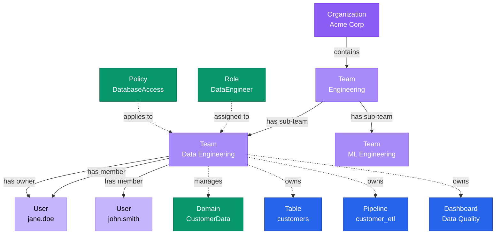

# Team

**Groups of users with hierarchy and ownership of data assets**

---

## Overview

The **Team** entity represents groups of users organized in a hierarchical structure. Teams can own data assets, have assigned roles, and establish organizational structure for data governance and collaboration.

---

## Relationship Diagram

```mermaid
graph TB
    subgraph "Team Hierarchy"
        ORG[Organization<br/>Acme Corp<br/><i>Type: Organization</i>]
        PARENT[Parent Team<br/>Engineering<br/><i>Type: Division</i>]
        TEAM[Team<br/>Data Engineering<br/><i>Type: Department</i>]
        CHILD1[Child Team<br/>Data Platform<br/><i>Type: Group</i>]
        CHILD2[Child Team<br/>Analytics<br/><i>Type: Group</i>]

        ORG -->|contains| PARENT
        PARENT -->|has sub-team| TEAM
        TEAM -->|has sub-team| CHILD1
        TEAM -->|has sub-team| CHILD2
    end

    subgraph "Team Members"
        USR1[User<br/>jane.doe<br/><i>Data Engineer</i>]
        USR2[User<br/>john.smith<br/><i>Senior Engineer</i>]
        USR3[User<br/>alice.wilson<br/><i>Team Lead</i>]

        TEAM -->|has member| USR1
        TEAM -->|has member| USR2
        TEAM -->|has member| USR3
        TEAM -->|owner| USR3
    end

    subgraph "Roles & Access Control"
        ROLE1[Role<br/>DataEngineer<br/><i>Default Role</i>]
        ROLE2[Role<br/>DataSteward<br/><i>Additional Role</i>]
        POL1[Policy<br/>DatabaseAccess<br/><i>Team Policy</i>]
        POL2[Policy<br/>PipelineManagement<br/><i>Team Policy</i>]

        TEAM -->|default role| ROLE1
        TEAM -->|default role| ROLE2
        TEAM -->|has policy| POL1
        TEAM -->|has policy| POL2
    end

    subgraph "Owned Data Assets"
        TBL1[Table<br/>customers<br/><i>postgres_prod.public</i>]
        TBL2[Table<br/>orders<br/><i>postgres_prod.public</i>]
        PIPE1[Pipeline<br/>customer_etl<br/><i>Daily ETL</i>]
        PIPE2[Pipeline<br/>analytics_sync<br/><i>Real-time</i>]
        DASH1[Dashboard<br/>Data Quality<br/><i>Tableau</i>]
        DASH2[Dashboard<br/>Team Metrics<br/><i>Tableau</i>]

        TEAM -.->|owns| TBL1
        TEAM -.->|owns| TBL2
        TEAM -.->|owns| PIPE1
        TEAM -.->|owns| PIPE2
        TEAM -.->|owns| DASH1
        TEAM -.->|owns| DASH2
    end

    subgraph "Governance"
        DOM[Domain<br/>Customer Data<br/><i>Business Domain</i>]
        GT1[GlossaryTerm<br/>Customer<br/><i>Owned Term</i>]
        GT2[GlossaryTerm<br/>Order<br/><i>Owned Term</i>]

        TEAM -.->|manages| DOM
        TEAM -.->|owns| GT1
        TEAM -.->|owns| GT2
    end

    subgraph "Additional Assets"
        ML1[MLModel<br/>churn_predictor<br/><i>Production</i>]
        TOPIC1[Topic<br/>user_events<br/><i>Kafka</i>]
        CONT1[Container<br/>raw_data<br/><i>S3 Bucket</i>]

        TEAM -.->|owns| ML1
        TEAM -.->|owns| TOPIC1
        TEAM -.->|owns| CONT1
    end

    %% Styling
    classDef orgStyle fill:#7C3AED,stroke:#5B21B6,color:#fff,stroke-width:3px
    classDef teamStyle fill:#8B5CF6,stroke:#7C3AED,color:#fff,stroke-width:3px
    classDef childStyle fill:#A78BFA,stroke:#8B5CF6,color:#000,stroke-width:2px
    classDef userStyle fill:#059669,stroke:#047857,color:#fff,stroke-width:2px
    classDef roleStyle fill:#10B981,stroke:#059669,color:#fff,stroke-width:2px
    classDef policyStyle fill:#34D399,stroke:#10B981,color:#000,stroke-width:2px
    classDef dataStyle fill:#2563EB,stroke:#1E40AF,color:#fff,stroke-width:2px
    classDef governanceStyle fill:#F59E0B,stroke:#D97706,color:#000,stroke-width:2px
    classDef additionalStyle fill:#06B6D4,stroke:#0891B2,color:#fff,stroke-width:2px

    class ORG orgStyle
    class PARENT,TEAM teamStyle
    class CHILD1,CHILD2 childStyle
    class USR1,USR2,USR3 userStyle
    class ROLE1,ROLE2 roleStyle
    class POL1,POL2 policyStyle
    class TBL1,TBL2,PIPE1,PIPE2,DASH1,DASH2 dataStyle
    class DOM,GT1,GT2 governanceStyle
    class ML1,TOPIC1,CONT1 additionalStyle
```



**Key Relationships:**

- **Hierarchical Structure**: Teams organize into parent-child relationships (Organization → Division → Department → Group)
- **Team Members**: Users belong to teams and inherit default roles
- **Access Control**: Teams have default roles and policies that apply to all members
- **Asset Ownership**: Teams own tables, dashboards, pipelines, ML models, topics, and other data assets
- **Domain Management**: Teams manage specific data domains for governance
- **Governance**: Teams own glossary terms and establish data standards

---

## Schema Specifications

View the complete Team schema in your preferred format:

=== "JSON Schema"

    **Complete JSON Schema Definition**

    ```json
    {
      "$id": "https://open-metadata.org/schema/entity/teams/team.json",
      "$schema": "http://json-schema.org/draft-07/schema#",
      "title": "Team",
      "description": "This schema defines the Team entity. A `Team` is a group of zero or more users and/or other teams. Teams can own zero or more data assets. Hierarchical teams are supported `Organization` -> `BusinessUnit` -> `Division` -> `Department`.",
      "type": "object",
      "javaType": "org.openmetadata.schema.entity.teams.Team",
      "javaInterfaces": ["org.openmetadata.schema.EntityInterface"],

      "definitions": {
        "teamType": {
          "description": "Organization is the highest level entity. An Organization has one of more Business Units, Division, Departments, Group, or Users. A Business Unit has one or more Divisions, Departments, Group, or Users. A Division has one or more Divisions, Departments, Group, or Users. A Department has one or more Departments, Group, or Users. A Group has only Users",
          "type": "string",
          "enum": [
            "Group",
            "Department",
            "Division",
            "BusinessUnit",
            "Organization"
          ],
          "default": "Group"
        }
      },

      "properties": {
        "id": {
          "$ref": "../../type/basic.json#/definitions/uuid"
        },
        "teamType": {
          "description": "Team type",
          "$ref": "#/definitions/teamType"
        },
        "name": {
          "description": "A unique name of the team typically the team ID from an identity provider. Example - group Id from LDAP.",
          "$ref": "../../type/basic.json#/definitions/entityName"
        },
        "email": {
          "description": "Email address of the team.",
          "$ref": "../../type/basic.json#/definitions/email"
        },
        "fullyQualifiedName": {
          "description": "FullyQualifiedName same as `name`.",
          "$ref": "../../type/basic.json#/definitions/fullyQualifiedEntityName"
        },
        "displayName": {
          "description": "Name used for display purposes. Example 'Data Science team'.",
          "type": "string"
        },
        "externalId": {
          "description": "External identifier for the team from an external identity provider (e.g., Azure AD group ID).",
          "type": "string"
        },
        "description": {
          "description": "Description of the team.",
          "$ref": "../../type/basic.json#/definitions/markdown"
        },
        "version": {
          "description": "Metadata version of the entity.",
          "$ref": "../../type/entityHistory.json#/definitions/entityVersion"
        },
        "updatedAt": {
          "description": "Last update time corresponding to the new version of the entity in Unix epoch time milliseconds.",
          "$ref": "../../type/basic.json#/definitions/timestamp"
        },
        "updatedBy": {
          "description": "User who made the update.",
          "type": "string"
        },
        "impersonatedBy": {
          "description": "Bot user that performed the action on behalf of the actual user.",
          "$ref": "../../type/basic.json#/definitions/impersonatedBy"
        },
        "href": {
          "description": "Link to the resource corresponding to this entity.",
          "$ref": "../../type/basic.json#/definitions/href"
        },
        "profile": {
          "description": "Team profile information.",
          "$ref": "../../type/profile.json"
        },
        "parents": {
          "description": "Parent teams. For an `Organization` the `parent` is always null. A `BusinessUnit` always has only one parent of type `BusinessUnit` or an `Organization`. A `Division` can have multiple parents of type `BusinessUnit` or `Division`. A `Department` can have multiple parents of type `Division` or `Department`.",
          "$ref": "../../type/entityReferenceList.json"
        },
        "children": {
          "description": "Children teams. An `Organization` can have `BusinessUnit`, `Division` or `Department` as children. A `BusinessUnit` can have `BusinessUnit`, `Division`, or `Department` as children. A `Division` can have `Division` or `Department` as children. A `Department` can have `Department` as children.",
          "$ref": "../../type/entityReferenceList.json"
        },
        "users": {
          "description": "Users that are part of the team.",
          "$ref": "../../type/entityReferenceList.json",
          "default": null
        },
        "childrenCount": {
          "description": "Total count of Children teams.",
          "type": "integer"
        },
        "userCount": {
          "description": "Total count of users that are part of the team.",
          "type": "integer"
        },
        "owns": {
          "description": "List of entities owned by the team.",
          "$ref": "../../type/entityReferenceList.json"
        },
        "owners": {
          "description": "Owner of this team.",
          "$ref": "../../type/entityReferenceList.json",
          "default": null
        },
        "isJoinable": {
          "description": "Can any user join this team during sign up? Value of true indicates yes, and false no.",
          "type": "boolean",
          "default": true
        },
        "changeDescription": {
          "description": "Change that lead to this version of the entity.",
          "$ref": "../../type/entityHistory.json#/definitions/changeDescription"
        },
        "incrementalChangeDescription": {
          "description": "Change that lead to this version of the entity.",
          "$ref": "../../type/entityHistory.json#/definitions/changeDescription"
        },
        "deleted": {
          "description": "When `true` indicates the entity has been soft deleted.",
          "type": "boolean",
          "default": false
        },
        "defaultRoles": {
          "description": "Default roles of a team. These roles will be inherited by all the users that are part of this team.",
          "$ref": "../../type/entityReferenceList.json"
        },
        "inheritedRoles": {
          "description": "Roles that a team is inheriting through membership in teams that have set team default roles.",
          "$ref": "../../type/entityReferenceList.json"
        },
        "policies": {
          "description": "Policies that is attached to this team.",
          "$ref": "../../type/entityReferenceList.json"
        },
        "domains": {
          "description": "Domain the Team belongs to.",
          "$ref": "../../type/entityReferenceList.json"
        }
      },

      "required": ["id", "name"],
      "additionalProperties": false
    }
    ```

    **[View Full JSON Schema →](https://github.com/open-metadata/OpenMetadataStandards/blob/main/schemas/entity/teams/team.json)**

=== "RDF"

    **RDF/OWL Ontology Definition**

    ```turtle
    @prefix om: <https://open-metadata.org/schema/> .
    @prefix rdfs: <http://www.w3.org/2000/01/rdf-schema#> .
    @prefix owl: <http://www.w3.org/2002/07/owl#> .
    @prefix xsd: <http://www.w3.org/2001/XMLSchema#> .

    # Team Class Definition
    om:Team a owl:Class ;
        rdfs:subClassOf om:Entity ;
        rdfs:label "Team" ;
        rdfs:comment "A Team is a group of zero or more users and/or other teams. Teams can own zero or more data assets." .

    # Datatype Properties
    om:teamName a owl:DatatypeProperty ;
        rdfs:domain om:Team ;
        rdfs:range xsd:string ;
        rdfs:label "name" ;
        rdfs:comment "A unique name of the team typically the team ID from an identity provider" .

    om:teamEmail a owl:DatatypeProperty ;
        rdfs:domain om:Team ;
        rdfs:range xsd:string ;
        rdfs:label "email" ;
        rdfs:comment "Email address of the team" .

    om:displayName a owl:DatatypeProperty ;
        rdfs:domain om:Team ;
        rdfs:range xsd:string ;
        rdfs:label "displayName" ;
        rdfs:comment "Name used for display purposes" .

    om:externalId a owl:DatatypeProperty ;
        rdfs:domain om:Team ;
        rdfs:range xsd:string ;
        rdfs:label "externalId" ;
        rdfs:comment "External identifier for the team from an external identity provider" .

    om:teamType a owl:DatatypeProperty ;
        rdfs:domain om:Team ;
        rdfs:range om:TeamType ;
        rdfs:label "teamType" ;
        rdfs:comment "Type of team: Group, Department, Division, BusinessUnit, Organization" .

    om:isJoinable a owl:DatatypeProperty ;
        rdfs:domain om:Team ;
        rdfs:range xsd:boolean ;
        rdfs:label "isJoinable" ;
        rdfs:comment "Can any user join this team during sign up" .

    om:childrenCount a owl:DatatypeProperty ;
        rdfs:domain om:Team ;
        rdfs:range xsd:integer ;
        rdfs:label "childrenCount" ;
        rdfs:comment "Total count of Children teams" .

    om:userCount a owl:DatatypeProperty ;
        rdfs:domain om:Team ;
        rdfs:range xsd:integer ;
        rdfs:label "userCount" ;
        rdfs:comment "Total count of users that are part of the team" .

    om:deleted a owl:DatatypeProperty ;
        rdfs:domain om:Team ;
        rdfs:range xsd:boolean ;
        rdfs:label "deleted" ;
        rdfs:comment "When true indicates the entity has been soft deleted" .

    # Object Properties
    om:hasParent a owl:ObjectProperty ;
        rdfs:domain om:Team ;
        rdfs:range om:Team ;
        rdfs:label "hasParent" ;
        rdfs:comment "Parent teams in the organizational hierarchy" .

    om:hasChild a owl:ObjectProperty ;
        rdfs:domain om:Team ;
        rdfs:range om:Team ;
        rdfs:label "hasChild" ;
        rdfs:comment "Children teams" .

    om:hasMember a owl:ObjectProperty ;
        rdfs:domain om:Team ;
        rdfs:range om:User ;
        rdfs:label "hasMember" ;
        rdfs:comment "Users that are part of the team" .

    om:hasOwner a owl:ObjectProperty ;
        rdfs:domain om:Team ;
        rdfs:range [ a owl:Class ; owl:unionOf (om:User om:Team) ] ;
        rdfs:label "hasOwner" ;
        rdfs:comment "Owner of this team" .

    om:hasDefaultRole a owl:ObjectProperty ;
        rdfs:domain om:Team ;
        rdfs:range om:Role ;
        rdfs:label "hasDefaultRole" ;
        rdfs:comment "Default roles of a team inherited by all users" .

    om:hasInheritedRole a owl:ObjectProperty ;
        rdfs:domain om:Team ;
        rdfs:range om:Role ;
        rdfs:label "hasInheritedRole" ;
        rdfs:comment "Roles that a team is inheriting through membership in teams" .

    om:hasPolicy a owl:ObjectProperty ;
        rdfs:domain om:Team ;
        rdfs:range om:Policy ;
        rdfs:label "hasPolicy" ;
        rdfs:comment "Policies that is attached to this team" .

    om:teamOwns a owl:ObjectProperty ;
        rdfs:domain om:Team ;
        rdfs:range om:Entity ;
        rdfs:label "teamOwns" ;
        rdfs:comment "List of entities owned by the team" .

    om:belongsToDomain a owl:ObjectProperty ;
        rdfs:domain om:Team ;
        rdfs:range om:Domain ;
        rdfs:label "belongsToDomain" ;
        rdfs:comment "Domain the Team belongs to" .

    om:hasProfile a owl:ObjectProperty ;
        rdfs:domain om:Team ;
        rdfs:range om:Profile ;
        rdfs:label "hasProfile" ;
        rdfs:comment "Team profile information" .

    # Team Type Enumeration
    om:TeamType a owl:Class ;
        owl:oneOf (
            om:GroupType
            om:DepartmentType
            om:DivisionType
            om:BusinessUnitType
            om:OrganizationType
        ) .

    # Example Instance
    ex:dataEngineeringTeam a om:Team ;
        om:teamName "Data Engineering" ;
        om:displayName "Data Engineering Team" ;
        om:teamEmail "data-eng@example.com" ;
        om:teamType om:DepartmentType ;
        om:hasParent ex:engineeringTeam ;
        om:hasMember ex:janeDoe ;
        om:hasMember ex:johnSmith ;
        om:hasOwner ex:teamLead ;
        om:hasDefaultRole ex:dataEngineerRole ;
        om:teamOwns ex:customersTable ;
        om:belongsToDomain ex:customerDataDomain ;
        om:isJoinable true ;
        om:userCount 2 ;
        om:childrenCount 0 .
    ```

    **[View Full RDF Ontology →](https://github.com/open-metadata/OpenMetadataStandards/blob/main/rdf/ontology/openmetadata.ttl)**

=== "JSON-LD"

    **JSON-LD Context and Example**

    ```json
    {
      "@context": {
        "@vocab": "https://open-metadata.org/schema/",
        "om": "https://open-metadata.org/schema/",
        "rdfs": "http://www.w3.org/2000/01/rdf-schema#",
        "xsd": "http://www.w3.org/2001/XMLSchema#",

        "Team": "om:Team",
        "name": {
          "@id": "om:teamName",
          "@type": "xsd:string"
        },
        "fullyQualifiedName": {
          "@id": "om:fullyQualifiedName",
          "@type": "xsd:string"
        },
        "displayName": {
          "@id": "om:displayName",
          "@type": "xsd:string"
        },
        "email": {
          "@id": "om:teamEmail",
          "@type": "xsd:string"
        },
        "externalId": {
          "@id": "om:externalId",
          "@type": "xsd:string"
        },
        "description": {
          "@id": "om:description",
          "@type": "xsd:string"
        },
        "teamType": {
          "@id": "om:teamType",
          "@type": "@vocab"
        },
        "isJoinable": {
          "@id": "om:isJoinable",
          "@type": "xsd:boolean"
        },
        "childrenCount": {
          "@id": "om:childrenCount",
          "@type": "xsd:integer"
        },
        "userCount": {
          "@id": "om:userCount",
          "@type": "xsd:integer"
        },
        "deleted": {
          "@id": "om:deleted",
          "@type": "xsd:boolean"
        },
        "parents": {
          "@id": "om:hasParent",
          "@type": "@id",
          "@container": "@set"
        },
        "children": {
          "@id": "om:hasChild",
          "@type": "@id",
          "@container": "@set"
        },
        "users": {
          "@id": "om:hasMember",
          "@type": "@id",
          "@container": "@set"
        },
        "owners": {
          "@id": "om:hasOwner",
          "@type": "@id",
          "@container": "@set"
        },
        "defaultRoles": {
          "@id": "om:hasDefaultRole",
          "@type": "@id",
          "@container": "@set"
        },
        "inheritedRoles": {
          "@id": "om:hasInheritedRole",
          "@type": "@id",
          "@container": "@set"
        },
        "policies": {
          "@id": "om:hasPolicy",
          "@type": "@id",
          "@container": "@set"
        },
        "owns": {
          "@id": "om:teamOwns",
          "@type": "@id",
          "@container": "@set"
        },
        "domains": {
          "@id": "om:belongsToDomain",
          "@type": "@id",
          "@container": "@set"
        },
        "profile": {
          "@id": "om:hasProfile",
          "@type": "@id"
        }
      }
    }
    ```

    **Example JSON-LD Instance**:

    ```json
    {
      "@context": "https://open-metadata.org/context/team.jsonld",
      "@type": "Team",
      "@id": "https://example.com/teams/data-engineering",

      "name": "DataEngineering",
      "fullyQualifiedName": "example_org.Engineering.DataEngineering",
      "displayName": "Data Engineering",
      "email": "data-eng@example.com",
      "externalId": "azure-ad-group-123",
      "description": "Team responsible for building and maintaining data infrastructure",
      "teamType": "Department",
      "isJoinable": true,
      "userCount": 2,
      "childrenCount": 0,

      "parents": [
        {
          "@id": "https://example.com/teams/engineering",
          "@type": "Team",
          "name": "Engineering"
        }
      ],

      "users": [
        {
          "@id": "https://example.com/users/jane.doe",
          "@type": "User",
          "name": "jane.doe"
        },
        {
          "@id": "https://example.com/users/john.smith",
          "@type": "User",
          "name": "john.smith"
        }
      ],

      "owners": [
        {
          "@id": "https://example.com/users/team.lead",
          "@type": "User",
          "name": "team.lead"
        }
      ],

      "defaultRoles": [
        {
          "@id": "https://example.com/roles/data-engineer",
          "@type": "Role",
          "name": "DataEngineer"
        }
      ],

      "owns": [
        {
          "@id": "https://example.com/tables/customers",
          "@type": "Table",
          "fullyQualifiedName": "postgres_prod.ecommerce.public.customers"
        }
      ],

      "domains": [
        {
          "@id": "https://example.com/domains/data-platform",
          "@type": "Domain",
          "name": "DataPlatform"
        }
      ]
    }
    ```

    **[View Full JSON-LD Context →](https://github.com/open-metadata/OpenMetadataStandards/blob/main/rdf/contexts/team.jsonld)**

---

## Use Cases

- Organize users into hierarchical team structures
- Assign ownership of data assets to teams
- Define default roles and permissions for team members
- Manage team-based access control policies
- Track team ownership across data domains
- Enable team-based collaboration on data assets
- Support organizational structure modeling
- Facilitate team notifications and communications

---

## JSON Schema Specification

### Core Properties

#### `id` (uuid)
**Type**: `string` (UUID format)
**Required**: Yes (system-generated)
**Description**: Unique identifier for this team instance

```json
{
  "id": "a1b2c3d4-e5f6-4a7b-8c9d-0e1f2a3b4c5d"
}
```

---

#### `name` (entityName)
**Type**: `string`
**Required**: Yes
**Pattern**: `^[^.]*$` (no dots allowed)
**Min Length**: 1
**Max Length**: 128
**Description**: Team name (unique within parent)

```json
{
  "name": "DataEngineering"
}
```

---

#### `fullyQualifiedName` (fullyQualifiedEntityName)
**Type**: `string`
**Required**: Yes (system-generated)
**Description**: Fully qualified name showing hierarchy: `organization.division.team`

```json
{
  "fullyQualifiedName": "example_org.Engineering.DataEngineering"
}
```

---

#### `displayName`
**Type**: `string`
**Required**: No
**Description**: Name used for display purposes. Example 'Data Science team'.

```json
{
  "displayName": "Data Engineering Team"
}
```

---

#### `externalId`
**Type**: `string`
**Required**: No
**Description**: External identifier for the team from an external identity provider (e.g., Azure AD group ID).

```json
{
  "externalId": "azure-ad-group-12345"
}
```

---

#### `description` (markdown)
**Type**: `string` (Markdown format)
**Required**: No
**Description**: Team description and purpose

```json
{
  "description": "# Data Engineering Team\n\nResponsible for building and maintaining data infrastructure, pipelines, and platforms."
}
```

---

### Team Type Properties

#### `teamType` (TeamType enum)
**Type**: `string` enum
**Required**: No (default: "Group")
**Allowed Values**:

- `Group` - Working group or project team (default)
- `Department` - Department within division
- `Division` - Division within business unit
- `BusinessUnit` - Business unit within organization
- `Organization` - Top-level organization

**Description**: Organization is the highest level entity. An Organization has one of more Business Units, Division, Departments, Group, or Users. A Business Unit has one or more Divisions, Departments, Group, or Users. A Division has one or more Divisions, Departments, Group, or Users. A Department has one or more Departments, Group, or Users. A Group has only Users.

```json
{
  "teamType": "Department"
}
```

---

#### `email`
**Type**: `string` (email format)
**Required**: No
**Description**: Email address of the team.

```json
{
  "email": "data-eng@example.com"
}
```

---

#### `profile`
**Type**: `object` (Profile reference)
**Required**: No
**Description**: Team profile information.

```json
{
  "profile": {
    "$ref": "../../type/profile.json"
  }
}
```

---

#### `href`
**Type**: `string` (URI format)
**Required**: No
**Description**: Link to the resource corresponding to this entity.

```json
{
  "href": "https://api.example.com/v1/teams/a1b2c3d4-e5f6-4a7b-8c9d-0e1f2a3b4c5d"
}
```

---

### Hierarchy Properties

#### `parents` (EntityReferenceList)
**Type**: `EntityReferenceList` (array of Team references)
**Required**: No
**Description**: Parent teams. For an `Organization` the `parent` is always null. A `BusinessUnit` always has only one parent of type `BusinessUnit` or an `Organization`. A `Division` can have multiple parents of type `BusinessUnit` or `Division`. A `Department` can have multiple parents of type `Division` or `Department`.

```json
{
  "parents": [
    {
      "id": "parent-team-uuid",
      "type": "team",
      "name": "Engineering",
      "fullyQualifiedName": "example_org.Engineering"
    }
  ]
}
```

---

#### `children` (EntityReferenceList)
**Type**: `EntityReferenceList` (array of Team references)
**Required**: No
**Description**: Children teams. An `Organization` can have `BusinessUnit`, `Division` or `Department` as children. A `BusinessUnit` can have `BusinessUnit`, `Division`, or `Department` as children. A `Division` can have `Division` or `Department` as children. A `Department` can have `Department` as children.

```json
{
  "children": [
    {
      "id": "child-team-uuid-1",
      "type": "team",
      "name": "DataPlatform",
      "fullyQualifiedName": "example_org.Engineering.DataEngineering.DataPlatform"
    },
    {
      "id": "child-team-uuid-2",
      "type": "team",
      "name": "Analytics",
      "fullyQualifiedName": "example_org.Engineering.DataEngineering.Analytics"
    }
  ]
}
```

---

### Membership Properties

#### `users` (EntityReferenceList)
**Type**: `EntityReferenceList` (array of User references)
**Required**: No (default: null)
**Description**: Users that are part of the team.

```json
{
  "users": [
    {
      "id": "user-uuid-1",
      "type": "user",
      "name": "jane.doe",
      "displayName": "Jane Doe"
    },
    {
      "id": "user-uuid-2",
      "type": "user",
      "name": "john.smith",
      "displayName": "John Smith"
    }
  ]
}
```

---

#### `userCount`
**Type**: `integer`
**Required**: No
**Description**: Total count of users that are part of the team.

```json
{
  "userCount": 15
}
```

---

#### `childrenCount`
**Type**: `integer`
**Required**: No
**Description**: Total count of Children teams.

```json
{
  "childrenCount": 3
}
```

---

#### `isJoinable`
**Type**: `boolean`
**Required**: No (default: true)
**Description**: Can any user join this team during sign up? Value of true indicates yes, and false no.

```json
{
  "isJoinable": true
}
```

---

### Role and Policy Properties

#### `defaultRoles` (EntityReferenceList)
**Type**: `EntityReferenceList` (array of Role references)
**Required**: No
**Description**: Default roles of a team. These roles will be inherited by all the users that are part of this team.

```json
{
  "defaultRoles": [
    {
      "id": "role-uuid",
      "type": "role",
      "name": "DataEngineer",
      "fullyQualifiedName": "DataEngineer"
    }
  ]
}
```

---

#### `inheritedRoles` (EntityReferenceList)
**Type**: `EntityReferenceList` (array of Role references)
**Required**: No
**Description**: Roles that a team is inheriting through membership in teams that have set team default roles.

```json
{
  "inheritedRoles": [
    {
      "id": "role-uuid",
      "type": "role",
      "name": "OrganizationViewer",
      "fullyQualifiedName": "OrganizationViewer"
    }
  ]
}
```

---

#### `policies` (EntityReferenceList)
**Type**: `EntityReferenceList` (array of Policy references)
**Required**: No
**Description**: Policies that is attached to this team.

```json
{
  "policies": [
    {
      "id": "policy-uuid-1",
      "type": "policy",
      "name": "TeamDataAccess",
      "fullyQualifiedName": "TeamDataAccess"
    },
    {
      "id": "policy-uuid-2",
      "type": "policy",
      "name": "TeamAdministration",
      "fullyQualifiedName": "TeamAdministration"
    }
  ]
}
```

---

### Ownership Properties

#### `owns` (EntityReferenceList)
**Type**: `EntityReferenceList` (array of entity references)
**Required**: No
**Description**: List of entities owned by the team.

```json
{
  "owns": [
    {
      "id": "table-uuid-1",
      "type": "table",
      "name": "customers",
      "fullyQualifiedName": "postgres_prod.ecommerce.public.customers"
    },
    {
      "id": "dashboard-uuid-1",
      "type": "dashboard",
      "name": "Team Dashboard"
    },
    {
      "id": "pipeline-uuid-1",
      "type": "pipeline",
      "name": "daily_etl"
    }
  ]
}
```

---

#### `owners` (EntityReferenceList)
**Type**: `EntityReferenceList` (array of User or Team references)
**Required**: No (default: null)
**Description**: Owner of this team.

```json
{
  "owners": [
    {
      "id": "user-uuid",
      "type": "user",
      "name": "team.lead",
      "displayName": "Team Lead"
    }
  ]
}
```

---

#### `domains` (EntityReferenceList)
**Type**: `EntityReferenceList` (array of Domain references)
**Required**: No
**Description**: Domain the Team belongs to.

```json
{
  "domains": [
    {
      "id": "domain-uuid",
      "type": "domain",
      "name": "DataPlatform",
      "fullyQualifiedName": "DataPlatform"
    }
  ]
}
```

---

### Versioning Properties

#### `version` (entityVersion)
**Type**: `number`
**Required**: Yes (system-managed)
**Description**: Metadata version number

```json
{
  "version": 2.1
}
```

---

#### `updatedAt` (timestamp)
**Type**: `integer` (Unix epoch milliseconds)
**Required**: Yes (system-managed)
**Description**: Last update timestamp

```json
{
  "updatedAt": 1704240000000
}
```

---

#### `updatedBy`
**Type**: `string`
**Required**: No (system-managed)
**Description**: User who made the update.

```json
{
  "updatedBy": "admin"
}
```

---

#### `impersonatedBy`
**Type**: `object`
**Required**: No
**Description**: Bot user that performed the action on behalf of the actual user.

```json
{
  "impersonatedBy": {
    "type": "bot",
    "name": "automation-bot"
  }
}
```

---

#### `changeDescription`
**Type**: `object`
**Required**: No
**Description**: Change that lead to this version of the entity.

```json
{
  "changeDescription": {
    "fieldsAdded": [],
    "fieldsUpdated": [
      {
        "name": "displayName",
        "oldValue": "Data Eng",
        "newValue": "Data Engineering Team"
      }
    ],
    "fieldsDeleted": [],
    "previousVersion": 1.0
  }
}
```

---

#### `incrementalChangeDescription`
**Type**: `object`
**Required**: No
**Description**: Change that lead to this version of the entity.

```json
{
  "incrementalChangeDescription": {
    "fieldsAdded": [],
    "fieldsUpdated": [],
    "fieldsDeleted": [],
    "previousVersion": 2.0
  }
}
```

---

#### `deleted`
**Type**: `boolean`
**Required**: No (default: false)
**Description**: When `true` indicates the entity has been soft deleted.

```json
{
  "deleted": false
}
```

---

## Complete Example

```json
{
  "id": "a1b2c3d4-e5f6-4a7b-8c9d-0e1f2a3b4c5d",
  "teamType": "Department",
  "name": "DataEngineering",
  "email": "data-eng@example.com",
  "fullyQualifiedName": "example_org.Engineering.DataEngineering",
  "displayName": "Data Engineering Team",
  "externalId": "azure-ad-group-12345",
  "description": "# Data Engineering Team\n\nResponsible for building and maintaining data infrastructure, pipelines, and platforms.",
  "href": "https://api.example.com/v1/teams/a1b2c3d4-e5f6-4a7b-8c9d-0e1f2a3b4c5d",
  "parents": [
    {
      "id": "parent-uuid",
      "type": "team",
      "name": "Engineering",
      "fullyQualifiedName": "example_org.Engineering"
    }
  ],
  "children": [
    {
      "id": "child-uuid-1",
      "type": "team",
      "name": "DataPlatform"
    },
    {
      "id": "child-uuid-2",
      "type": "team",
      "name": "Analytics"
    }
  ],
  "childrenCount": 2,
  "users": [
    {
      "id": "user-uuid-1",
      "type": "user",
      "name": "jane.doe",
      "displayName": "Jane Doe"
    },
    {
      "id": "user-uuid-2",
      "type": "user",
      "name": "john.smith",
      "displayName": "John Smith"
    }
  ],
  "userCount": 2,
  "owners": [
    {
      "id": "owner-uuid",
      "type": "user",
      "name": "team.lead",
      "displayName": "Team Lead"
    }
  ],
  "isJoinable": true,
  "defaultRoles": [
    {
      "id": "role-uuid",
      "type": "role",
      "name": "DataEngineer"
    }
  ],
  "policies": [
    {
      "id": "policy-uuid",
      "type": "policy",
      "name": "TeamDataAccess"
    }
  ],
  "owns": [
    {
      "type": "table",
      "name": "customers",
      "fullyQualifiedName": "postgres_prod.ecommerce.public.customers"
    },
    {
      "type": "pipeline",
      "name": "daily_etl"
    }
  ],
  "domains": [
    {
      "id": "domain-uuid",
      "type": "domain",
      "name": "DataPlatform"
    }
  ],
  "version": 2.1,
  "updatedAt": 1704240000000,
  "updatedBy": "admin",
  "deleted": false
}
```

---

## RDF Representation

### Ontology Class

```turtle
@prefix om: <https://open-metadata.org/schema/> .
@prefix rdfs: <http://www.w3.org/2000/01/rdf-schema#> .
@prefix owl: <http://www.w3.org/2002/07/owl#> .

om:Team a owl:Class ;
    rdfs:subClassOf om:Entity ;
    rdfs:label "Team" ;
    rdfs:comment "A Team is a group of zero or more users and/or other teams. Teams can own zero or more data assets." ;
    om:hasProperties [
        om:name "string" ;
        om:teamType "TeamType" ;
        om:externalId "string" ;
        om:parents "Team[]" ;
        om:children "Team[]" ;
        om:users "User[]" ;
        om:owners "EntityReference[]" ;
        om:defaultRoles "Role[]" ;
        om:inheritedRoles "Role[]" ;
        om:policies "Policy[]" ;
        om:owns "Entity[]" ;
        om:domains "Domain[]" ;
        om:userCount "integer" ;
        om:childrenCount "integer" ;
        om:deleted "boolean" ;
    ] .
```

### Instance Example

```turtle
@prefix om: <https://open-metadata.org/schema/> .
@prefix ex: <https://example.com/> .

ex:dataEngineeringTeam a om:Team ;
    om:teamName "DataEngineering" ;
    om:displayName "Data Engineering Team" ;
    om:teamType om:DepartmentType ;
    om:teamEmail "data-eng@example.com" ;
    om:externalId "azure-ad-group-12345" ;
    om:hasParent ex:engineeringTeam ;
    om:hasChild ex:dataPlatformTeam ;
    om:hasChild ex:analyticsTeam ;
    om:hasMember ex:janeDoe ;
    om:hasMember ex:johnSmith ;
    om:hasOwner ex:teamLead ;
    om:hasDefaultRole ex:dataEngineerRole ;
    om:hasPolicy ex:teamDataAccessPolicy ;
    om:teamOwns ex:customersTable ;
    om:belongsToDomain ex:dataPlatformDomain ;
    om:isJoinable true ;
    om:userCount 2 ;
    om:childrenCount 2 ;
    om:deleted false .
```

---

## JSON-LD Context

```json
{
  "@context": {
    "@vocab": "https://open-metadata.org/schema/",
    "Team": "om:Team",
    "name": "om:teamName",
    "email": "om:teamEmail",
    "externalId": "om:externalId",
    "teamType": {
      "@id": "om:teamType",
      "@type": "@vocab"
    },
    "isJoinable": {
      "@id": "om:isJoinable",
      "@type": "xsd:boolean"
    },
    "userCount": {
      "@id": "om:userCount",
      "@type": "xsd:integer"
    },
    "childrenCount": {
      "@id": "om:childrenCount",
      "@type": "xsd:integer"
    },
    "deleted": {
      "@id": "om:deleted",
      "@type": "xsd:boolean"
    },
    "parents": {
      "@id": "om:hasParent",
      "@type": "@id",
      "@container": "@set"
    },
    "children": {
      "@id": "om:hasChild",
      "@type": "@id",
      "@container": "@set"
    },
    "users": {
      "@id": "om:hasMember",
      "@type": "@id",
      "@container": "@set"
    },
    "owners": {
      "@id": "om:hasOwner",
      "@type": "@id",
      "@container": "@set"
    },
    "defaultRoles": {
      "@id": "om:hasDefaultRole",
      "@type": "@id",
      "@container": "@set"
    },
    "inheritedRoles": {
      "@id": "om:hasInheritedRole",
      "@type": "@id",
      "@container": "@set"
    },
    "policies": {
      "@id": "om:hasPolicy",
      "@type": "@id",
      "@container": "@set"
    },
    "owns": {
      "@id": "om:teamOwns",
      "@type": "@id",
      "@container": "@set"
    },
    "domains": {
      "@id": "om:belongsToDomain",
      "@type": "@id",
      "@container": "@set"
    }
  }
}
```

### JSON-LD Example

```json
{
  "@context": "https://open-metadata.org/context/team.jsonld",
  "@type": "Team",
  "@id": "https://example.com/teams/data-engineering",
  "name": "DataEngineering",
  "displayName": "Data Engineering Team",
  "email": "data-eng@example.com",
  "externalId": "azure-ad-group-12345",
  "teamType": "Department",
  "isJoinable": true,
  "userCount": 2,
  "childrenCount": 2,
  "parents": [
    {
      "@id": "https://example.com/teams/engineering",
      "@type": "Team"
    }
  ],
  "children": [
    {
      "@id": "https://example.com/teams/data-platform",
      "@type": "Team"
    }
  ],
  "users": [
    {
      "@id": "https://example.com/users/jane.doe",
      "@type": "User"
    },
    {
      "@id": "https://example.com/users/john.smith",
      "@type": "User"
    }
  ],
  "owners": [
    {
      "@id": "https://example.com/users/team.lead",
      "@type": "User"
    }
  ],
  "defaultRoles": [
    {
      "@id": "https://example.com/roles/data-engineer",
      "@type": "Role"
    }
  ],
  "owns": [
    {
      "@id": "https://example.com/tables/customers",
      "@type": "Table"
    }
  ],
  "domains": [
    {
      "@id": "https://example.com/domains/data-platform",
      "@type": "Domain"
    }
  ],
  "deleted": false
}
```

---

## Relationships

### Parent Entities
- **Organization**: Root organization
- **Team**: Parent teams in hierarchy

### Child Entities
- **Team**: Sub-teams within this team
- **User**: Team members

### Associated Entities
- **Role**: Default roles for members
- **Policy**: Access control policies
- **Domain**: Managed data domain
- **DataAsset**: Owned assets

### Relationship Diagram



---

## Custom Properties

This entity supports custom properties through the `extension` field.
Common custom properties include:

- **Data Classification**: Sensitivity level
- **Cost Center**: Billing allocation
- **Retention Period**: Data retention requirements
- **Application Owner**: Owning application/team

See [Custom Properties](../metadata-specifications/custom-properties.md)
for details on defining and using custom properties.

---

## API Operations

### Create Team

```http
POST /api/v1/teams
Content-Type: application/json

{
  "name": "DataEngineering",
  "displayName": "Data Engineering Team",
  "teamType": "Department",
  "email": "data-eng@example.com",
  "parents": ["Engineering"]
}
```

### Get Team

```http
GET /api/v1/teams/name/DataEngineering?fields=users,owns,children,defaultRoles
```

### Update Team

```http
PATCH /api/v1/teams/{id}
Content-Type: application/json-patch+json

[
  {
    "op": "add",
    "path": "/users/-",
    "value": {"id": "user-uuid", "type": "user"}
  }
]
```

### Add User to Team

```http
PUT /api/v1/teams/{id}/users/{userId}
```

### Set Team as Owner

```http
PUT /api/v1/tables/{tableId}/owner
Content-Type: application/json

{
  "owner": {
    "id": "team-uuid",
    "type": "team"
  }
}
```

### Assign Default Roles

```http
PUT /api/v1/teams/{id}/defaultRoles
Content-Type: application/json

{
  "defaultRoles": [
    {"id": "role-uuid", "type": "role"}
  ]
}
```

---

## Related Documentation

- **[User](user.md)** - User entity
- **[Role](role.md)** - Role entity
- **[Domain](../governance/domain.md)** - Data domain
- **[Policy](../security/policies.md)** - Access policies
- **[Organization](../core-concepts/organization.md)** - Organization structure
- **[Ownership](../governance/ownership.md)** - Asset ownership
