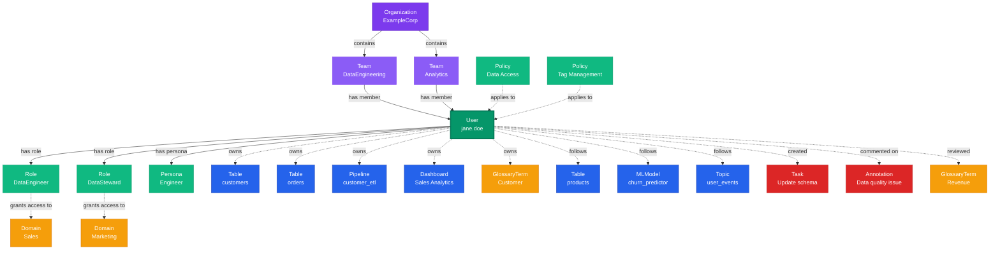

# User

**Individual users with profiles, roles, and team memberships**

---

## Overview

The **User** entity represents individual users within the organization who interact with data assets. Users have profiles, authentication credentials, role assignments, and team memberships that determine their access and responsibilities.

---

## Relationship Diagram

```mermaid
graph TB
    subgraph "User Profile & Authentication"
        USR[User<br/>jane.doe<br/><i>jane.doe@example.com</i>]
        PROF[Profile<br/>Data Engineer<br/><i>SF, CA • PST</i>]
        AUTH[Authentication<br/>SSO<br/><i>Google Auth</i>]

        USR -->|has profile| PROF
        USR -->|auth via| AUTH
    end

    subgraph "Team Memberships"
        TEAM1[Team<br/>Data Engineering<br/><i>Primary Team</i>]
        TEAM2[Team<br/>Analytics<br/><i>Secondary Team</i>]
        TEAM3[Team<br/>ML Platform<br/><i>Cross-functional</i>]

        USR -->|member of| TEAM1
        USR -->|member of| TEAM2
        USR -->|member of| TEAM3
    end

    subgraph "Roles & Permissions"
        ROLE1[Role<br/>DataEngineer<br/><i>Primary Role</i>]
        ROLE2[Role<br/>DataSteward<br/><i>Additional Role</i>]
        ROLE3[Role<br/>DataConsumer<br/><i>Read Access</i>]
        POL1[Policy<br/>DatabaseAccess]
        POL2[Policy<br/>PipelineManagement]

        USR -->|has role| ROLE1
        USR -->|has role| ROLE2
        USR -->|has role| ROLE3
        ROLE1 -.->|grants| POL1
        ROLE1 -.->|grants| POL2
    end

    subgraph "Personas"
        PERS1[Persona<br/>Engineer<br/><i>Default Persona</i>]
        PERS2[Persona<br/>Analyst<br/><i>Secondary Persona</i>]
        UI[UI Preferences<br/>Landing: /pipelines<br/><i>Custom Widgets</i>]

        USR -->|default persona| PERS1
        USR -->|has persona| PERS2
        PERS1 -->|defines| UI
    end

    subgraph "Owned Assets"
        TBL1[Table<br/>customers<br/><i>postgres_prod.public</i>]
        TBL2[Table<br/>orders<br/><i>postgres_prod.public</i>]
        PIPE1[Pipeline<br/>customer_etl<br/><i>Airflow</i>]
        DASH1[Dashboard<br/>Sales Analytics<br/><i>Tableau</i>]
        ML1[MLModel<br/>churn_predictor<br/><i>Production</i>]
        GT1[GlossaryTerm<br/>Customer<br/><i>Business Glossary</i>]

        USR -.->|owns| TBL1
        USR -.->|owns| TBL2
        USR -.->|owns| PIPE1
        USR -.->|owns| DASH1
        USR -.->|owns| ML1
        USR -.->|owns| GT1
    end

    subgraph "Followed Assets"
        TBL3[Table<br/>products<br/><i>Following</i>]
        PIPE2[Pipeline<br/>daily_etl<br/><i>Watching</i>]
        DASH2[Dashboard<br/>Executive Summary<br/><i>Following</i>]
        ML2[MLModel<br/>recommendation_engine<br/><i>Watching</i>]
        TOPIC1[Topic<br/>user_events<br/><i>Following</i>]

        USR -.->|follows| TBL3
        USR -.->|follows| PIPE2
        USR -.->|follows| DASH2
        USR -.->|follows| ML2
        USR -.->|follows| TOPIC1
    end

    subgraph "Activity & Collaboration"
        ACT1[Activity<br/>Created Pipeline<br/><i>2 hours ago</i>]
        ACT2[Activity<br/>Updated Table Schema<br/><i>1 day ago</i>]
        TASK1[Task<br/>Update Documentation<br/><i>In Progress</i>]
        ANNO1[Annotation<br/>Data Quality Issue<br/><i>Comment</i>]
        REV1[Review<br/>Glossary Term<br/><i>Approved</i>]

        USR -.->|created| ACT1
        USR -.->|performed| ACT2
        USR -.->|assigned| TASK1
        USR -.->|commented| ANNO1
        USR -.->|reviewed| REV1
    end

    subgraph "Access Domains"
        DOM1[Domain<br/>Customer Data<br/><i>Via DataEngineer Role</i>]
        DOM2[Domain<br/>Sales<br/><i>Via DataSteward Role</i>]
        DOM3[Domain<br/>Marketing<br/><i>Via Team Membership</i>]

        ROLE1 -.->|grants access| DOM1
        ROLE2 -.->|grants access| DOM2
        TEAM1 -.->|grants access| DOM3
    end

    %% Styling
    classDef userStyle fill:#059669,stroke:#047857,color:#fff,stroke-width:4px
    classDef profileStyle fill:#10B981,stroke:#059669,color:#fff,stroke-width:2px
    classDef teamStyle fill:#8B5CF6,stroke:#7C3AED,color:#fff,stroke-width:2px
    classDef roleStyle fill:#6366F1,stroke:#4F46E5,color:#fff,stroke-width:2px
    classDef policyStyle fill:#818CF8,stroke:#6366F1,color:#fff,stroke-width:2px
    classDef personaStyle fill:#EC4899,stroke:#DB2777,color:#fff,stroke-width:2px
    classDef ownedStyle fill:#2563EB,stroke:#1E40AF,color:#fff,stroke-width:2px
    classDef followStyle fill:#06B6D4,stroke:#0891B2,color:#fff,stroke-width:2px
    classDef activityStyle fill:#F59E0B,stroke:#D97706,color:#000,stroke-width:2px
    classDef domainStyle fill:#EF4444,stroke:#DC2626,color:#fff,stroke-width:2px

    class USR userStyle
    class PROF,AUTH profileStyle
    class TEAM1,TEAM2,TEAM3 teamStyle
    class ROLE1,ROLE2,ROLE3 roleStyle
    class POL1,POL2 policyStyle
    class PERS1,PERS2,UI personaStyle
    class TBL1,TBL2,PIPE1,DASH1,ML1,GT1 ownedStyle
    class TBL3,PIPE2,DASH2,ML2,TOPIC1 followStyle
    class ACT1,ACT2,TASK1,ANNO1,REV1 activityStyle
    class DOM1,DOM2,DOM3 domainStyle
```

**Key Relationships:**

- **Profile & Authentication**: User profile information and authentication mechanisms (SSO, LDAP, OAuth2, etc.)
- **Team Memberships**: Users belong to multiple teams and inherit team-level permissions
- **Roles & Permissions**: Users have assigned roles that grant specific permissions via policies
- **Personas**: Users have personas that customize their UI experience and workflows
- **Asset Ownership**: Users own tables, dashboards, pipelines, ML models, glossary terms, and other assets
- **Following**: Users follow assets to track changes and receive notifications
- **Activity Feed**: Track user actions including creates, updates, comments, and reviews
- **Domain Access**: Access to data domains determined by roles and team memberships

---

## Schema Specifications

View the complete User schema in your preferred format:

=== "JSON Schema"

    **Complete JSON Schema Definition**

    ```json
    {
      "$id": "https://open-metadata.org/schema/entity/teams/user.json",
      "$schema": "http://json-schema.org/draft-07/schema#",
      "title": "User",
      "description": "A `User` represents a user of OpenMetadata. A user can be part of 0 or more teams. A special type of user called Bot is used for automation. A user can be an owner of zero or more data assets. A user can also follow zero or more data assets.",
      "type": "object",
      "javaType": "org.openmetadata.schema.entity.teams.User",
      "javaInterfaces": ["org.openmetadata.schema.EntityInterface"],

      "definitions": {
        "authenticationMechanism": {
          "type": "object",
          "description": "User/Bot Authentication Mechanism.",
          "javaType": "org.openmetadata.schema.entity.teams.AuthenticationMechanism",
          "properties": {
            "config": {
              "oneOf": [
                {"$ref": "../../auth/ssoAuth.json"},
                {"$ref": "../../auth/jwtAuth.json"},
                {"$ref": "../../auth/basicAuth.json"}
              ]
            },
            "authType": {
              "enum": ["JWT", "SSO", "BASIC"]
            }
          },
          "additionalProperties": false
        }
      },

      "properties": {
        "id": {
          "description": "Unique identifier that identifies a user entity instance.",
          "$ref": "../../type/basic.json#/definitions/uuid"
        },
        "name": {
          "description": "A unique name of the user, typically the user ID from an identity provider. Example - uid from LDAP.",
          "$ref": "../../type/basic.json#/definitions/entityName"
        },
        "fullyQualifiedName": {
          "description": "FullyQualifiedName same as `name`.",
          "$ref": "../../type/basic.json#/definitions/fullyQualifiedEntityName"
        },
        "description": {
          "description": "Used for user biography.",
          "$ref": "../../type/basic.json#/definitions/markdown"
        },
        "externalId": {
          "description": "External identifier from identity provider (used for SCIM).",
          "type": "string"
        },
        "scimUserName": {
          "description": "Raw user name from SCIM.",
          "type": "string"
        },
        "displayName": {
          "description": "Name used for display purposes. Example 'FirstName LastName'.",
          "type": "string"
        },
        "version": {
          "description": "Metadata version of the entity.",
          "$ref": "../../type/entityHistory.json#/definitions/entityVersion"
        },
        "updatedAt": {
          "description": "Last update time corresponding to the new version of the entity in Unix epoch time milliseconds.",
          "$ref": "../../type/basic.json#/definitions/timestamp"
        },
        "updatedBy": {
          "description": "User who made the update.",
          "type": "string"
        },
        "impersonatedBy": {
          "description": "Bot user that performed the action on behalf of the actual user.",
          "$ref": "../../type/basic.json#/definitions/impersonatedBy"
        },
        "email": {
          "description": "Email address of the user.",
          "$ref": "../../type/basic.json#/definitions/email"
        },
        "href": {
          "description": "Link to the resource corresponding to this entity.",
          "$ref": "../../type/basic.json#/definitions/href"
        },
        "timezone": {
          "description": "Timezone of the user.",
          "type": "string",
          "format": "timezone"
        },
        "isBot": {
          "description": "When true indicates a special type of user called Bot.",
          "type": "boolean",
          "default": false
        },
        "isAdmin": {
          "description": "When true indicates user is an administrator for the system with superuser privileges.",
          "type": "boolean",
          "default": false
        },
        "allowImpersonation": {
          "description": "When true, this bot is allowed to impersonate users (subject to policy checks). Only applicable for bot users.",
          "type": "boolean",
          "default": false
        },
        "authenticationMechanism": {
          "$ref": "#/definitions/authenticationMechanism"
        },
        "profile": {
          "description": "Profile of the user.",
          "$ref": "../../type/profile.json"
        },
        "teams": {
          "description": "Teams that the user belongs to.",
          "$ref": "../../type/entityReferenceList.json"
        },
        "defaultPersona": {
          "description": "Default Persona for the user from list of personas.",
          "$ref": "../../type/entityReference.json"
        },
        "personas": {
          "description": "Personas that the user assigned to.",
          "$ref": "../../type/entityReferenceList.json"
        },
        "owns": {
          "description": "List of entities owned by the user.",
          "$ref": "../../type/entityReferenceList.json"
        },
        "follows": {
          "description": "List of entities followed by the user.",
          "$ref": "../../type/entityReferenceList.json"
        },
        "changeDescription": {
          "description": "Change that lead to this version of the entity.",
          "$ref": "../../type/entityHistory.json#/definitions/changeDescription"
        },
        "incrementalChangeDescription": {
          "description": "Change that lead to this version of the entity.",
          "$ref": "../../type/entityHistory.json#/definitions/changeDescription"
        },
        "deleted": {
          "description": "When `true` indicates the entity has been soft deleted.",
          "type": "boolean",
          "default": false
        },
        "roles": {
          "description": "Roles that the user has been assigned.",
          "$ref": "../../type/entityReferenceList.json"
        },
        "inheritedRoles": {
          "description": "Roles that a user is inheriting through membership in teams that have set team default roles.",
          "$ref": "../../type/entityReferenceList.json"
        },
        "isEmailVerified": {
          "description": "If the User has verified the mail",
          "type": "boolean"
        },
        "domains": {
          "description": "Domain the User belongs to. This is inherited by the team the user belongs to.",
          "$ref": "../../type/entityReferenceList.json"
        },
        "lastLoginTime": {
          "description": "Last time the user logged in.",
          "$ref": "../../type/basic.json#/definitions/timestamp"
        },
        "lastActivityTime": {
          "description": "Last time the user was active in the system.",
          "$ref": "../../type/basic.json#/definitions/timestamp"
        },
        "personaPreferences": {
          "description": "User's personal preferences for each persona. Users can customize certain UI elements per persona while inheriting base persona configuration.",
          "type": "array",
          "items": {
            "$ref": "../../type/personaPreferences.json"
          },
          "default": []
        }
      },

      "additionalProperties": false,
      "required": ["id", "name", "email"]
    }
    ```

    **[View Full JSON Schema →](https://github.com/open-metadata/OpenMetadataStandards/blob/main/schemas/entity/teams/user.json)**

=== "RDF"

    **RDF/OWL Ontology Definition**

    ```turtle
    @prefix om: <https://open-metadata.org/schema/> .
    @prefix rdfs: <http://www.w3.org/2000/01/rdf-schema#> .
    @prefix owl: <http://www.w3.org/2002/07/owl#> .
    @prefix xsd: <http://www.w3.org/2001/XMLSchema#> .

    # User Class Definition
    om:User a owl:Class ;
        rdfs:subClassOf om:Entity ;
        rdfs:label "User" ;
        rdfs:comment "A user of OpenMetadata. A user can be part of 0 or more teams. A special type of user called Bot is used for automation. A user can be an owner of zero or more data assets. A user can also follow zero or more data assets." .

    # Datatype Properties
    om:userName a owl:DatatypeProperty ;
        rdfs:domain om:User ;
        rdfs:range xsd:string ;
        rdfs:label "name" ;
        rdfs:comment "A unique name of the user, typically the user ID from an identity provider. Example - uid from LDAP." .

    om:email a owl:DatatypeProperty ;
        rdfs:domain om:User ;
        rdfs:range xsd:string ;
        rdfs:label "email" ;
        rdfs:comment "Email address of the user." .

    om:displayName a owl:DatatypeProperty ;
        rdfs:domain om:User ;
        rdfs:range xsd:string ;
        rdfs:label "displayName" ;
        rdfs:comment "Name used for display purposes. Example 'FirstName LastName'." .

    om:externalId a owl:DatatypeProperty ;
        rdfs:domain om:User ;
        rdfs:range xsd:string ;
        rdfs:label "externalId" ;
        rdfs:comment "External identifier from identity provider (used for SCIM)." .

    om:scimUserName a owl:DatatypeProperty ;
        rdfs:domain om:User ;
        rdfs:range xsd:string ;
        rdfs:label "scimUserName" ;
        rdfs:comment "Raw user name from SCIM." .

    om:isAdmin a owl:DatatypeProperty ;
        rdfs:domain om:User ;
        rdfs:range xsd:boolean ;
        rdfs:label "isAdmin" ;
        rdfs:comment "When true indicates user is an administrator for the system with superuser privileges." .

    om:isBot a owl:DatatypeProperty ;
        rdfs:domain om:User ;
        rdfs:range xsd:boolean ;
        rdfs:label "isBot" ;
        rdfs:comment "When true indicates a special type of user called Bot." .

    om:allowImpersonation a owl:DatatypeProperty ;
        rdfs:domain om:User ;
        rdfs:range xsd:boolean ;
        rdfs:label "allowImpersonation" ;
        rdfs:comment "When true, this bot is allowed to impersonate users (subject to policy checks). Only applicable for bot users." .

    om:isEmailVerified a owl:DatatypeProperty ;
        rdfs:domain om:User ;
        rdfs:range xsd:boolean ;
        rdfs:label "isEmailVerified" ;
        rdfs:comment "If the User has verified the mail" .

    om:timezone a owl:DatatypeProperty ;
        rdfs:domain om:User ;
        rdfs:range xsd:string ;
        rdfs:label "timezone" ;
        rdfs:comment "Timezone of the user." .

    om:lastLoginTime a owl:DatatypeProperty ;
        rdfs:domain om:User ;
        rdfs:range xsd:long ;
        rdfs:label "lastLoginTime" ;
        rdfs:comment "Last time the user logged in." .

    om:lastActivityTime a owl:DatatypeProperty ;
        rdfs:domain om:User ;
        rdfs:range xsd:long ;
        rdfs:label "lastActivityTime" ;
        rdfs:comment "Last time the user was active in the system." .

    # Object Properties
    om:memberOf a owl:ObjectProperty ;
        rdfs:domain om:User ;
        rdfs:range om:Team ;
        rdfs:label "memberOf" ;
        rdfs:comment "Teams that the user belongs to." .

    om:hasRole a owl:ObjectProperty ;
        rdfs:domain om:User ;
        rdfs:range om:Role ;
        rdfs:label "hasRole" ;
        rdfs:comment "Roles that the user has been assigned." .

    om:hasInheritedRole a owl:ObjectProperty ;
        rdfs:domain om:User ;
        rdfs:range om:Role ;
        rdfs:label "hasInheritedRole" ;
        rdfs:comment "Roles that a user is inheriting through membership in teams that have set team default roles." .

    om:hasPersona a owl:ObjectProperty ;
        rdfs:domain om:User ;
        rdfs:range om:Persona ;
        rdfs:label "hasPersona" ;
        rdfs:comment "Personas that the user assigned to." .

    om:hasDefaultPersona a owl:ObjectProperty ;
        rdfs:domain om:User ;
        rdfs:range om:Persona ;
        rdfs:label "hasDefaultPersona" ;
        rdfs:comment "Default Persona for the user from list of personas." .

    om:belongsToDomain a owl:ObjectProperty ;
        rdfs:domain om:User ;
        rdfs:range om:Domain ;
        rdfs:label "belongsToDomain" ;
        rdfs:comment "Domain the User belongs to. This is inherited by the team the user belongs to." .

    om:owns a owl:ObjectProperty ;
        rdfs:domain om:User ;
        rdfs:range om:Entity ;
        rdfs:label "owns" ;
        rdfs:comment "List of entities owned by the user." .

    om:follows a owl:ObjectProperty ;
        rdfs:domain om:User ;
        rdfs:range om:Entity ;
        rdfs:label "follows" ;
        rdfs:comment "List of entities followed by the user." .

    # Example Instance
    ex:janeDoe a om:User ;
        om:userName "jane.doe" ;
        om:email "jane.doe@example.com" ;
        om:displayName "Jane Doe" ;
        om:isAdmin false ;
        om:isBot false ;
        om:isEmailVerified true ;
        om:timezone "America/Los_Angeles" ;
        om:memberOf ex:dataEngineeringTeam ;
        om:hasRole ex:dataEngineerRole ;
        om:hasPersona ex:engineerPersona ;
        om:hasDefaultPersona ex:engineerPersona ;
        om:belongsToDomain ex:salesDomain ;
        om:owns ex:customersTable ;
        om:follows ex:ordersTable .
    ```

    **[View Full RDF Ontology →](https://github.com/open-metadata/OpenMetadataStandards/blob/main/rdf/ontology/openmetadata.ttl)**

=== "JSON-LD"

    **JSON-LD Context and Example**

    ```json
    {
      "@context": {
        "@vocab": "https://open-metadata.org/schema/",
        "om": "https://open-metadata.org/schema/",
        "rdfs": "http://www.w3.org/2000/01/rdf-schema#",
        "xsd": "http://www.w3.org/2001/XMLSchema#",

        "User": "om:User",
        "name": {
          "@id": "om:userName",
          "@type": "xsd:string"
        },
        "fullyQualifiedName": {
          "@id": "om:fullyQualifiedName",
          "@type": "xsd:string"
        },
        "displayName": {
          "@id": "om:displayName",
          "@type": "xsd:string"
        },
        "email": {
          "@id": "om:email",
          "@type": "xsd:string"
        },
        "externalId": {
          "@id": "om:externalId",
          "@type": "xsd:string"
        },
        "scimUserName": {
          "@id": "om:scimUserName",
          "@type": "xsd:string"
        },
        "description": {
          "@id": "om:description",
          "@type": "xsd:string"
        },
        "timezone": {
          "@id": "om:timezone",
          "@type": "xsd:string"
        },
        "isAdmin": {
          "@id": "om:isAdmin",
          "@type": "xsd:boolean"
        },
        "isBot": {
          "@id": "om:isBot",
          "@type": "xsd:boolean"
        },
        "allowImpersonation": {
          "@id": "om:allowImpersonation",
          "@type": "xsd:boolean"
        },
        "isEmailVerified": {
          "@id": "om:isEmailVerified",
          "@type": "xsd:boolean"
        },
        "lastLoginTime": {
          "@id": "om:lastLoginTime",
          "@type": "xsd:long"
        },
        "lastActivityTime": {
          "@id": "om:lastActivityTime",
          "@type": "xsd:long"
        },
        "teams": {
          "@id": "om:memberOf",
          "@type": "@id",
          "@container": "@set"
        },
        "roles": {
          "@id": "om:hasRole",
          "@type": "@id",
          "@container": "@set"
        },
        "inheritedRoles": {
          "@id": "om:hasInheritedRole",
          "@type": "@id",
          "@container": "@set"
        },
        "personas": {
          "@id": "om:hasPersona",
          "@type": "@id",
          "@container": "@set"
        },
        "defaultPersona": {
          "@id": "om:hasDefaultPersona",
          "@type": "@id"
        },
        "domains": {
          "@id": "om:belongsToDomain",
          "@type": "@id",
          "@container": "@set"
        },
        "owns": {
          "@id": "om:owns",
          "@type": "@id",
          "@container": "@set"
        },
        "follows": {
          "@id": "om:follows",
          "@type": "@id",
          "@container": "@set"
        }
      }
    }
    ```

    **Example JSON-LD Instance**:

    ```json
    {
      "@context": "https://open-metadata.org/context/user.jsonld",
      "@type": "User",
      "@id": "https://example.com/users/jane.doe",

      "name": "jane.doe",
      "fullyQualifiedName": "jane.doe",
      "displayName": "Jane Doe",
      "email": "jane.doe@example.com",
      "description": "Senior Data Engineer specializing in data platform and analytics",
      "timezone": "America/Los_Angeles",
      "isAdmin": false,
      "isBot": false,
      "isEmailVerified": true,

      "profile": {
        "images": {
          "image": "https://example.com/avatars/jane.doe.jpg",
          "image192": "https://example.com/avatars/jane.doe_192.jpg"
        }
      },

      "teams": [
        {
          "@id": "https://example.com/teams/data-engineering",
          "@type": "Team",
          "name": "Data Engineering"
        }
      ],

      "roles": [
        {
          "@id": "https://example.com/roles/data-engineer",
          "@type": "Role",
          "name": "DataEngineer"
        }
      ],

      "personas": [
        {
          "@id": "https://example.com/personas/engineer",
          "@type": "Persona",
          "name": "Engineer"
        }
      ],

      "defaultPersona": {
        "@id": "https://example.com/personas/engineer",
        "@type": "Persona",
        "name": "Engineer"
      },

      "domains": [
        {
          "@id": "https://example.com/domains/sales",
          "@type": "Domain",
          "name": "Sales"
        }
      ],

      "owns": [
        {
          "@id": "https://example.com/tables/customers",
          "@type": "Table",
          "fullyQualifiedName": "postgres_prod.ecommerce.public.customers"
        }
      ],

      "follows": [
        {
          "@id": "https://example.com/tables/orders",
          "@type": "Table",
          "fullyQualifiedName": "postgres_prod.ecommerce.public.orders"
        }
      ]
    }
    ```

    **[View Full JSON-LD Context →](https://github.com/open-metadata/OpenMetadataStandards/blob/main/rdf/contexts/user.jsonld)**

---

## Use Cases

- Manage user authentication and authorization
- Track ownership of data assets
- Assign roles and permissions to users
- Organize users into teams
- Define user personas for tailored experiences
- Follow and collaborate on data assets
- Audit user actions and access patterns
- Manage user profiles and preferences

---

## JSON Schema Specification

### Core Properties

#### `id` (uuid)
**Type**: `string` (UUID format)
**Required**: Yes (system-generated)
**Description**: Unique identifier for this user instance

```json
{
  "id": "f6a7b8c9-d0e1-4f2a-3b4c-5d6e7f8a9b0c"
}
```

---

#### `name` (entityName)
**Type**: `string`
**Required**: Yes
**Pattern**: `^[^.]*$` (no dots allowed)
**Min Length**: 1
**Max Length**: 128
**Description**: Username (typically email prefix or unique identifier)

```json
{
  "name": "jane.doe"
}
```

---

#### `fullyQualifiedName` (fullyQualifiedEntityName)
**Type**: `string`
**Required**: Yes (system-generated)
**Description**: FullyQualifiedName same as `name`

```json
{
  "fullyQualifiedName": "jane.doe"
}
```

---

#### `displayName`
**Type**: `string`
**Required**: No
**Description**: Human-readable display name

```json
{
  "displayName": "Jane Doe"
}
```

---

#### `email`
**Type**: `string` (email format)
**Required**: Yes
**Description**: User email address (must be unique)

```json
{
  "email": "jane.doe@example.com"
}
```

---

#### `description` (markdown)
**Type**: `string` (Markdown format)
**Required**: No
**Description**: Used for user biography

```json
{
  "description": "Senior Data Engineer specializing in data platform and analytics infrastructure"
}
```

---

#### `externalId`
**Type**: `string`
**Required**: No
**Description**: External identifier from identity provider (used for SCIM)

```json
{
  "externalId": "user-12345-abcde"
}
```

---

#### `scimUserName`
**Type**: `string`
**Required**: No
**Description**: Raw user name from SCIM

```json
{
  "scimUserName": "jane.doe@company.com"
}
```

---

### Authentication Properties

#### `authenticationMechanism`
**Type**: `object`
**Required**: No
**Description**: User/Bot Authentication Mechanism

**Properties**:

| Property | Type | Required | Description |
|----------|------|----------|-------------|
| `authType` | enum | Yes | Authentication type: JWT, SSO, BASIC |
| `config` | object | No | Auth-specific configuration (oneOf: ssoAuth, jwtAuth, basicAuth) |

```json
{
  "authenticationMechanism": {
    "authType": "SSO",
    "config": {
      "ssoServiceType": "google",
      "authConfig": {}
    }
  }
}
```

---

#### `isAdmin`
**Type**: `boolean`
**Required**: No (default: false)
**Description**: When true indicates user is an administrator for the system with superuser privileges

```json
{
  "isAdmin": false
}
```

---

#### `isBot`
**Type**: `boolean`
**Required**: No (default: false)
**Description**: When true indicates a special type of user called Bot

```json
{
  "isBot": false
}
```

---

#### `allowImpersonation`
**Type**: `boolean`
**Required**: No (default: false)
**Description**: When true, this bot is allowed to impersonate users (subject to policy checks). Only applicable for bot users

```json
{
  "allowImpersonation": false
}
```

---

### Profile Properties

#### `profile`
**Type**: `object`
**Required**: No
**Description**: Profile of the user

**Properties**:

| Property | Type | Required | Description |
|----------|------|----------|-------------|
| `images` | object | No | Links to a list of images of varying resolutions/sizes (image, image24, image32, image48, image72, image192, image512) |
| `subscription` | object | No | Holds the Subscription Config for different types (slack, msTeams, gChat, generic) |

```json
{
  "profile": {
    "images": {
      "image": "https://example.com/avatars/jane.doe.jpg",
      "image192": "https://example.com/avatars/jane.doe_192.jpg",
      "image512": "https://example.com/avatars/jane.doe_512.jpg"
    },
    "subscription": {
      "slack": {
        "endpoint": "https://hooks.slack.com/services/..."
      }
    }
  }
}
```

---

### Team and Role Properties

#### `teams` (EntityReferenceList)
**Type**: `array` of Team references
**Required**: No
**Description**: Teams that the user belongs to

```json
{
  "teams": [
    {
      "id": "a1b2c3d4-e5f6-4a7b-8c9d-0e1f2a3b4c5d",
      "type": "team",
      "name": "Data Engineering",
      "fullyQualifiedName": "DataEngineering"
    },
    {
      "id": "b2c3d4e5-f6a7-4b8c-9d0e-1f2a3b4c5d6e",
      "type": "team",
      "name": "Analytics",
      "fullyQualifiedName": "Analytics"
    }
  ]
}
```

---

#### `roles` (EntityReferenceList)
**Type**: `array` of Role references
**Required**: No
**Description**: Roles that the user has been assigned

```json
{
  "roles": [
    {
      "id": "c3d4e5f6-a7b8-4c9d-0e1f-2a3b4c5d6e7f",
      "type": "role",
      "name": "DataEngineer",
      "fullyQualifiedName": "DataEngineer"
    },
    {
      "id": "d4e5f6a7-b8c9-4d0e-1f2a-3b4c5d6e7f8a",
      "type": "role",
      "name": "DataSteward",
      "fullyQualifiedName": "DataSteward"
    }
  ]
}
```

---

#### `inheritedRoles` (EntityReferenceList)
**Type**: `array` of Role references
**Required**: No
**Description**: Roles that a user is inheriting through membership in teams that have set team default roles

```json
{
  "inheritedRoles": [
    {
      "id": "f6a7b8c9-d0e1-4f2a-3b4c-5d6e7f8a9b0c",
      "type": "role",
      "name": "TeamDefaultRole",
      "fullyQualifiedName": "TeamDefaultRole"
    }
  ]
}
```

---

#### `personas` (EntityReferenceList)
**Type**: `array` of Persona references
**Required**: No
**Description**: Personas that the user assigned to

```json
{
  "personas": [
    {
      "id": "e5f6a7b8-c9d0-4e1f-2a3b-4c5d6e7f8a9b",
      "type": "persona",
      "name": "Engineer",
      "fullyQualifiedName": "Engineer"
    }
  ]
}
```

---

#### `defaultPersona` (EntityReference)
**Type**: `object` (EntityReference)
**Required**: No
**Description**: Default Persona for the user from list of personas

```json
{
  "defaultPersona": {
    "id": "e5f6a7b8-c9d0-4e1f-2a3b-4c5d6e7f8a9b",
    "type": "persona",
    "name": "Engineer"
  }
}
```

---

#### `domains` (EntityReferenceList)
**Type**: `array` of Domain references
**Required**: No
**Description**: Domain the User belongs to. This is inherited by the team the user belongs to

```json
{
  "domains": [
    {
      "id": "a9b0c1d2-e3f4-5a6b-7c8d-9e0f1a2b3c4d",
      "type": "domain",
      "name": "Sales",
      "fullyQualifiedName": "Sales"
    }
  ]
}
```

---

### Ownership and Following Properties

#### `owns` (EntityReferenceList)
**Type**: `array`
**Required**: No
**Description**: List of entities owned by the user

```json
{
  "owns": [
    {
      "id": "table-uuid-1",
      "type": "table",
      "name": "customers",
      "fullyQualifiedName": "postgres_prod.ecommerce.public.customers"
    },
    {
      "id": "dashboard-uuid-1",
      "type": "dashboard",
      "name": "Sales Dashboard"
    }
  ]
}
```

---

#### `follows` (EntityReferenceList)
**Type**: `array`
**Required**: No
**Description**: List of entities followed by the user

```json
{
  "follows": [
    {
      "id": "table-uuid-2",
      "type": "table",
      "name": "orders"
    },
    {
      "id": "pipeline-uuid-1",
      "type": "pipeline",
      "name": "daily_etl"
    }
  ]
}
```

---

### Versioning Properties

#### `version` (entityVersion)
**Type**: `number`
**Required**: Yes (system-managed)
**Description**: Metadata version number

```json
{
  "version": 1.5
}
```

---

#### `updatedAt` (timestamp)
**Type**: `integer` (Unix epoch milliseconds)
**Required**: Yes (system-managed)
**Description**: Last update timestamp

```json
{
  "updatedAt": 1704240000000
}
```

---

#### `updatedBy` (string)
**Type**: `string`
**Required**: Yes (system-managed)
**Description**: User who made the update

```json
{
  "updatedBy": "admin"
}
```

---

#### `impersonatedBy`
**Type**: `object`
**Required**: No (system-managed)
**Description**: Bot user that performed the action on behalf of the actual user

```json
{
  "impersonatedBy": {
    "id": "bot-uuid",
    "type": "bot",
    "name": "automation-bot"
  }
}
```

---

#### `href`
**Type**: `string` (URI format)
**Required**: No (system-managed)
**Description**: Link to the resource corresponding to this entity

```json
{
  "href": "https://api.example.com/v1/users/jane.doe"
}
```

---

#### `isEmailVerified`
**Type**: `boolean`
**Required**: No
**Description**: If the User has verified the mail

```json
{
  "isEmailVerified": true
}
```

---

#### `lastLoginTime` (timestamp)
**Type**: `integer` (Unix epoch milliseconds)
**Required**: No
**Description**: Last time the user logged in

```json
{
  "lastLoginTime": 1704240000000
}
```

---

#### `lastActivityTime` (timestamp)
**Type**: `integer` (Unix epoch milliseconds)
**Required**: No
**Description**: Last time the user was active in the system

```json
{
  "lastActivityTime": 1704250000000
}
```

---

#### `personaPreferences`
**Type**: `array`
**Required**: No (default: [])
**Description**: User's personal preferences for each persona. Users can customize certain UI elements per persona while inheriting base persona configuration

```json
{
  "personaPreferences": [
    {
      "personaId": "e5f6a7b8-c9d0-4e1f-2a3b-4c5d6e7f8a9b",
      "preferences": {
        "theme": "dark",
        "landingPage": "/tables"
      }
    }
  ]
}
```

---

#### `changeDescription`
**Type**: `object`
**Required**: No (system-managed)
**Description**: Change that lead to this version of the entity

```json
{
  "changeDescription": {
    "fieldsAdded": [],
    "fieldsUpdated": [
      {
        "name": "displayName",
        "oldValue": "Jane",
        "newValue": "Jane Doe"
      }
    ],
    "fieldsDeleted": []
  }
}
```

---

#### `incrementalChangeDescription`
**Type**: `object`
**Required**: No (system-managed)
**Description**: Change that lead to this version of the entity

```json
{
  "incrementalChangeDescription": {
    "fieldsAdded": [],
    "fieldsUpdated": [],
    "fieldsDeleted": []
  }
}
```

---

#### `deleted`
**Type**: `boolean`
**Required**: No (default: false)
**Description**: When `true` indicates the entity has been soft deleted

```json
{
  "deleted": false
}
```

---

## Complete Example

```json
{
  "id": "f6a7b8c9-d0e1-4f2a-3b4c-5d6e7f8a9b0c",
  "name": "jane.doe",
  "fullyQualifiedName": "jane.doe",
  "displayName": "Jane Doe",
  "email": "jane.doe@example.com",
  "description": "Senior Data Engineer specializing in data platform and analytics",
  "externalId": "user-12345-abcde",
  "timezone": "America/Los_Angeles",
  "isAdmin": false,
  "isBot": false,
  "isEmailVerified": true,
  "profile": {
    "images": {
      "image": "https://example.com/avatars/jane.doe.jpg",
      "image192": "https://example.com/avatars/jane.doe_192.jpg",
      "image512": "https://example.com/avatars/jane.doe_512.jpg"
    }
  },
  "authenticationMechanism": {
    "authType": "SSO",
    "config": {
      "ssoServiceType": "google"
    }
  },
  "teams": [
    {
      "id": "a1b2c3d4-e5f6-4a7b-8c9d-0e1f2a3b4c5d",
      "type": "team",
      "name": "Data Engineering"
    }
  ],
  "roles": [
    {
      "id": "c3d4e5f6-a7b8-4c9d-0e1f-2a3b4c5d6e7f",
      "type": "role",
      "name": "DataEngineer"
    }
  ],
  "inheritedRoles": [
    {
      "id": "f6a7b8c9-d0e1-4f2a-3b4c-5d6e7f8a9b0c",
      "type": "role",
      "name": "TeamDefaultRole"
    }
  ],
  "personas": [
    {
      "id": "e5f6a7b8-c9d0-4e1f-2a3b-4c5d6e7f8a9b",
      "type": "persona",
      "name": "Engineer"
    }
  ],
  "defaultPersona": {
    "id": "e5f6a7b8-c9d0-4e1f-2a3b-4c5d6e7f8a9b",
    "type": "persona",
    "name": "Engineer"
  },
  "domains": [
    {
      "id": "a9b0c1d2-e3f4-5a6b-7c8d-9e0f1a2b3c4d",
      "type": "domain",
      "name": "Sales"
    }
  ],
  "owns": [
    {
      "type": "table",
      "name": "customers",
      "fullyQualifiedName": "postgres_prod.ecommerce.public.customers"
    }
  ],
  "follows": [
    {
      "type": "table",
      "name": "orders"
    }
  ],
  "personaPreferences": [
    {
      "personaId": "e5f6a7b8-c9d0-4e1f-2a3b-4c5d6e7f8a9b",
      "preferences": {
        "theme": "dark",
        "landingPage": "/tables"
      }
    }
  ],
  "lastLoginTime": 1704240000000,
  "lastActivityTime": 1704250000000,
  "version": 1.5,
  "updatedAt": 1704240000000,
  "updatedBy": "admin",
  "href": "https://api.example.com/v1/users/jane.doe",
  "deleted": false
}
```

---

## RDF Representation

### Ontology Class

The User entity is defined as an OWL class with datatype and object properties as shown in the RDF section above.

### Instance Example

```turtle
@prefix om: <https://open-metadata.org/schema/> .
@prefix ex: <https://example.com/> .
@prefix xsd: <http://www.w3.org/2001/XMLSchema#> .

ex:janeDoe a om:User ;
    om:userName "jane.doe" ;
    om:email "jane.doe@example.com" ;
    om:displayName "Jane Doe" ;
    om:externalId "user-12345-abcde" ;
    om:timezone "America/Los_Angeles" ;
    om:isAdmin false ;
    om:isBot false ;
    om:isEmailVerified true ;
    om:allowImpersonation false ;
    om:lastLoginTime "1704240000000"^^xsd:long ;
    om:lastActivityTime "1704250000000"^^xsd:long ;
    om:memberOf ex:dataEngineeringTeam ;
    om:hasRole ex:dataEngineerRole ;
    om:hasInheritedRole ex:teamDefaultRole ;
    om:hasPersona ex:engineerPersona ;
    om:hasDefaultPersona ex:engineerPersona ;
    om:belongsToDomain ex:salesDomain ;
    om:owns ex:customersTable ;
    om:follows ex:ordersTable .
```

---

## JSON-LD Context

The complete JSON-LD context and example are shown in the JSON-LD section above.

---

## Relationships

### Parent Entities
- **Organization**: The organization this user belongs to
- **Team**: Teams this user is a member of

### Associated Entities
- **Role**: Roles assigned to the user
- **Persona**: Personas assigned to the user
- **DataAsset**: Assets owned by the user
- **Entity**: Entities followed by the user

### Relationship Diagram



---

## Custom Properties

This entity supports custom properties through the `extension` field.
Common custom properties include:

- **Data Classification**: Sensitivity level
- **Cost Center**: Billing allocation
- **Retention Period**: Data retention requirements
- **Application Owner**: Owning application/team

See [Custom Properties](../metadata-specifications/custom-properties.md)
for details on defining and using custom properties.

---

## API Operations

### Create User

```http
POST /api/v1/users
Content-Type: application/json

{
  "name": "jane.doe",
  "email": "jane.doe@example.com",
  "displayName": "Jane Doe",
  "teams": ["Data Engineering"],
  "roles": ["DataEngineer"]
}
```

### Get User

```http
GET /api/v1/users/name/jane.doe?fields=teams,roles,owns,follows
```

### Update User

```http
PATCH /api/v1/users/{id}
Content-Type: application/json-patch+json

[
  {
    "op": "add",
    "path": "/roles/-",
    "value": {"id": "role-uuid", "type": "role"}
  }
]
```

### Assign Role

```http
PUT /api/v1/users/{id}/roles
Content-Type: application/json

{
  "roles": [
    {"id": "role-uuid", "type": "role"}
  ]
}
```

### Set User as Owner

```http
PUT /api/v1/tables/{tableId}/owner
Content-Type: application/json

{
  "owner": {
    "id": "user-uuid",
    "type": "user"
  }
}
```

---

## Related Documentation

- **[Team](team.md)** - Team entity
- **[Role](role.md)** - Role entity
- **[Persona](persona.md)** - Persona entity
- **[Authentication](../security/authentication.md)** - Authentication mechanisms
- **[Authorization](../security/authorization.md)** - Access control
- **[Policies](../security/policies.md)** - Permission policies
