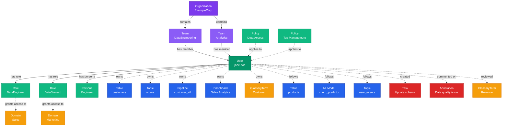

# User

**Individual users with profiles, roles, and team memberships**

---

## Overview

The **User** entity represents individual users within the organization who interact with data assets. Users have profiles, authentication credentials, role assignments, and team memberships that determine their access and responsibilities.

---

## Relationship Diagram

```mermaid
graph TB
    subgraph "User Profile & Authentication"
        USR[User<br/>jane.doe<br/><i>jane.doe@example.com</i>]
        PROF[Profile<br/>Data Engineer<br/><i>SF, CA • PST</i>]
        AUTH[Authentication<br/>SSO<br/><i>Google Auth</i>]

        USR -->|has profile| PROF
        USR -->|auth via| AUTH
    end

    subgraph "Team Memberships"
        TEAM1[Team<br/>Data Engineering<br/><i>Primary Team</i>]
        TEAM2[Team<br/>Analytics<br/><i>Secondary Team</i>]
        TEAM3[Team<br/>ML Platform<br/><i>Cross-functional</i>]

        USR -->|member of| TEAM1
        USR -->|member of| TEAM2
        USR -->|member of| TEAM3
    end

    subgraph "Roles & Permissions"
        ROLE1[Role<br/>DataEngineer<br/><i>Primary Role</i>]
        ROLE2[Role<br/>DataSteward<br/><i>Additional Role</i>]
        ROLE3[Role<br/>DataConsumer<br/><i>Read Access</i>]
        POL1[Policy<br/>DatabaseAccess]
        POL2[Policy<br/>PipelineManagement]

        USR -->|has role| ROLE1
        USR -->|has role| ROLE2
        USR -->|has role| ROLE3
        ROLE1 -.->|grants| POL1
        ROLE1 -.->|grants| POL2
    end

    subgraph "Personas"
        PERS1[Persona<br/>Engineer<br/><i>Default Persona</i>]
        PERS2[Persona<br/>Analyst<br/><i>Secondary Persona</i>]
        UI[UI Preferences<br/>Landing: /pipelines<br/><i>Custom Widgets</i>]

        USR -->|default persona| PERS1
        USR -->|has persona| PERS2
        PERS1 -->|defines| UI
    end

    subgraph "Owned Assets"
        TBL1[Table<br/>customers<br/><i>postgres_prod.public</i>]
        TBL2[Table<br/>orders<br/><i>postgres_prod.public</i>]
        PIPE1[Pipeline<br/>customer_etl<br/><i>Airflow</i>]
        DASH1[Dashboard<br/>Sales Analytics<br/><i>Tableau</i>]
        ML1[MLModel<br/>churn_predictor<br/><i>Production</i>]
        GT1[GlossaryTerm<br/>Customer<br/><i>Business Glossary</i>]

        USR -.->|owns| TBL1
        USR -.->|owns| TBL2
        USR -.->|owns| PIPE1
        USR -.->|owns| DASH1
        USR -.->|owns| ML1
        USR -.->|owns| GT1
    end

    subgraph "Followed Assets"
        TBL3[Table<br/>products<br/><i>Following</i>]
        PIPE2[Pipeline<br/>daily_etl<br/><i>Watching</i>]
        DASH2[Dashboard<br/>Executive Summary<br/><i>Following</i>]
        ML2[MLModel<br/>recommendation_engine<br/><i>Watching</i>]
        TOPIC1[Topic<br/>user_events<br/><i>Following</i>]

        USR -.->|follows| TBL3
        USR -.->|follows| PIPE2
        USR -.->|follows| DASH2
        USR -.->|follows| ML2
        USR -.->|follows| TOPIC1
    end

    subgraph "Activity & Collaboration"
        ACT1[Activity<br/>Created Pipeline<br/><i>2 hours ago</i>]
        ACT2[Activity<br/>Updated Table Schema<br/><i>1 day ago</i>]
        TASK1[Task<br/>Update Documentation<br/><i>In Progress</i>]
        ANNO1[Annotation<br/>Data Quality Issue<br/><i>Comment</i>]
        REV1[Review<br/>Glossary Term<br/><i>Approved</i>]

        USR -.->|created| ACT1
        USR -.->|performed| ACT2
        USR -.->|assigned| TASK1
        USR -.->|commented| ANNO1
        USR -.->|reviewed| REV1
    end

    subgraph "Access Domains"
        DOM1[Domain<br/>Customer Data<br/><i>Via DataEngineer Role</i>]
        DOM2[Domain<br/>Sales<br/><i>Via DataSteward Role</i>]
        DOM3[Domain<br/>Marketing<br/><i>Via Team Membership</i>]

        ROLE1 -.->|grants access| DOM1
        ROLE2 -.->|grants access| DOM2
        TEAM1 -.->|grants access| DOM3
    end

    %% Styling
    classDef userStyle fill:#059669,stroke:#047857,color:#fff,stroke-width:4px
    classDef profileStyle fill:#10B981,stroke:#059669,color:#fff,stroke-width:2px
    classDef teamStyle fill:#8B5CF6,stroke:#7C3AED,color:#fff,stroke-width:2px
    classDef roleStyle fill:#6366F1,stroke:#4F46E5,color:#fff,stroke-width:2px
    classDef policyStyle fill:#818CF8,stroke:#6366F1,color:#fff,stroke-width:2px
    classDef personaStyle fill:#EC4899,stroke:#DB2777,color:#fff,stroke-width:2px
    classDef ownedStyle fill:#2563EB,stroke:#1E40AF,color:#fff,stroke-width:2px
    classDef followStyle fill:#06B6D4,stroke:#0891B2,color:#fff,stroke-width:2px
    classDef activityStyle fill:#F59E0B,stroke:#D97706,color:#000,stroke-width:2px
    classDef domainStyle fill:#EF4444,stroke:#DC2626,color:#fff,stroke-width:2px

    class USR userStyle
    class PROF,AUTH profileStyle
    class TEAM1,TEAM2,TEAM3 teamStyle
    class ROLE1,ROLE2,ROLE3 roleStyle
    class POL1,POL2 policyStyle
    class PERS1,PERS2,UI personaStyle
    class TBL1,TBL2,PIPE1,DASH1,ML1,GT1 ownedStyle
    class TBL3,PIPE2,DASH2,ML2,TOPIC1 followStyle
    class ACT1,ACT2,TASK1,ANNO1,REV1 activityStyle
    class DOM1,DOM2,DOM3 domainStyle
```

**Key Relationships:**

- **Profile & Authentication**: User profile information and authentication mechanisms (SSO, LDAP, OAuth2, etc.)
- **Team Memberships**: Users belong to multiple teams and inherit team-level permissions
- **Roles & Permissions**: Users have assigned roles that grant specific permissions via policies
- **Personas**: Users have personas that customize their UI experience and workflows
- **Asset Ownership**: Users own tables, dashboards, pipelines, ML models, glossary terms, and other assets
- **Following**: Users follow assets to track changes and receive notifications
- **Activity Feed**: Track user actions including creates, updates, comments, and reviews
- **Domain Access**: Access to data domains determined by roles and team memberships

---

## Schema Specifications

View the complete User schema in your preferred format:

=== "JSON Schema"

    **Complete JSON Schema Definition**

    ```json
    {
      "$id": "https://open-metadata.org/schema/entity/teams/user.json",
      "$schema": "http://json-schema.org/draft-07/schema#",
      "title": "User",
      "description": "A `User` represents an individual person with authentication credentials, profile information, and role assignments.",
      "type": "object",
      "javaType": "org.openmetadata.schema.entity.teams.User",

      "definitions": {
        "authenticationMechanism": {
          "type": "object",
          "properties": {
            "authType": {
              "type": "string",
              "enum": ["JWT", "SSO", "BASIC", "LDAP", "OAUTH2", "SAML"]
            },
            "config": {
              "type": "object"
            }
          }
        },
        "userProfile": {
          "type": "object",
          "properties": {
            "bio": {
              "type": "string",
              "description": "User biography"
            },
            "location": {
              "type": "string",
              "description": "User location"
            },
            "timezone": {
              "type": "string",
              "description": "User timezone"
            },
            "images": {
              "type": "object",
              "properties": {
                "avatar": {"type": "string"},
                "banner": {"type": "string"}
              }
            }
          }
        }
      },

      "properties": {
        "id": {
          "description": "Unique identifier",
          "$ref": "../../type/basic.json#/definitions/uuid"
        },
        "name": {
          "description": "Username",
          "$ref": "../../type/basic.json#/definitions/entityName"
        },
        "fullyQualifiedName": {
          "description": "Fully qualified name: organization.username",
          "$ref": "../../type/basic.json#/definitions/fullyQualifiedEntityName"
        },
        "displayName": {
          "description": "Display name",
          "type": "string"
        },
        "email": {
          "description": "User email address",
          "type": "string",
          "format": "email"
        },
        "description": {
          "description": "User description",
          "$ref": "../../type/basic.json#/definitions/markdown"
        },
        "profile": {
          "$ref": "#/definitions/userProfile"
        },
        "isAdmin": {
          "description": "Is system administrator",
          "type": "boolean",
          "default": false
        },
        "isBot": {
          "description": "Is bot account",
          "type": "boolean",
          "default": false
        },
        "authenticationMechanism": {
          "$ref": "#/definitions/authenticationMechanism"
        },
        "teams": {
          "description": "Teams this user belongs to",
          "type": "array",
          "items": {
            "$ref": "../../type/entityReference.json"
          }
        },
        "roles": {
          "description": "Roles assigned to this user",
          "type": "array",
          "items": {
            "$ref": "../../type/entityReference.json"
          }
        },
        "personas": {
          "description": "Personas assigned to this user",
          "type": "array",
          "items": {
            "$ref": "../../type/entityReference.json"
          }
        },
        "defaultPersona": {
          "description": "Default persona for this user",
          "$ref": "../../type/entityReference.json"
        },
        "owns": {
          "description": "Data assets owned by this user",
          "type": "array",
          "items": {
            "$ref": "../../type/entityReference.json"
          }
        },
        "follows": {
          "description": "Entities this user follows",
          "type": "array",
          "items": {
            "$ref": "../../type/entityReference.json"
          }
        },
        "isActive": {
          "description": "Account is active",
          "type": "boolean",
          "default": true
        },
        "timezone": {
          "description": "User timezone",
          "type": "string"
        },
        "version": {
          "description": "Metadata version",
          "$ref": "../../type/entityHistory.json#/definitions/entityVersion"
        }
      },

      "required": ["id", "name", "email"]
    }
    ```

    **[View Full JSON Schema →](https://github.com/open-metadata/OpenMetadataStandards/blob/main/schemas/entity/teams/user.json)**

=== "RDF"

    **RDF/OWL Ontology Definition**

    ```turtle
    @prefix om: <https://open-metadata.org/schema/> .
    @prefix rdfs: <http://www.w3.org/2000/01/rdf-schema#> .
    @prefix owl: <http://www.w3.org/2001/XMLSchema#> .
    @prefix xsd: <http://www.w3.org/2001/XMLSchema#> .

    # User Class Definition
    om:User a owl:Class ;
        rdfs:subClassOf om:Entity ;
        rdfs:label "User" ;
        rdfs:comment "An individual user with authentication and profile information" .

    # Properties
    om:userName a owl:DatatypeProperty ;
        rdfs:domain om:User ;
        rdfs:range xsd:string ;
        rdfs:label "name" ;
        rdfs:comment "Username for the user" .

    om:email a owl:DatatypeProperty ;
        rdfs:domain om:User ;
        rdfs:range xsd:string ;
        rdfs:label "email" ;
        rdfs:comment "User email address" .

    om:displayName a owl:DatatypeProperty ;
        rdfs:domain om:User ;
        rdfs:range xsd:string ;
        rdfs:label "displayName" ;
        rdfs:comment "Display name for the user" .

    om:isAdmin a owl:DatatypeProperty ;
        rdfs:domain om:User ;
        rdfs:range xsd:boolean ;
        rdfs:label "isAdmin" ;
        rdfs:comment "Whether user has admin privileges" .

    om:isBot a owl:DatatypeProperty ;
        rdfs:domain om:User ;
        rdfs:range xsd:boolean ;
        rdfs:label "isBot" ;
        rdfs:comment "Whether this is a bot account" .

    om:isActive a owl:DatatypeProperty ;
        rdfs:domain om:User ;
        rdfs:range xsd:boolean ;
        rdfs:label "isActive" ;
        rdfs:comment "Whether the account is active" .

    om:memberOf a owl:ObjectProperty ;
        rdfs:domain om:User ;
        rdfs:range om:Team ;
        rdfs:label "memberOf" ;
        rdfs:comment "Teams this user belongs to" .

    om:hasRole a owl:ObjectProperty ;
        rdfs:domain om:User ;
        rdfs:range om:Role ;
        rdfs:label "hasRole" ;
        rdfs:comment "Roles assigned to this user" .

    om:hasPersona a owl:ObjectProperty ;
        rdfs:domain om:User ;
        rdfs:range om:Persona ;
        rdfs:label "hasPersona" ;
        rdfs:comment "Personas assigned to this user" .

    om:owns a owl:ObjectProperty ;
        rdfs:domain om:User ;
        rdfs:range om:DataAsset ;
        rdfs:label "owns" ;
        rdfs:comment "Data assets owned by this user" .

    om:follows a owl:ObjectProperty ;
        rdfs:domain om:User ;
        rdfs:range om:Entity ;
        rdfs:label "follows" ;
        rdfs:comment "Entities followed by this user" .

    # Example Instance
    ex:janeDoe a om:User ;
        om:userName "jane.doe" ;
        om:email "jane.doe@example.com" ;
        om:displayName "Jane Doe" ;
        om:isAdmin false ;
        om:isBot false ;
        om:isActive true ;
        om:memberOf ex:dataEngineeringTeam ;
        om:hasRole ex:dataEngineerRole ;
        om:hasPersona ex:engineerPersona ;
        om:owns ex:customersTable .
    ```

    **[View Full RDF Ontology →](https://github.com/open-metadata/OpenMetadataStandards/blob/main/rdf/ontology/openmetadata.ttl)**

=== "JSON-LD"

    **JSON-LD Context and Example**

    ```json
    {
      "@context": {
        "@vocab": "https://open-metadata.org/schema/",
        "om": "https://open-metadata.org/schema/",
        "rdfs": "http://www.w3.org/2000/01/rdf-schema#",
        "xsd": "http://www.w3.org/2001/XMLSchema#",

        "User": "om:User",
        "name": {
          "@id": "om:userName",
          "@type": "xsd:string"
        },
        "fullyQualifiedName": {
          "@id": "om:fullyQualifiedName",
          "@type": "xsd:string"
        },
        "displayName": {
          "@id": "om:displayName",
          "@type": "xsd:string"
        },
        "email": {
          "@id": "om:email",
          "@type": "xsd:string"
        },
        "description": {
          "@id": "om:description",
          "@type": "xsd:string"
        },
        "isAdmin": {
          "@id": "om:isAdmin",
          "@type": "xsd:boolean"
        },
        "isBot": {
          "@id": "om:isBot",
          "@type": "xsd:boolean"
        },
        "isActive": {
          "@id": "om:isActive",
          "@type": "xsd:boolean"
        },
        "teams": {
          "@id": "om:memberOf",
          "@type": "@id",
          "@container": "@set"
        },
        "roles": {
          "@id": "om:hasRole",
          "@type": "@id",
          "@container": "@set"
        },
        "personas": {
          "@id": "om:hasPersona",
          "@type": "@id",
          "@container": "@set"
        },
        "owns": {
          "@id": "om:owns",
          "@type": "@id",
          "@container": "@set"
        },
        "follows": {
          "@id": "om:follows",
          "@type": "@id",
          "@container": "@set"
        }
      }
    }
    ```

    **Example JSON-LD Instance**:

    ```json
    {
      "@context": "https://open-metadata.org/context/user.jsonld",
      "@type": "User",
      "@id": "https://example.com/users/jane.doe",

      "name": "jane.doe",
      "fullyQualifiedName": "example_org.jane.doe",
      "displayName": "Jane Doe",
      "email": "jane.doe@example.com",
      "description": "Senior Data Engineer specializing in data platform and analytics",
      "isAdmin": false,
      "isBot": false,
      "isActive": true,

      "profile": {
        "bio": "Data engineer with 8+ years experience building scalable data platforms",
        "location": "San Francisco, CA",
        "timezone": "America/Los_Angeles"
      },

      "teams": [
        {
          "@id": "https://example.com/teams/data-engineering",
          "@type": "Team",
          "name": "Data Engineering"
        }
      ],

      "roles": [
        {
          "@id": "https://example.com/roles/data-engineer",
          "@type": "Role",
          "name": "DataEngineer"
        }
      ],

      "personas": [
        {
          "@id": "https://example.com/personas/engineer",
          "@type": "Persona",
          "name": "Engineer"
        }
      ],

      "owns": [
        {
          "@id": "https://example.com/tables/customers",
          "@type": "Table",
          "fullyQualifiedName": "postgres_prod.ecommerce.public.customers"
        }
      ]
    }
    ```

    **[View Full JSON-LD Context →](https://github.com/open-metadata/OpenMetadataStandards/blob/main/rdf/contexts/user.jsonld)**

---

## Use Cases

- Manage user authentication and authorization
- Track ownership of data assets
- Assign roles and permissions to users
- Organize users into teams
- Define user personas for tailored experiences
- Follow and collaborate on data assets
- Audit user actions and access patterns
- Manage user profiles and preferences

---

## JSON Schema Specification

### Core Properties

#### `id` (uuid)
**Type**: `string` (UUID format)
**Required**: Yes (system-generated)
**Description**: Unique identifier for this user instance

```json
{
  "id": "f6a7b8c9-d0e1-4f2a-3b4c-5d6e7f8a9b0c"
}
```

---

#### `name` (entityName)
**Type**: `string`
**Required**: Yes
**Pattern**: `^[^.]*$` (no dots allowed)
**Min Length**: 1
**Max Length**: 128
**Description**: Username (typically email prefix or unique identifier)

```json
{
  "name": "jane.doe"
}
```

---

#### `fullyQualifiedName` (fullyQualifiedEntityName)
**Type**: `string`
**Required**: Yes (system-generated)
**Description**: Fully qualified name in the format `organization.username`

```json
{
  "fullyQualifiedName": "example_org.jane.doe"
}
```

---

#### `displayName`
**Type**: `string`
**Required**: No
**Description**: Human-readable display name

```json
{
  "displayName": "Jane Doe"
}
```

---

#### `email`
**Type**: `string` (email format)
**Required**: Yes
**Description**: User email address (must be unique)

```json
{
  "email": "jane.doe@example.com"
}
```

---

#### `description` (markdown)
**Type**: `string` (Markdown format)
**Required**: No
**Description**: User description or bio

```json
{
  "description": "Senior Data Engineer specializing in data platform and analytics infrastructure"
}
```

---

### Authentication Properties

#### `authenticationMechanism`
**Type**: `object`
**Required**: No
**Description**: Authentication configuration for the user

**Properties**:

| Property | Type | Required | Description |
|----------|------|----------|-------------|
| `authType` | enum | Yes | Authentication type: JWT, SSO, BASIC, LDAP, OAUTH2, SAML |
| `config` | object | No | Auth-specific configuration |

```json
{
  "authenticationMechanism": {
    "authType": "SSO",
    "config": {
      "ssoServiceType": "google",
      "authConfig": {}
    }
  }
}
```

---

#### `isAdmin`
**Type**: `boolean`
**Required**: No (default: false)
**Description**: Whether user has system administrator privileges

```json
{
  "isAdmin": false
}
```

---

#### `isBot`
**Type**: `boolean`
**Required**: No (default: false)
**Description**: Whether this is a bot/service account

```json
{
  "isBot": false
}
```

---

#### `isActive`
**Type**: `boolean`
**Required**: No (default: true)
**Description**: Whether the user account is active

```json
{
  "isActive": true
}
```

---

### Profile Properties

#### `profile`
**Type**: `object`
**Required**: No
**Description**: User profile information

**Properties**:

| Property | Type | Required | Description |
|----------|------|----------|-------------|
| `bio` | string | No | User biography |
| `location` | string | No | User location |
| `timezone` | string | No | User timezone |
| `images` | object | No | Avatar and banner images |

```json
{
  "profile": {
    "bio": "Data engineer with 8+ years experience building scalable data platforms",
    "location": "San Francisco, CA",
    "timezone": "America/Los_Angeles",
    "images": {
      "avatar": "https://example.com/avatars/jane.doe.jpg",
      "banner": "https://example.com/banners/jane.doe.jpg"
    }
  }
}
```

---

### Team and Role Properties

#### `teams[]` (EntityReference[])
**Type**: `array` of Team references
**Required**: No
**Description**: Teams this user belongs to

```json
{
  "teams": [
    {
      "id": "a1b2c3d4-e5f6-4a7b-8c9d-0e1f2a3b4c5d",
      "type": "team",
      "name": "Data Engineering",
      "fullyQualifiedName": "example_org.DataEngineering"
    },
    {
      "id": "b2c3d4e5-f6a7-4b8c-9d0e-1f2a3b4c5d6e",
      "type": "team",
      "name": "Analytics",
      "fullyQualifiedName": "example_org.Analytics"
    }
  ]
}
```

---

#### `roles[]` (EntityReference[])
**Type**: `array` of Role references
**Required**: No
**Description**: Roles assigned to this user

```json
{
  "roles": [
    {
      "id": "c3d4e5f6-a7b8-4c9d-0e1f-2a3b4c5d6e7f",
      "type": "role",
      "name": "DataEngineer",
      "fullyQualifiedName": "DataEngineer"
    },
    {
      "id": "d4e5f6a7-b8c9-4d0e-1f2a-3b4c5d6e7f8a",
      "type": "role",
      "name": "DataSteward",
      "fullyQualifiedName": "DataSteward"
    }
  ]
}
```

---

#### `personas[]` (EntityReference[])
**Type**: `array` of Persona references
**Required**: No
**Description**: Personas assigned to this user

```json
{
  "personas": [
    {
      "id": "e5f6a7b8-c9d0-4e1f-2a3b-4c5d6e7f8a9b",
      "type": "persona",
      "name": "Engineer",
      "fullyQualifiedName": "Engineer"
    }
  ]
}
```

---

#### `defaultPersona`
**Type**: `object` (EntityReference)
**Required**: No
**Description**: Default persona for this user

```json
{
  "defaultPersona": {
    "id": "e5f6a7b8-c9d0-4e1f-2a3b-4c5d6e7f8a9b",
    "type": "persona",
    "name": "Engineer"
  }
}
```

---

### Ownership and Following Properties

#### `owns[]` (EntityReference[])
**Type**: `array`
**Required**: No
**Description**: Data assets owned by this user

```json
{
  "owns": [
    {
      "id": "table-uuid-1",
      "type": "table",
      "name": "customers",
      "fullyQualifiedName": "postgres_prod.ecommerce.public.customers"
    },
    {
      "id": "dashboard-uuid-1",
      "type": "dashboard",
      "name": "Sales Dashboard"
    }
  ]
}
```

---

#### `follows[]` (EntityReference[])
**Type**: `array`
**Required**: No
**Description**: Entities this user follows

```json
{
  "follows": [
    {
      "id": "table-uuid-2",
      "type": "table",
      "name": "orders"
    },
    {
      "id": "pipeline-uuid-1",
      "type": "pipeline",
      "name": "daily_etl"
    }
  ]
}
```

---

### Versioning Properties

#### `version` (entityVersion)
**Type**: `number`
**Required**: Yes (system-managed)
**Description**: Metadata version number

```json
{
  "version": 1.5
}
```

---

#### `updatedAt` (timestamp)
**Type**: `integer` (Unix epoch milliseconds)
**Required**: Yes (system-managed)
**Description**: Last update timestamp

```json
{
  "updatedAt": 1704240000000
}
```

---

#### `updatedBy` (string)
**Type**: `string`
**Required**: Yes (system-managed)
**Description**: User who made the update

```json
{
  "updatedBy": "admin"
}
```

---

## Complete Example

```json
{
  "id": "f6a7b8c9-d0e1-4f2a-3b4c-5d6e7f8a9b0c",
  "name": "jane.doe",
  "fullyQualifiedName": "example_org.jane.doe",
  "displayName": "Jane Doe",
  "email": "jane.doe@example.com",
  "description": "Senior Data Engineer specializing in data platform and analytics",
  "isAdmin": false,
  "isBot": false,
  "isActive": true,
  "profile": {
    "bio": "Data engineer with 8+ years experience building scalable data platforms",
    "location": "San Francisco, CA",
    "timezone": "America/Los_Angeles",
    "images": {
      "avatar": "https://example.com/avatars/jane.doe.jpg"
    }
  },
  "authenticationMechanism": {
    "authType": "SSO",
    "config": {
      "ssoServiceType": "google"
    }
  },
  "teams": [
    {
      "id": "a1b2c3d4-e5f6-4a7b-8c9d-0e1f2a3b4c5d",
      "type": "team",
      "name": "Data Engineering"
    }
  ],
  "roles": [
    {
      "id": "c3d4e5f6-a7b8-4c9d-0e1f-2a3b4c5d6e7f",
      "type": "role",
      "name": "DataEngineer"
    }
  ],
  "personas": [
    {
      "id": "e5f6a7b8-c9d0-4e1f-2a3b-4c5d6e7f8a9b",
      "type": "persona",
      "name": "Engineer"
    }
  ],
  "defaultPersona": {
    "id": "e5f6a7b8-c9d0-4e1f-2a3b-4c5d6e7f8a9b",
    "type": "persona",
    "name": "Engineer"
  },
  "owns": [
    {
      "type": "table",
      "name": "customers",
      "fullyQualifiedName": "postgres_prod.ecommerce.public.customers"
    }
  ],
  "follows": [
    {
      "type": "table",
      "name": "orders"
    }
  ],
  "version": 1.5,
  "updatedAt": 1704240000000,
  "updatedBy": "admin"
}
```

---

## RDF Representation

### Ontology Class

```turtle
@prefix om: <https://open-metadata.org/schema/> .
@prefix rdfs: <http://www.w3.org/2000/01/rdf-schema#> .
@prefix owl: <http://www.w3.org/2001/XMLSchema#> .

om:User a owl:Class ;
    rdfs:subClassOf om:Entity ;
    rdfs:label "User" ;
    rdfs:comment "An individual user with authentication and profile" ;
    om:hasProperties [
        om:name "string" ;
        om:email "string" ;
        om:displayName "string" ;
        om:isAdmin "boolean" ;
        om:teams "Team[]" ;
        om:roles "Role[]" ;
        om:personas "Persona[]" ;
        om:owns "DataAsset[]" ;
    ] .
```

### Instance Example

```turtle
@prefix om: <https://open-metadata.org/schema/> .
@prefix ex: <https://example.com/> .

ex:janeDoe a om:User ;
    om:userName "jane.doe" ;
    om:email "jane.doe@example.com" ;
    om:displayName "Jane Doe" ;
    om:isAdmin false ;
    om:isBot false ;
    om:isActive true ;
    om:memberOf ex:dataEngineeringTeam ;
    om:hasRole ex:dataEngineerRole ;
    om:hasPersona ex:engineerPersona ;
    om:owns ex:customersTable ;
    om:follows ex:ordersTable .
```

---

## JSON-LD Context

```json
{
  "@context": {
    "@vocab": "https://open-metadata.org/schema/",
    "User": "om:User",
    "name": "om:userName",
    "email": "om:email",
    "displayName": "om:displayName",
    "teams": {
      "@id": "om:memberOf",
      "@type": "@id",
      "@container": "@set"
    },
    "roles": {
      "@id": "om:hasRole",
      "@type": "@id",
      "@container": "@set"
    },
    "personas": {
      "@id": "om:hasPersona",
      "@type": "@id",
      "@container": "@set"
    },
    "owns": {
      "@id": "om:owns",
      "@type": "@id",
      "@container": "@set"
    }
  }
}
```

### JSON-LD Example

```json
{
  "@context": "https://open-metadata.org/context/user.jsonld",
  "@type": "User",
  "@id": "https://example.com/users/jane.doe",
  "name": "jane.doe",
  "email": "jane.doe@example.com",
  "displayName": "Jane Doe",
  "isAdmin": false,
  "teams": [
    {
      "@id": "https://example.com/teams/data-engineering",
      "@type": "Team"
    }
  ],
  "roles": [
    {
      "@id": "https://example.com/roles/data-engineer",
      "@type": "Role"
    }
  ],
  "owns": [
    {
      "@id": "https://example.com/tables/customers",
      "@type": "Table"
    }
  ]
}
```

---

## Relationships

### Parent Entities
- **Organization**: The organization this user belongs to
- **Team**: Teams this user is a member of

### Associated Entities
- **Role**: Roles assigned to the user
- **Persona**: Personas assigned to the user
- **DataAsset**: Assets owned by the user
- **Entity**: Entities followed by the user

### Relationship Diagram



---

## Custom Properties

This entity supports custom properties through the `extension` field.
Common custom properties include:

- **Data Classification**: Sensitivity level
- **Cost Center**: Billing allocation
- **Retention Period**: Data retention requirements
- **Application Owner**: Owning application/team

See [Custom Properties](../metadata-specifications/custom-properties.md)
for details on defining and using custom properties.

---

## API Operations

### Create User

```http
POST /api/v1/users
Content-Type: application/json

{
  "name": "jane.doe",
  "email": "jane.doe@example.com",
  "displayName": "Jane Doe",
  "teams": ["Data Engineering"],
  "roles": ["DataEngineer"]
}
```

### Get User

```http
GET /api/v1/users/name/jane.doe?fields=teams,roles,owns,follows
```

### Update User

```http
PATCH /api/v1/users/{id}
Content-Type: application/json-patch+json

[
  {
    "op": "add",
    "path": "/roles/-",
    "value": {"id": "role-uuid", "type": "role"}
  }
]
```

### Assign Role

```http
PUT /api/v1/users/{id}/roles
Content-Type: application/json

{
  "roles": [
    {"id": "role-uuid", "type": "role"}
  ]
}
```

### Set User as Owner

```http
PUT /api/v1/tables/{tableId}/owner
Content-Type: application/json

{
  "owner": {
    "id": "user-uuid",
    "type": "user"
  }
}
```

---

## Related Documentation

- **[Team](team.md)** - Team entity
- **[Role](role.md)** - Role entity
- **[Persona](persona.md)** - Persona entity
- **[Authentication](../security/authentication.md)** - Authentication mechanisms
- **[Authorization](../security/authorization.md)** - Access control
- **[Policies](../security/policies.md)** - Permission policies
